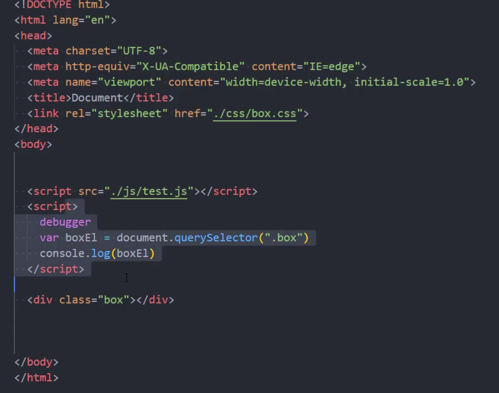

# 网页的解析过程(重点)

浏览器在请求静态资源服务器时，会先下载一个html文件，然后再根据html的link和script引入资源，从静态资源服务器请求对应的资源索引连接，下载相关的资源。

**当在浏览器中输入URL并进入该页面时，会执行以下步骤：**

1. 浏览器查找域名的**IP地址**：**通过DNS来进行查找和解析对应域名的IP地址**，DNS找到并解析出该IP地址后，浏览器会获取该IP地址，并且根据该IP地址指向的服务器，向服务器发起请求。
2. 浏览器向服务器**发送HTTP请求**：请求包括**请求方法**（如GET、POST等）、**头信息**等。
3. 服务器处理请求并返回HTTP响应：响应包括**状态码**（如200表示成功，404表示未找到页面等）、**响应内容**（通常是HTML、CSS、JavaScript、图片等资源）。
4. 浏览器解析并渲染页面：浏览器首先解析HTML以构建**DOM树**，然后解析CSS以构建**CSSOM树**，**将二者结合生成渲染树**，最后进行**布局和绘制**。
5. 浏览器**执行JavaScript代码**：这可能会**修改DOM树和CSSOM树**，进而改变页面的显示。

整个流程就是：

DNS解析生成IP地址=>发起HTTP请求(携参)=>服务器处理请求返回资源=>浏览器通过解析资源生成DOM树(HTML)和CSSOM树(CSS)，生成渲染树进行布局和绘制=>浏览器执行JS代码，可能会变更DOM树和CSSOM树重新布局和绘制。

以上就是在浏览器输入URL并进入页面时的基本过程。

1. HTML经过解析后会生成**DOM Tree**，而CSS经过解析后会生成一套**CSS规则**。
2. 通过Attachment将DOM Tree和CSS规则结合起来，**生成Render Tree渲染树**。
3. 此时渲染树还没有对应的节点和位置，也就是没有生成具体的布局，所以我们需要**先通过Layout生成布局，生成详细的节点信息。**(同时不生成部分不需要渲染的节点，节省性能。)
4. 根据**Render Tree经过Layout布局处理后的节点**，**再进行Painting绘制**，完成HTML页面的生成和展示。
5. **style的css解析不会阻塞html的解析**，反之亦然。但是如果DOM解析或者Style Rules解析其中一项没有完成，就会影响后续的Render Tree的生成。 **所以下载CSS文件不会影响DOM的解析，浏览器下载完CSS文件后，就会对CSS文件进行解析，解析出对应的规则树。**
6. 所以，**link元素**不会阻塞DOM Tree的构建过程，但是**可能会阻塞Render Tree的构建过程**(因为渲染树必须要等CSS规则和DOM树全部完成构建才能开始生成工作)。
7. Render Tree和DOM Tree**不是一一对应关系**，部分体现在CSS为不显示的元素，在Render Tree上浏览器不会进行渲染策略。

## 布局(Layout)和绘制(Paint)

浏览器执行的是**先布局，再绘制**的渲染策略。

### 渲染树运行布局计算节点几何体面积

渲染树**只负责展示节点和对应样式**，不负责表示节点的位置和尺寸。

布局是提炼出树中**所有节点的宽度，高度等位置信息**。

### 将每个节点绘制(Paint)到屏幕上

绘制过程中，浏览器会将布局阶段计算出来的每个**frame**转换为屏幕上的像素点。

对元素的可见部分进行绘制，比如文本，颜色，边框，阴影，替换元素等等。

## 回流和重绘

### 回流(reflow)

网页第一次确定节点的大小和位置，也就是计算元素大小和尺寸，称之为Layout布局。

回流阶段发生在浏览器上元素的位置或者尺寸发生了改变，也就是发生在**布局之后的节点的大小和位置重新计算，称之为回流。**

#### 引起回流的情况

- DOM结构发生改变(添加或者移除节点)。
- 改变了节点元素的布局(width,height,padding,font-size)。
- **更改浏览器窗口的size**，也可能引起回流。
- 调用getComputedStyle方法获取尺寸和位置信息时导致了回流。

### 重绘

第一次渲染内容是整个构建流程中的**paint绘制**。

**之后重新渲染称之为重绘**。

#### 引起重绘的情况

 只更改各种颜色和样式会导致重绘，注意更改尺寸是会导致回流。

### 如何避免回流

# 浏览器的渲染原理

## 特殊解析-composite合成

绘制的过程中，可以将布局后的元素绘制到多个合成图层之中。

默认情况下，标准流中所有的内容都会被绘制到同一个图层之中，设**置绝对定位`fixed`会使得元素在另外一个图层之中，但是`absolute`依然会使其在同一个图层之中。**

但是一些特殊的属性，会创建一个新的合成层，并且新的图层可以利用GPU来加速绘制：

### 特殊合成层(compositingLayer)

特殊的composite合成属性的合成层中，每个合成层都是单独渲染的，它们可以通过以下属性来生成独立的合成层：

- 3D Transforms(注意是3D)
- video,canvas,iframe(canvas,iframe默认都是通过GPU加速展示的)
- opacity动画转换
- **position:fixed**
- will-change
- animation或者transition设置了opacity,transform属性

# 合成和性能优化

# defer和async

**注意：html文件解析的过程中，如果碰到加载js文件的<script>元素，那么就无法继续构建DOM树。**

**JS会强令停止HTML的DOM Tree构建，执行首先下载JS代码，然后执行JS脚本。**

等到JS脚本执行结束后，才会继续解析HTML，构建DOM树。

如上图所示，如果我们在script中打了debugger，那么就会导致后续的解析直接卡住。 

### 浏览器执行JS优先策略的原因

- JS作用之一就是操作DOM，因为JS可以修改DOM。
- 如果等到DOM Tree构建完成，并且实现了Render Tree的渲染后再执行JS，会造成严重的回流和重绘，影响页面的性能。
- **所以我们会在遇到script元素时，优先下载和执行JS代码，再继续构建DOM Tree。**

但是这种策略会导致现代JS框架出现严重的阻塞问题，因为Vue，react中JS代码的加载比重很高，处理时间更长。

所以会导致页面的解析阻塞，在脚本的下载和执行完成之前，用户陷入了漫长的等待期。

## defer属性

defer属性告诉浏览器不要等待脚本下载，而是继续解析HTML，构建DOM Tree，JS脚本会独立进行下载。

- 脚本会由浏览器来继续下载，**但不会阻塞DOM Tree的构建过程**(注意这个时候还没有到布局的阶段)。
- **如果脚本提前下载完毕后，它会等待DOM Tree构建进程到`DOMContentLoaded`事件钩子执行之前，才开始执行。**
- 这样执行的好处是为了保证DOM Tree在进行渲染之前，提前进行JS对DOM的操作，减少回流和重绘的性能损失。
- 然后在`DOMContentLoaded`事件触发之前(在此事件钩子执行完成后DOM Tree才算真正意义的全流程加载完成)，先介入中止DOM Tree的继续解析(此时DOM Tree事实上已经解析完毕)，然后执行defer中的代码，用于操作DOM使用。

**DOMContentLoaded是DOM Tree构建完成事件之前的事件，常用于告知DOM Tree构建完成使用。*

上图所示案例中，defer脚本会先执行，`DOMContentLoaded`监听事件回调会后执行。

#### defer脚本的执行顺序

如果存在多个defer脚本，是可以保证多个defer JS脚本可以按顺序依次执行。

另外defer主要适用于外部脚本，在带有defer属性的script标签里面写执行代码意义不大。

## async

async的特性和defer比较相似，它能够使HTML的渲染不被阻塞。

**但是携带async属性的若干个JS脚本的执行顺序不被保证，它是独立下载独立运行的，不会等待其它脚本。**

**async不能保证在DOMContentLoaded之前或者之后执行，所以async对DOM没有依赖。**