# 深入V8引擎原理

## 浏览器内核的组成

浏览器内核由两部分组成：

**WebCore**:负责HTML解析，布局，渲染等等工作。

**JavaScriptCore**:解析，执行JS代码。 

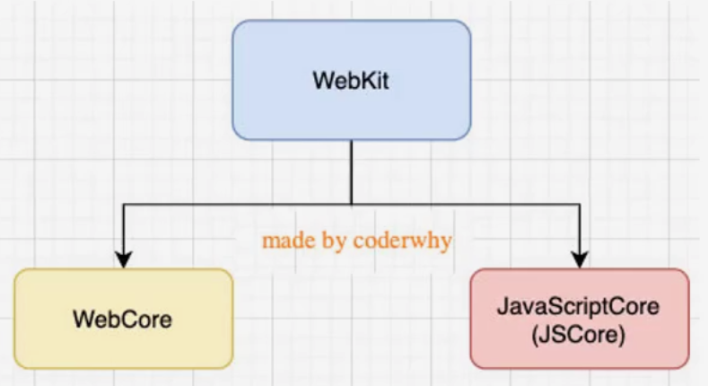

## JS代码的转化

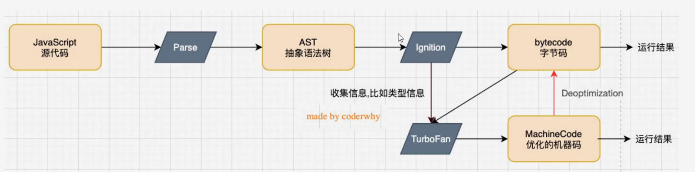

**V8引擎会把JS代码转化为AST抽象语法树**，用于将整个代码进行正确的转化和识别。

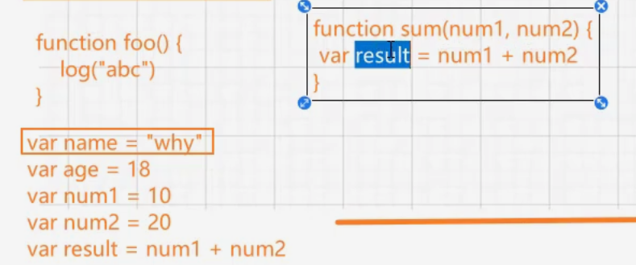

*<u>比如对上面的代码进行抽取和正确的识别，就会利用AST树进行转化操作。</u>*

随后通过Ignition(解释器)转化为字节码，字节码可以使得代码运行在不同的终端 平台，比如MAC或者WIN。

**TurboFan可以对多次调用同一函数的函数进行优化和存储，使得后续再次调用这个函数时无需重新进行编译和转化为字节码，而是直接利用原有的优化后的机器码进行处理。**

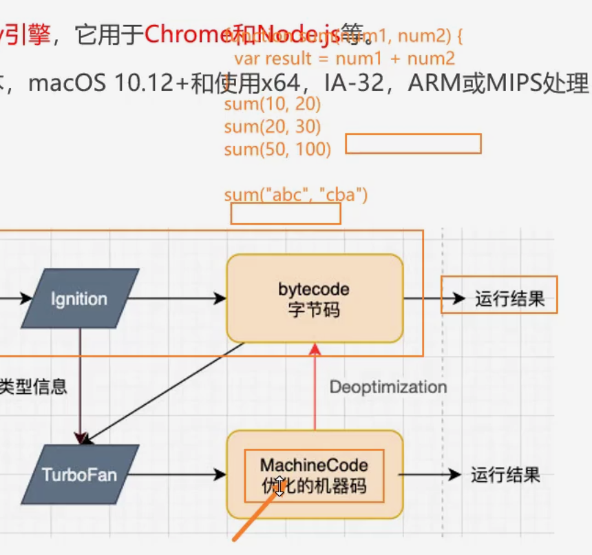

一旦相加的数值从数字变成了字符串，就会导致整个字节码重新编译，这也是为什么需要TS固定数值类型的原因，TS能够提高整个编译的性能。

## V8引擎的架构

- Parse模块会把JS代码转化为AST抽象语法树。

  如果函数没有被调用，则不会被转化为AST。

- Ignition是一个解释器，会将AST转化为ByteCode(字节码)

  它会同步从TurboFan中收集需要优化的信息。

  如果函数只调用一次，解释器会解释执行ByteCode字节码。

- TurboFan是一个编译器，可以把字节码编译为CPU可以直接执行的机器码。

  如果一个函数被多次调用，那么就会被**TurboFan编译器**标记为**热点函数**，经过TurboFan编译器转化为优化的机器码，提高代码的执行性能。

  **一旦函数的执行参数类型发生变化，就会被逆向转化为字节码，这也是为什么需要TS提高编译性能的原因。**

## V8引擎解析

先进行词法分析，然后进行语法分析。

- **词法分析（英文lexical  analysis）** 

  词法分析的过程是将**字符序列**转换成**token序列**的过程(此token非彼token)。 

  token是记号化 （tokenization）的缩写，也就是对JS代码每个部分进行拆分和获取。

  词法分析器（lexical  analyzer，简称lexer），也 叫扫描器（scanner）

  **比如 `var name ='why'`，就会对var,name,=,'why'进行拆分和分析。**

- **语法分析（英语：syntactic  analysis，也叫 parsing）** 

  语法分析器也可以称之为 parser。

  也就是对一些关键字，比如`var name ='why'`中的name和"why"进行分析，**从而生成对应的AST树**。

# JS执行上下文

```js
  <script>
    var message = "Global Message"

    function foo() {
      var message = "Foo Message"
      console.log("foo function")
    }

    var num1 = 10
    var num2 = 20
    var result = num1 + num2
    console.log(result)
  </script>
```

##  全局对象GO

**JS引擎会在执行之前，会在堆内存创建一个全局对象Global Object：**

- 该对象中所有的作用域(scope)都可以访问。
- 里面包含了Date、Array、String、Number、setTimeout、setInterval等等。
- 其中还有一个window属性指向自己。

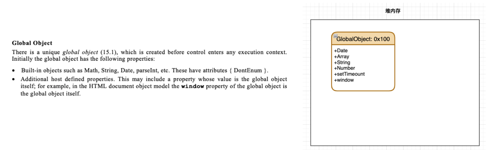

## 执行上下文栈(ECS)

JS引擎内部有一个执行上下文栈(ECS)，它是用于执行代码的调用栈。

它执行的目标是全局的代码块。

- 全局的代码块为了执行会构建一个GEC(Global Execution Context)。
- **GEC会被放入ECS中执行**。

GEC被放入到ECS中里面包含**两部分**内容：

- 第一部分：在代码执行前，在**代码经过parser编译器转化为AST(抽象语法树)的过程中**，会把全局代码定义的变量，函数等加入到GlobalObject中，**但是此时不会赋值**。

  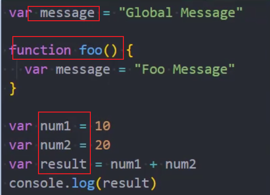

  ***上述的描述恰恰就是变量的作用域提升。**

- 第二部分，在代码执行中，对变量赋值，或者执行其他函数。

## 认识VO对象(Variable Object)

在JavaScript中，VO（Variable Object）变量对象是**执行上下文的一部分**。**当执行上下文（全局或函数）被创建时，VO也会被创建。**

**VO包含了在上下文中定义的所有变量和函数声明。对于函数上下文，参数也会被添加到VO中。**

例如，考虑以下JavaScript代码：

```JS
function test(a, b) {
  var x = 10;
  function inner() {
    return x;
  }
  return inner;
}
```

在函数`test`的执行上下文中，VO将包含：

- 参数 `a` 和 `b`
- 变量 `x`
- 函数 `inner`

**注意，函数表达式和使用`let`和`const`声明的变量不会被添加到VO中，它们被存储在词法环境组件的环境记录中。**

在ES2015（也称为ES6）及以后的版本中，执行上下文的概念已经被扩展为包括**变量环境**和**词法环境**，以更好地支持`let`、`const`和块级作用域。

**每一个执行上下文会关联一个VO**，变量和函数声明会被提取出来存放到VO对象里面(比如下图中GO里面存放的变量和函数指向的内存地址)。


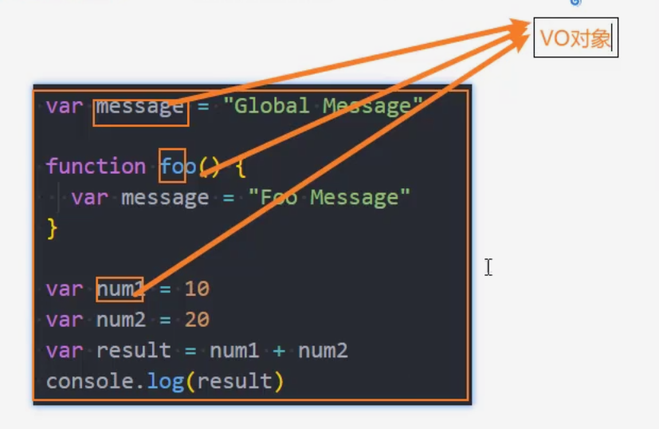

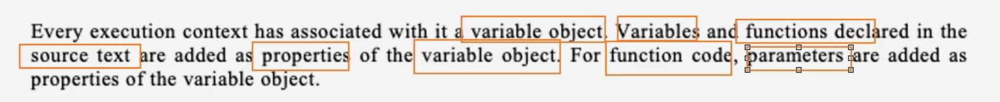

对于定义在全局之中的代码，它们的VO实际上就是GO(Global Object)，也就是说**当全局代码被执行时，VO就是GO对象。**

在JavaScript中，当全局代码被执行时，此时要执行的变量对象（VO）就是全局对象（GO）。**全局对象是预定义的对象，它在所有的JavaScript代码执行前就已经存在。**

在浏览器环境中，全局对象通常是`window`对象。

全局对象包含了所有的全局变量，全局函数，以及预定义的全局对象如`Math`，`Date`等。

### 全局代码执行过程

当全局代码被执行时，所有的变量和函数声明都会被添加到全局对象中，因此在这种情况下，我们可以说VO对象就是全局对象。

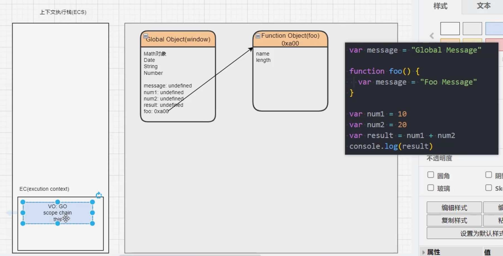

在创建GO(VO)对象的时候，JS引擎对函数进行特殊处理，它会提前创建函数并开辟一块新的内存地址(FO)，使得函数可以被提前访问，这和变量是存在区别的，**此时函数内部的基本属性和基本方法都会被提前创建**。

在代码开始执行时，变量会在执行中进行赋值操作，而函数因为已经被提前声明，所以会跳过。

由于函数是被提前声明的，一旦出现重名属性，就会导致函数被该重名属性所覆盖。

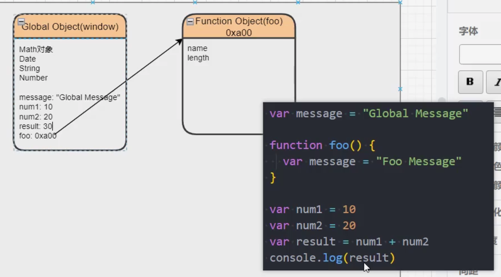

### 函数代码执行过程

函数在**执行**的过程中，会创建一个VO对象。(注意要区分**定义函数**和**执行函数**，**只有JS引擎执行到函数调用时，执行上下文栈才会创建一个属于函数的执行上下文**。)

**定义函数**会在**堆内存空间**中生成一个**函数执行体的内存空间**，而**执行函数**才会在**执行上下文栈**创建一个**属于该函数的执行上下文(下图中的AO)**。每个执行上下文都必须要关联一个VO。

**(重要)**函数开始执行后，执行上下文栈中的函数VO在创建初始时，找不到函数体的执行上下文的，**所以JS引擎在堆内存空间里面创建Activation Object，来关联函数执行上下文的VO**。

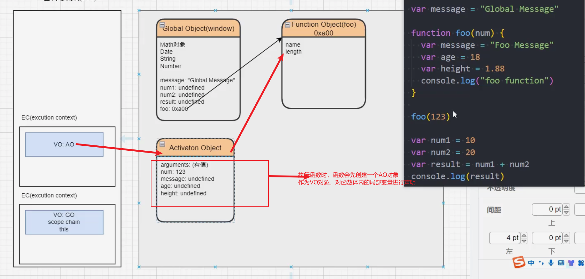

**在代码整体的执行过程中执行到一个函数，就会根据函数体创建一个函数执行上下文(FEC)，并且压入到ECS里面，同步创建一个函数的VO，我们一般称之为AO。**

我们在执行到函数的调用时，因为我们准备执行一个新的代码(因为函数被存在另外一个堆内存空间里面)，存在一个新的代码块，所以在执行上下文栈中会**创建**一个**新的执行上下文**，用于执行函数里面的代码块。

**注意！任何一个新的执行上下文，都必将会关联一个新的VO对象！此时函数里面声明的各类变量都会被存放到关联的VO对象中。**

- **函数的VO关联了一个新创建的对象，该对象里面会存放函数中声明的各类变量。**我们一般将其称之为AO对象。
- 这个AO对象会使用arguments作为初始化，初始化值是传入的参数。
- 这个AO对象会作为执行上下文的VO来存放变量的初始化。
- AO对象在创建初始，此时处于**编译阶段**，内部的变量会被声明，但是暂时不会被赋值。

一旦开始执行(进入到**执行阶段**)，函数体内部的局部变量就会**开始进行赋值**。

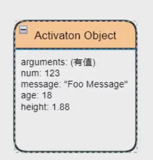

### 函数的多次执行

```js
  <script>
    var message = "Global Message"

    function foo(num) {
      var message = "Foo Message"
      var age = 18
      var height = 1.88
      console.log("foo function")
    }
    
    foo(123)
    foo(321)
    foo(111)
    foo(222)

    var num1 = 10
    var num2 = 20
    var result = num1 + num2
    console.log(result)
  </script>
```

在函数的AO关联Activation Object完毕之后，我们开始真正执行函数执行体里面的内容，我们会将传入的值一一赋值，使得Activation Object里面的值被依次填充：

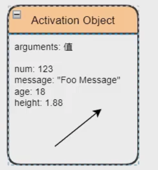

**在函数执行完毕后，函数的AO会从上下文执行栈(ECS)中弹出去，此时EC就变成栈中的顶部元素。**

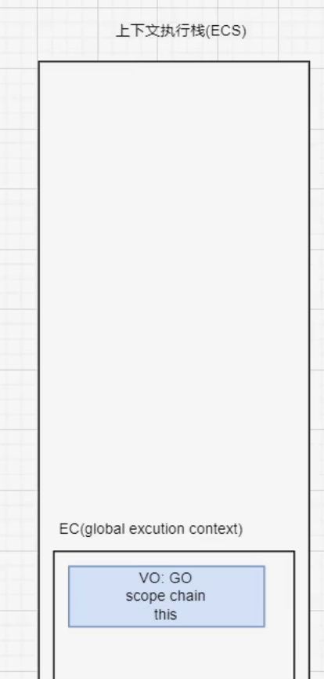

一定要学会区分执行上下文栈和堆空间的定义！对应的函数执行完成后会被弹出执行上下文栈，但是其关联在堆空间中的Activation Object**可能**会被销毁。

- 当第一个函数调用被执行完成后，会被弹出执行上下文栈，然后继续执行EC中的代码，直到执行第二个函数调用。

  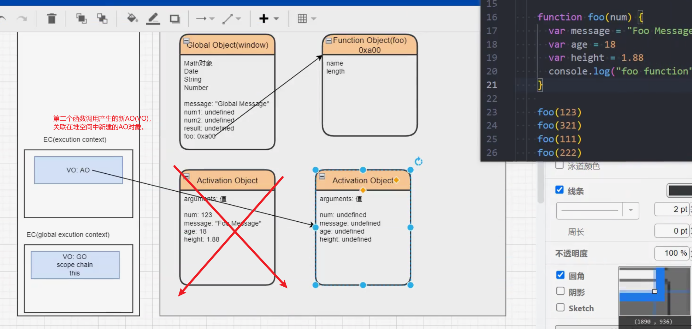

- 第二个函数调用会在执行上下文栈生成一个新的AO，此时**上一个**关联在堆空间中的Activation Object**可能**会被销毁，接着基于这个函数在堆空间中创建一个新的Activation Object。

- 紧接着我们会执行这个函数调用，为函数执行体中的局部变量进行赋值操作：

  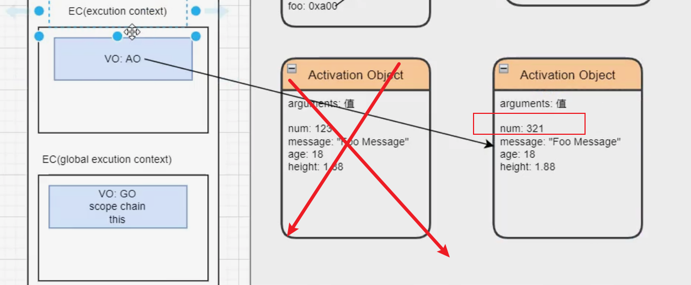

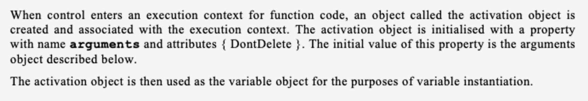

### 函数代码相互调用

```js
    var message = "Global Message"
    var obj = {
      name: "why"
    }
    function test() {
    }
    function bar() {
      console.log("bar function")
      test()
      test()
      var address = "bar"
    }
    function foo(num) {
      var message = "Foo Message"
      bar()
      var age = 18
      var height = 1.88
      console.log("foo function")
    }
    foo(123)
    var num1 = 10
    var num2 = 20
    var result = num1 + num2
    console.log(result)
```

只有函数对象才能被提前声明，普通对象(obj)是不会被提前声明的。

在函数开始执行时，我们在全局执行上下文中依次对代码进行执行操作，在堆空间中创建了以下各类对象：

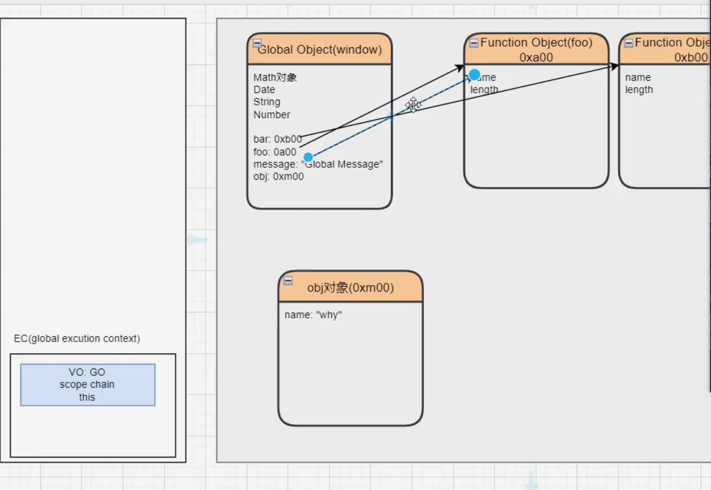

**(重要！)执行上下文栈对变量进行赋值操作时，堆空间中会另外进行一次变量的赋值，然后稳稳地存储这个变量的值，直到执行垃圾回收。**

**栈的执行上下文中，实际上会对变量进行赋值执行操作，同时会和堆的存储对象中同步存储的值产生一个关联，将来查找就会来到堆空间进行查找。**

无语了，JS引擎就会这么操作，JS执行栈对变量赋值会执行一次，堆空间关联的对象中变量的值也会进行一次赋值操作，**最终堆空间中的变量存储了赋值**。

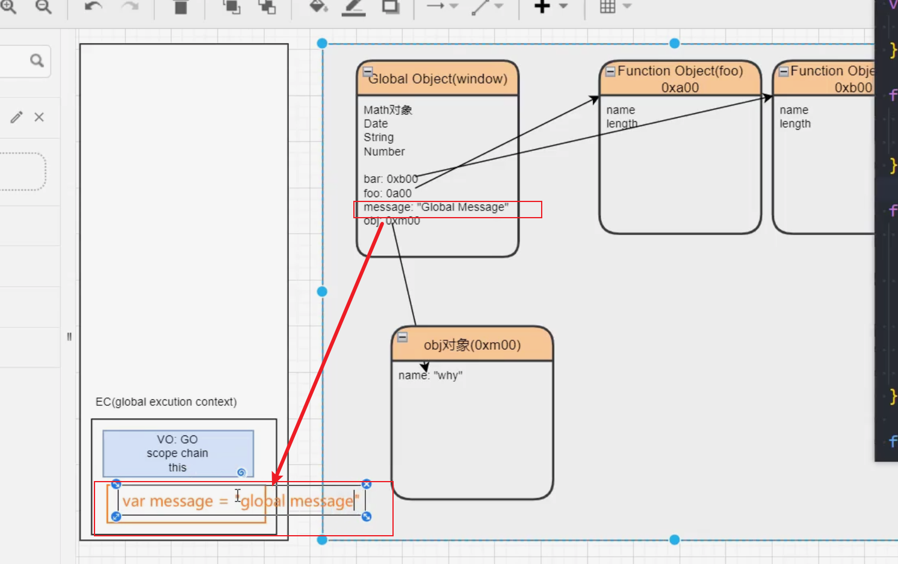

#### foo的执行

和前面一样，它会在堆空间里面创建一个Activation Object，然后执行变量的赋值，当执行到调用`bar()`时，转机出现了：

此时会在执行上下文栈中创建一个全新的执行上下文，该执行上下文直指bar函数执行体，注意此时foo的执行上下文没有执行完，不会被弹出。

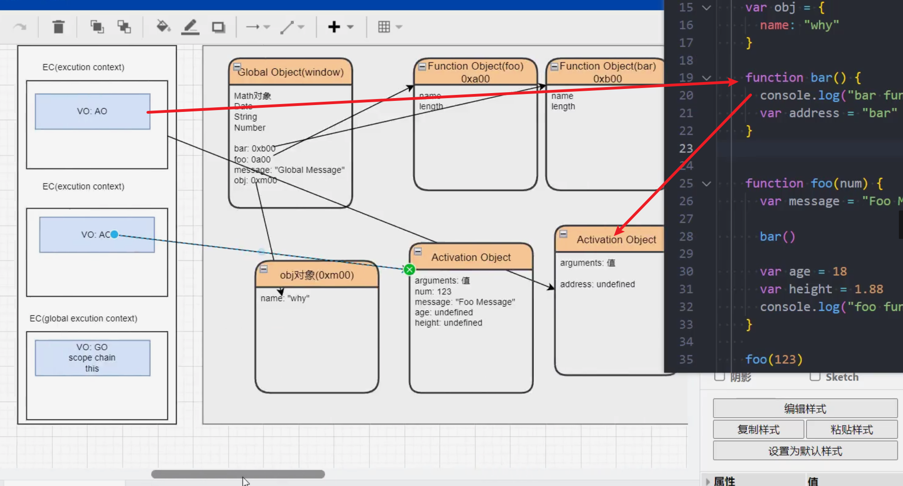

紧接着就开始执行bar函数，对内部的局部变量进行赋值，操作完成后就弹出执行上下文栈中bar的执行上下文。

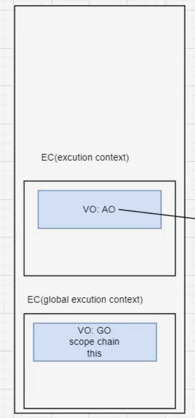

此时foo的执行上下 文变成了栈顶元素，继续执行foo函数，全部执行完成后foo的执行上下文也会被弹出去。

### 总结

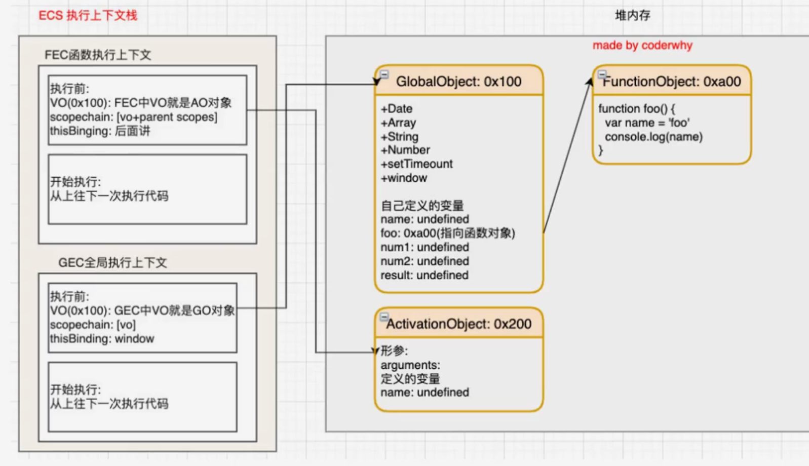

# 作用域和作用域链

**当进入到一个执行上下文时，执行上下文也会关联一个作用域链。**

- 作用域链是一个对象列表，用于变量标识符的求值。
- **当进入到一个执行上下文时，这个作用域链被创建，**并且根据代码类型，添加一系列的对象。

函数的作用域链和调用位置无关，而是和定义位置有关，函数的作用域链在代码编译阶段就已经被确定了。

无论采用对象属性调用还是其他方式调用，函数内部查找变量的方式是沿着函数定义时的作用域链去进行查找：

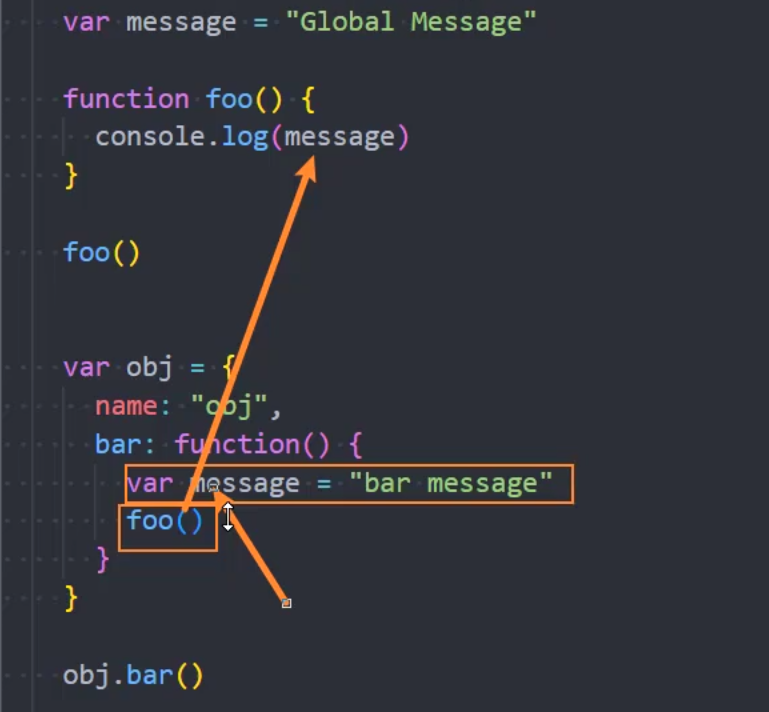

## 全局代码查找变量

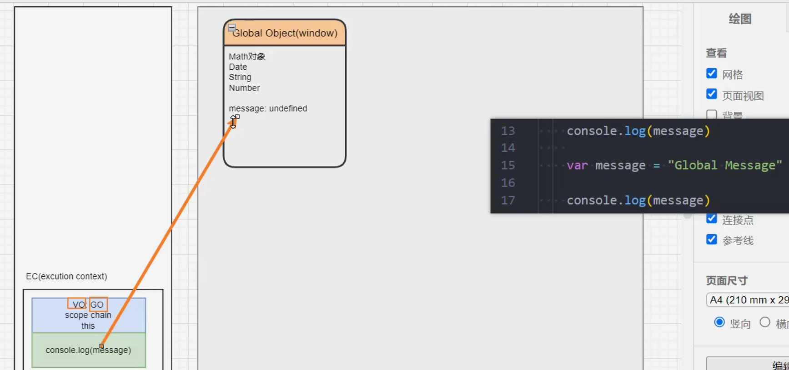

在执行上下文中，当代码执行到`console.log(message)`,它会到VO里面去查找对应的message， 此时message已经被放入了global Object里面，不过尚未赋值，所以此时message是undefined。

而第二次打印时，message已经进行了赋值，在堆空间的GO中可以查到message的值已存在。

## 函数代码查找变量

### 函数中存在同名变量

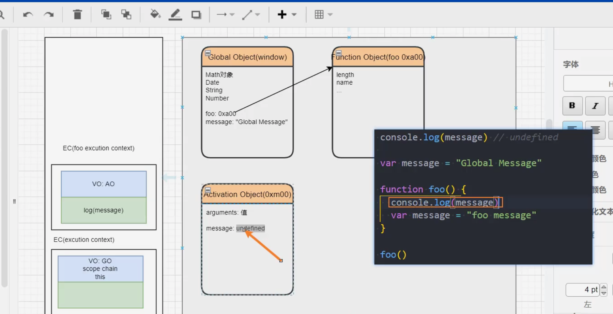

```js
    var message = "Global Message";

      function foo() {
        console.log(message);
        var message = "foo message";
      }

      foo();
```

注意，函数执行体中查找某个变量时，如果查找一个同名变量的值，此时函数体已经在堆空间中创建了属于自己的VO(也就是AO)，它会优先在自己的VO中查找该变量，哪怕该变量尚未进行赋值。

### 函数中不存在同名变量

首先我们需要明确两个概念：

在JavaScript中，Function Object和Activation Object都是在堆空间中创建的对象，但它们的用途和创建时机有所不同。

1. Function Object：当解析器遇到一个函数声明时，就会在堆空间中创建一个Function Object。这个对象包含了**函数的参数、函数体和作用域链**。Function Object是可以被多次调用的，每次调用都会创建一个新的执行环境(AO)。
2. Activation Object：当函数被调用时，会创建一个Activation Object。Activation Object是函数执行环境的一部分，它包含了**函数的参数、局部变量和内部函数**。每次函数调用都会创建一个新的Activation Object，**函数调用结束后，这个Activation Object就可能会被销毁。**

总的来说，**Function Object和Activation Object都是在堆空间中创建的对象**，但Function Object是在函数声明时创建，用于保存函数的信息；而Activation Object是在函数调用时创建，用于保存函数执行环境的信息。

下面我们来看一段代码：

```js
      var message = "Global Message";
debugger
      function foo() {
        console.log(message);
      }
      foo();
```

这里延伸一下此章节开篇提到的“函数的作用域链和调用位置无关，而是和定义位置有关，函数的作用域链在代码编译阶段就已经被确定了。”。

正因为foo在全局对象GO在执行时(foo函数此时尚未执行)，声明该函数时经由Function Object已经确定了作用域链。

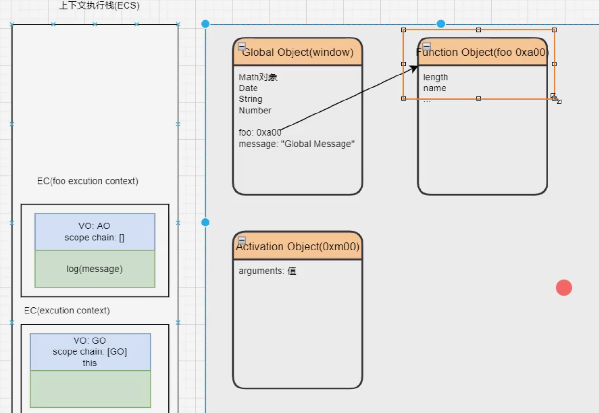

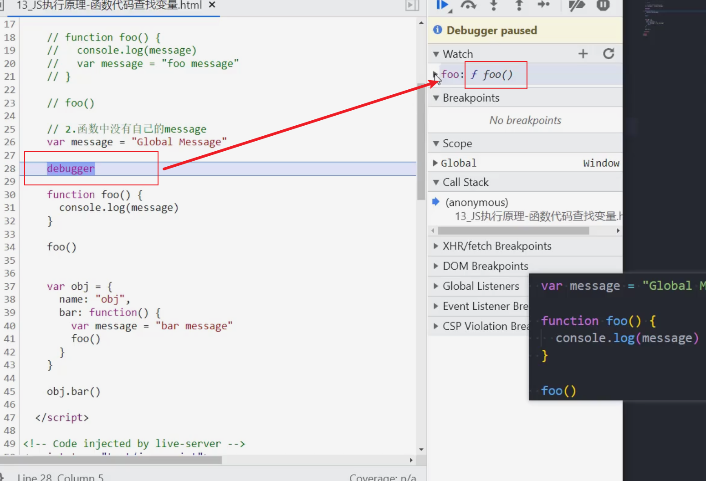

在debugger中打印foo的值，会发现运行到28行时，foo函数已经存在。

我们展开看一下watch里面的foo，会发现它的作用域链已经被确认了是全局作用域(GO)，这个作用域链也就是 `[[Scopes]]`对象，我们常称之为scope chain对象 ：

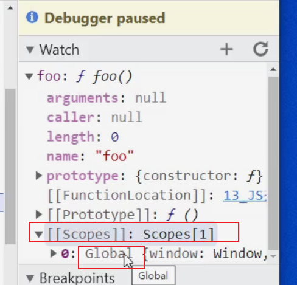

这个 `[[scopes]]`指向GO的内存地址：

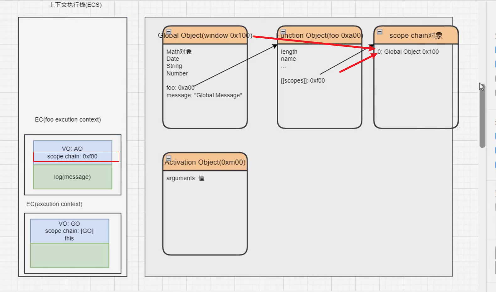

**我们去查找这个函数中的变量时，它就会优先在自己的作用域范围内(Local)去查找这个属性。**

**如果找不到，再按照 `[[Scopes]]`里面定义的作用域链，跑去Global去查找这个属性。**

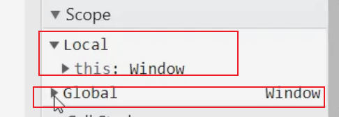

总结：函数执行体查找属性时，会根据自己定义时的作用域链进行查找。

### 多层嵌套的查找顺序

```js
    var message = "global message"

    function foo() {
      var name = "foo"
      function bar() {
        console.log(name)
      }
      return bar
    }

    var bar = foo()
    bar()
```

初始只创建foo函数的FO，里面的函数不会被创建。

在执行上下文栈执行foo的时候，它的AO里面会包含一个bar的函数对象，从而在堆空间创建一个bar的FO，在执行`bar()`(`foo()()`)的时候，基于词法作用域的原理，bar的`[[Scope]]`指向了foo函数。

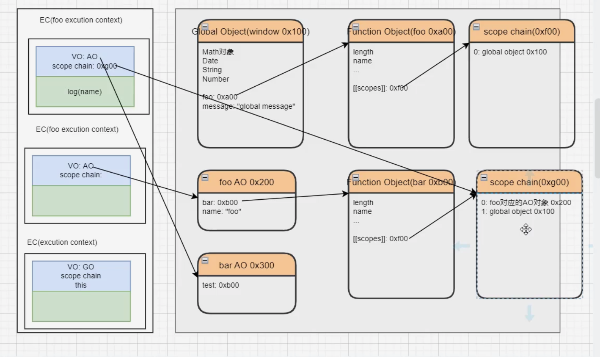

注意`[[Scopes]]`指向的也是scopes作用域链对象，查询变量时会优先查询自身，再顺着作用域链向上查询，每一层都是上层函数或者全局的词法作用域。

`foo()`被调用的时候，会建立一个VO对象用来保存各种变量和函数的声明，所以我们需要在堆空间建立自己的AO对象。

### 面试题

#### 面试题一

```js
     var n = 100
     function foo() {
       n = 200
     }
     foo()

     console.log(n)
```

1. JS引擎编译这段代码，首先会在执行上下文栈里面生成一个VO，这个VO指向堆内存空间新建的GO对象，该GO对象在浏览器里面指向window。
2. 然后GO扫描全局中存在的变量和函数，依次把message,foo存入堆空间里面，此时foo函数会在堆内存生成一个Function Object,里面存放foo函数的基础信息。
3. 此时会生成一个作用域链对象,foo函数的FO的内部属性`[[Scope]]`作为内存地址指向生成的作用域对象，它的里面只有一层，指向GO对象。
4. 开始执行整个代码，先对n进行赋值，**执行到foo的时候因为已建立FO对象所以会跳过，**最后执行到foo的时候，会在查找对应的VO，因为不存在VO所以会在堆内存里面建立对应的关联AO。
5. foo的AO里面会建立函数内部的各种局部变量，因为这里没有局部变量，所以只生成一个基本的arguments，随后执行到 `n=200`，此时foo会优先查找自己有没有n，如果没有那就沿着自身FO的`[[Scope]]`在作用域链里面查找n。
6. 找到GO对象里面的n，对GO对象里面的n进行重新赋值。然后foo在执行上下文栈中被弹出。

#### 面试题二

```js
      var n = 100
       function foo() {
         console.log(n)
         return
         var n = 200
       }
       foo()
```

foo()在调用时依旧产生了一个AO对象，里面的局部变量都会得到声明，**这是发生在编译阶段的事件**。

而在执行阶段，n已经被声明但没有赋值，所以打印出来n的值是一个`undefined`。

#### 面试题三

```js
      function foo() {
        var a = (b = 100);
      }
      foo();
      console.log(a);
```

**一定要注意这道题的盲点！**

a是存在于foo的ao对象之中的，而查找b是在全局GO对象里面查找的，查找只会沿着作用域链向外层查找而不会向内层查找！所以这里会报错！

如果查找b则是基于LHS查询，这是一种错误的使用方法，但依然能够在全局声明，这是JS引擎的规则。