# JS内存管理

## 内存管理的生命周期

第一步：分配申请你所需要的内存(申请)

第二步：使用分配的内存(存放一些数据，比如对象、属性、函数等等)

第三步：不需要使用时，应该释放掉这块内存

**内存分配主要是基于堆空间进行操作。**

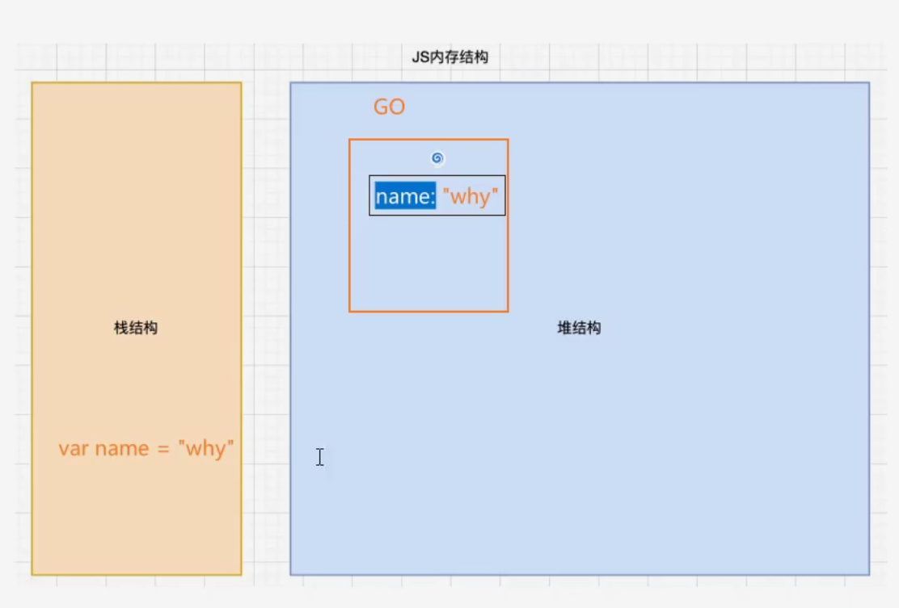

栈结构负责为属性分配值，执行完赋值操作后整个赋值语句会被销毁，而堆内存负责在栈结构执行赋值操作完成后，保存属性的值。

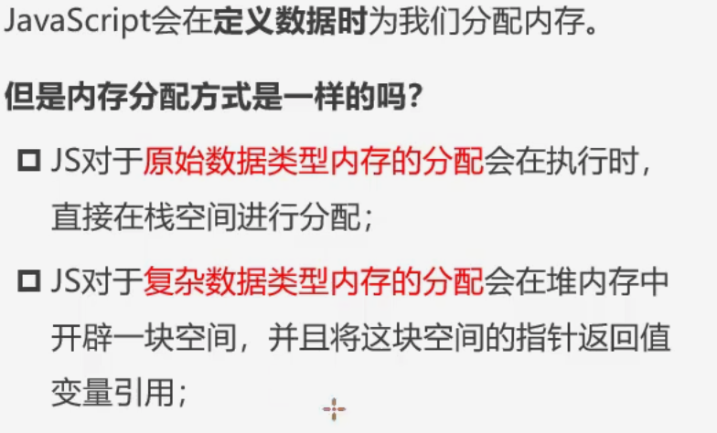

注意，如果是一个对象或者是函数(函数也是对象)，则会在定义时分别生成一个AO或者FO，用于存储对象中的值，而全局对象GO则会存储该对象的内存地址。

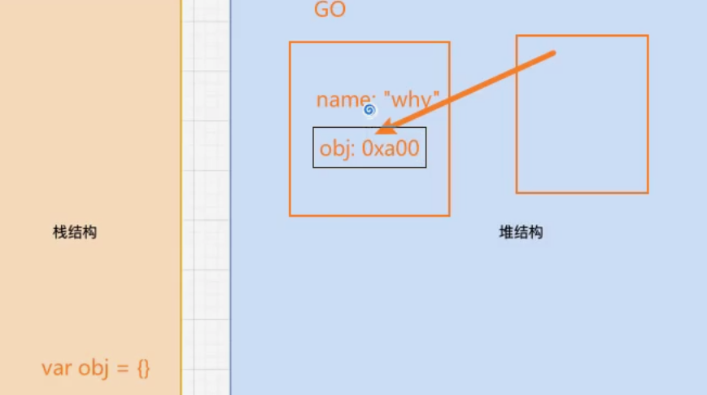

# 垃圾回收机制(GC)算法

大多数现代编程语言都是有自己的垃圾回收机制算法的，我们一般称其为GC。

对于不再使用的对象，都会被识别为垃圾回收的目标，它们被回收后会释放更多的内存空间。

## 垃圾回收机制(GC)算法类型

### 引用计数(非JS的回收算法，常用于swift)

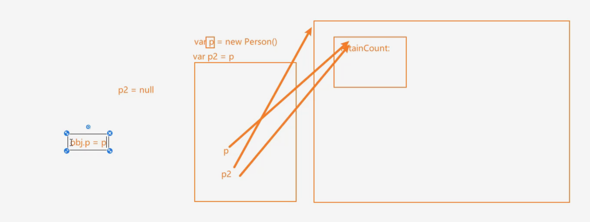

比如我们通过 `var p=new Person()`来生成一个新对象，Person()会在堆内存空间里面生成一个AO对象。

此时执行栈里面的p会指向堆内存的Person()的AO对象，AO对象里面会有一个属性为retainCount，它的值是一个数字，表示此时仍在引用该AO对象的属性。

只要存在属性引用了该对象，retainCount就会持续+1，直到没有属性引用该对象，该对象在堆内存中的AO对象就会被释放。

**这种算法存在一个严重的问题，就是会产生循环引用。**

### 标记清除(mark-Sweep)

标记清楚的核心思路称之为**可达性(Reachability)**

这个算法是设置了一个**根对象(root object)**，**垃圾回收机制**会定期从这个根对象开始，找到所有从根对象开始有引用到的对象，对于没有引用到的对象，就认为是不可用的对象。

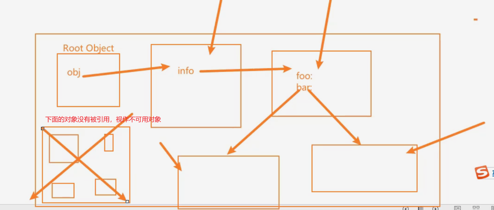

这个算法可以很好的解决循环引用问题。

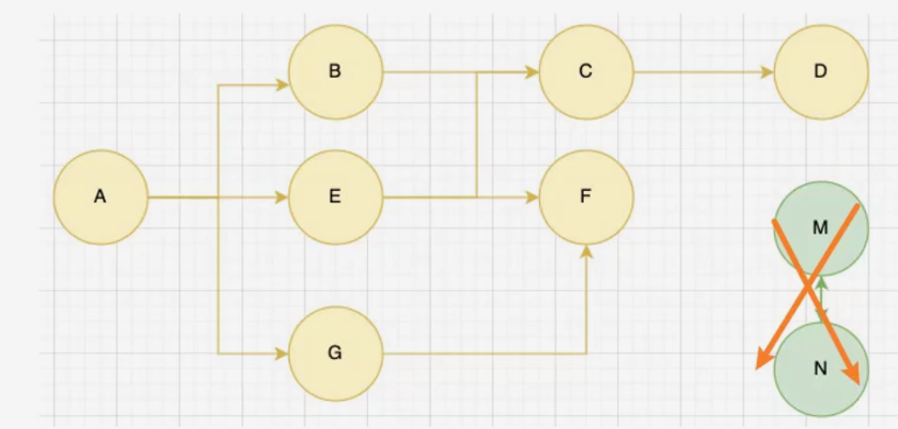

**在JS里面，根对象就是window。我们可以视作堆空间里面的Global Object，或者Root Object。**

### 标记整理(其它算法补充)

回收期间会将保留的 存储对象搬运汇集到连续的内存空间，从而整合空闲空间，避免内存碎片化。


### 分代收集

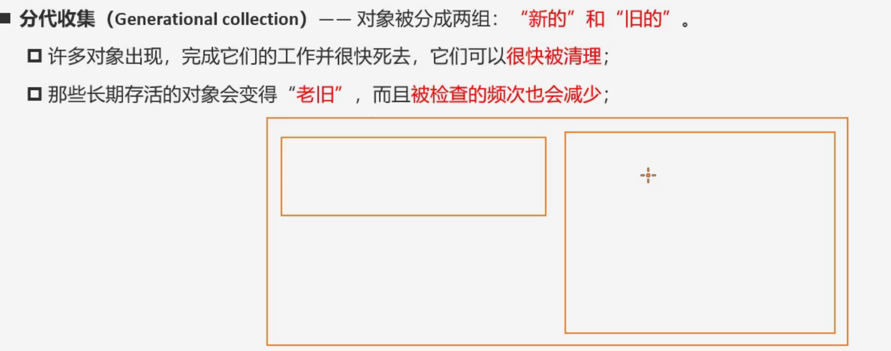

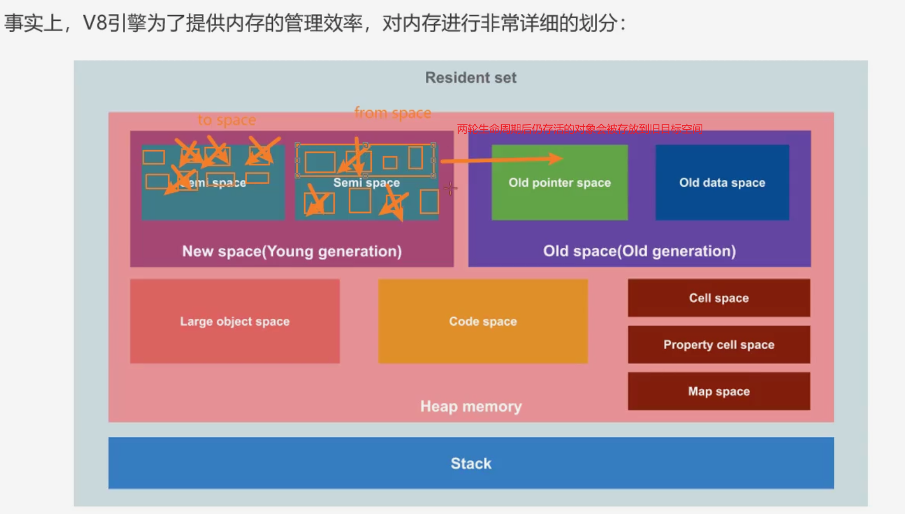

# 闭包

JS是一门支持函数式编程的语言，函数在JS中使一等公民。

函数甚至可以作为另外一个函数的参数来使用，也可以作为另外一个函数的返回值来使用。

## 闭包的定义

### 计算机科学

计算机科学中的闭包称之为词法闭包，或者函数闭包。

它是支持**头等函数**的编程语言中，实现词法绑定的一种技术。

闭包在实现上是一种结构体，它存储了**一个函数**和**一个关联的环境**。

闭包和函数的区别在于:捕捉闭包时，它的**自由变量**会在捕捉时被确定，这样即使脱离了捕捉时的上下文，它也可以**照常运行**。

### JavaScript

一个函数对其周围状态(词法环境)的引用捆绑在一起(或者说函数被引用包围)，这种组合就是闭包。

闭包可以实现在一个**内层函数**中**访问**到其外层**函数的作用域**。

在JS中，每创建一个函数，闭包就会在函数创建的同时被创建出来。

**任何一个函数，只要它能够访问外层作用域的自由变量，那么该函数就是一个闭包。**

- 广义解释：JS中所有函数都是闭包。
- 狭义解释：JS中的一个函数，如果**访问了外层作用域的自由变量**，就形成了闭包。

## 没有闭包的局限性

```js
    var name = "why"
    var age = 18
    var height = 1.88
    var address = "广州市"
    var intro = "了解真相, 你才能获得真正自由!"

    
    function foo(name, age, height, address, intro, num1, num2) {
      var message = "Hello World"
      console.log(message, name, age, height, address, intro)

      function bar() {
        console.log(name)
      }

      bar()
    }


    foo(name, age, height, address, intro, 20, 30)
```

如果你希望在函数不传参的情况下访问到外部作用域的属性，那么必须借助闭包才能实现。

JS可以通过闭包，使得在不传参的情况下，沿着作用域链向外部查找对应的变量，避免了变量必须以参数的形式通过层层传递才能获取。

## 闭包的访问过程

```js
function createAdder(count) {
      function adder(num) {
        return count + num
      }

      return adder
    }

    var adder5 = createAdder(5)
    adder5(100)
    adder5(55)
    adder5(12)

    var adder8 = createAdder(8)
    adder8(22)
    adder8(35)
    adder8(7)

    console.log(adder5(24))
    console.log(adder8(30))

    // 永远不会再使用adder8
    // 内存泄漏: 对于那些我们永远不会再使用的对象, 但是对于GC来说, 它不知道要进行释放的对应内存会依然保留着
```

每次调用 `createAdder(num)`，createAdder函数在定义时会创建一个FO，在被调用时会创建一个新的AO。

在JavaScript中，每次调用函数都会创建一个新的执行环境（Execution Context）。

这个执行环境包含了函数的局部变量、参数和内部函数等信息。

- 当你调用 `createAdder()` 函数时，就会**创建一个新的执行环境**，并在堆内存中为这个环境分配空间。
- 每次调用 `createAdder()` 都会在堆内存中创建一个新的执行环境，并且这个环境会被返回的 `adder()` 函数引用，形成一个新的闭包。这就是为什么每次调用 `createAdder()` 都会在堆内存中创建一个新的对象。
- 注意区别FO和AO的区别，AO是实际执行时创建的存储变量/函数的对象。

### 执行`createAdder(5)`前

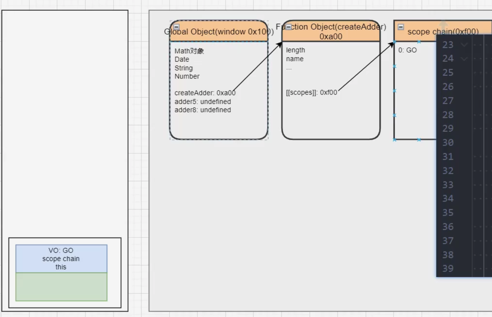

开始调用时，调用了 `createAdder(5)`函数，随即生成一个新的执行上下文，堆内存里面会同步创建一个自己的VO，所以创建了一个AO对象。

### 执行`createAdder(5)`后

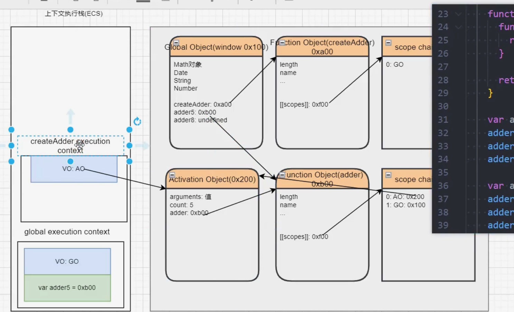

**这里需要注意一件事情，AO中存储函数的内存地址指向的是函数的FO，而非函数的AO。**

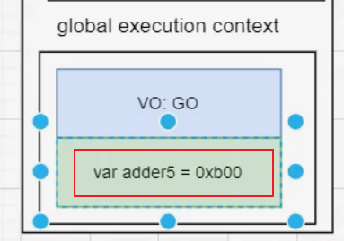

因为在全局进行了赋值操作，所以GO对象里面的`adder5`也会赋值`adder`函数的内存地址。

因为此时GO中的`adder5`有了值并且指向`adder`的FO，所以`adder`的FO是不会被销毁的，adder也不会被销毁。

### 执行`adder5(100)`

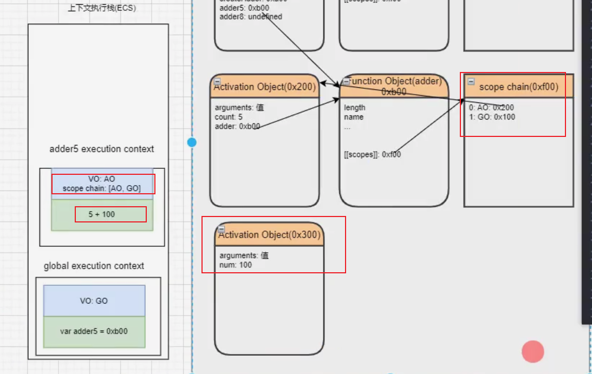

此时会在执行上下文栈中创建一个`adder5()`的AO对象，里面执行`num+count`，沿着自身和作用域链去查找这个两个值。

num在自身作用域找到，而count则需要顺着adder的FO的`[[scopes]]`查找，最终找到到在它上层的AO(`createAdder`的AO对象)里面存在count，获取该值。

执行本轮的`adder5`调用后，`adder5`和`createAdder`的执行体从执行上下文栈弹出。

但是 `createAdder`的AO不会从堆内存空间中销毁，此时adder5的FO中的 `[[scopes]]` 依然指向`createAdder`的AO。

### 执行`createAdder(8)`

**注意，两次执行`createAdder()`的过程中，GO中的`createAdder`始终指向`createAdder`的FO，而`createAdder`则会因为两次调用分别生成对应的AO对象，但是FO始终不会变化。**

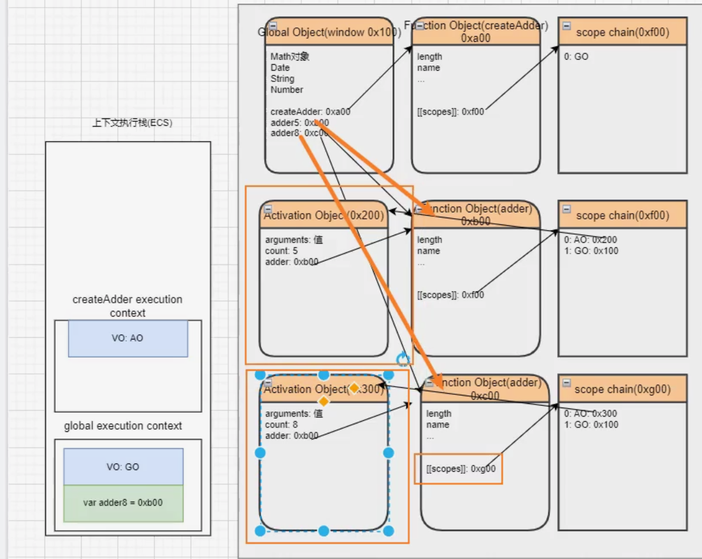

堆空间里面的所有的创建对象因为存在基于标记清除建立的`root Object`的引用关联，所以它们都不会被销毁。

## 闭包的内存泄漏

如果我们打算永远不使用 `adder8()`，对于这些永远不会使用的对象，但是对于GC来说，它无法获知应该释放的内存是否需要保留。

这时候，我们可以通过 `adder8=null`来释放掉对应的堆内存空间。

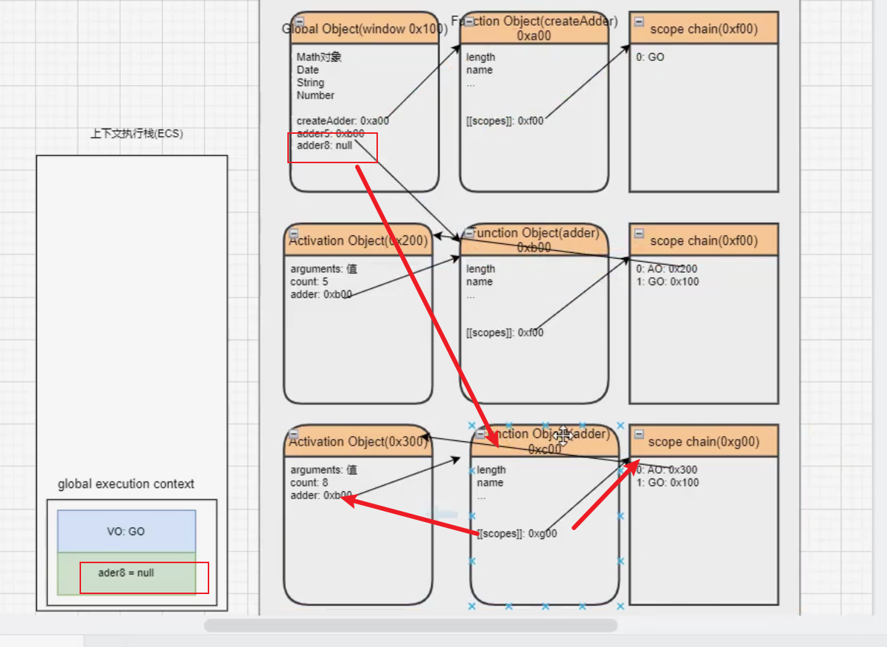

此时因为GO对象中`adder8`的指向为null，`adder8`的FO和作用域链对象将会失去关联，从而在下一轮垃圾回收中被回收，而关联的`createAdeer(8)`的AO也会因为关联链切断而被回收。

**闭包是需要进行手动释放的，否则规范上是会永久保存对应的FO,关联AO，`[[scopes]]`。**


```js
   function createArray() {
      // 4 1024 -> 4kb * 1024 -> 4M
      var arr = new Array(1024*1024).fill(1)

      function test() {
        console.log(arr)
      }

      return test
    }


    // 点击按钮
    var totalArr = []

    var createBtnEl = document.querySelector(".create")
    var destroyBtnEl = document.querySelector(".destroy")
    createBtnEl.onclick = function() {
      for (var i = 0; i < 100; i++) {
        totalArr.push(createArray())
      }
      console.log(totalArr.length)
    }
    destroyBtnEl.onclick = function() {
      totalArr = []
    }
```

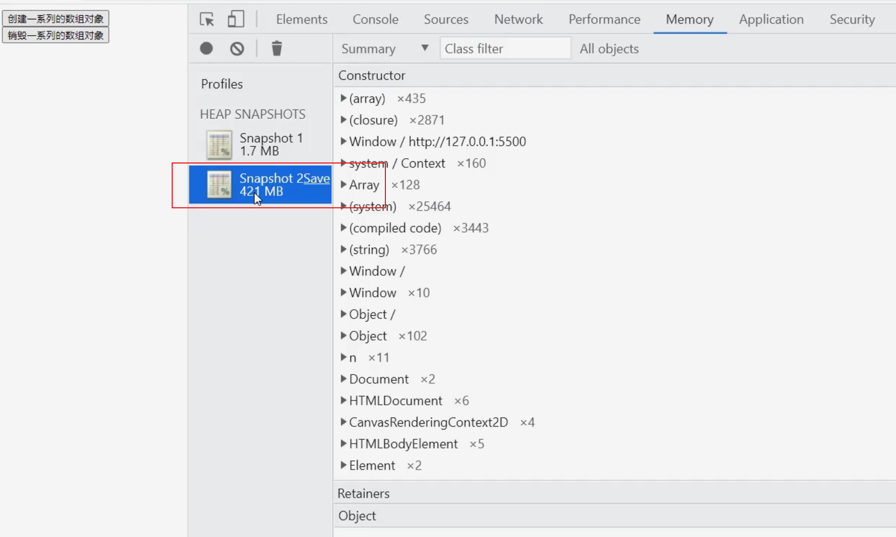

只要我们对totalArr进行清空数组操作，那么就能够做到释放堆空间里面所有的闭包函数，解决内存泄露问题。

### 浏览器的优化操作

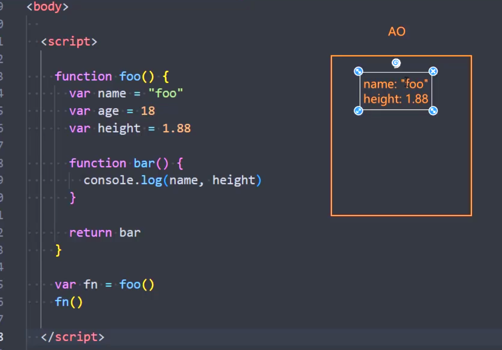

浏览器的V8引擎会把没有使用的age自动执行优化策略，进行垃圾回收操作，释放掉了age。

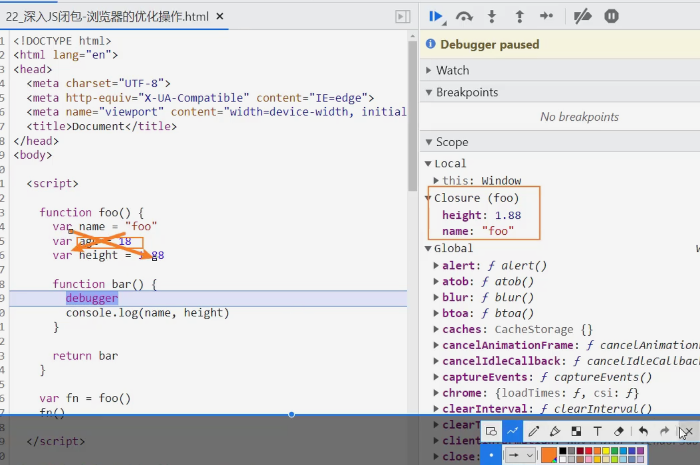