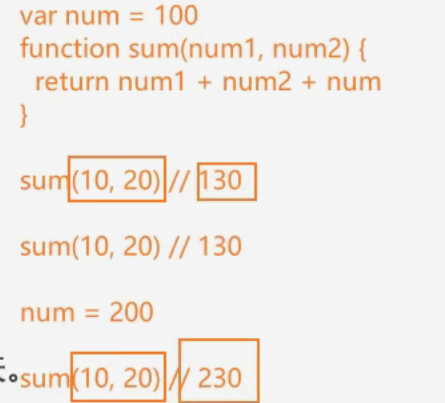
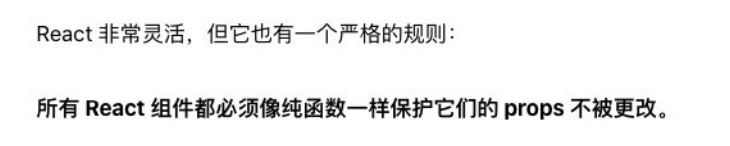

# 函数增强

### 函数自有属性

函数拥有两个自有属性，分别是name和length。

- name就是函数自身的名称，而length则是函数参数的个数。
- 函数也是对象类型 ，自身可以拥有属性(注意区分局部变量)
- 注意length是获取明确定义的传参的个数，而不是arguments的传参。
- 函数可以采用 `...args`剩余参数的形式定义传参，这个传参会被作为一个数组来使用。同样length属性不会计算`...args`的参数个数。
- 无论自定义的传参个数有多少，假设实际调用函数时传参个数超出定义参数个数，依然可以在**类数组对象**`arguments`里面获取所有的参数。

##  函数的传参

### 类数组Arguments的转换方法

方法一：使用`Array.from(arguments)`进行类数组转化为数组，以一个新数组的方式返回，不改变原有`arguments`的属性。

方法二：展开运算符`[...arguments]`可以转换类数组。

方法三：使用`slice()`方法将类数组转换为数组：

因为 `arguments` 是一个类数组对象，它具有数组的长度属性和索引，但并不是一个真正的数组，所以它没有数组的内置方法，比如 `slice()`。

因此，我们不能直接在 `arguments` 上调用 `slice()` 方法。

然而，我们可以通过 `apply()` 方法将 `slice()` 方法借用给 `arguments`。`apply()` 方法允许我们在一个不同的对象上调用一个方法或函数。在这个例子中，我们在 `arguments` 对象上调用了数组的 `slice()` 方法。

`[].slice.apply(arguments)` 的工作原理如下：

1. `[]` 创建一个新的空数组。
2. `.slice` 访问空数组的 `slice()` 方法，但并没有调用它（即没有使用括号 `()`）。
3. `.apply(arguments)` 使用 `apply()` 方法调用 `slice()` 方法，并将 `arguments` 对象作为上下文，这样 `slice()` 方法就会在 `arguments` 对象上执行，而不是在空数组上。

这样，我们就可以使用 `slice()` 方法将 `arguments` 对象转换为一个真正的数组。

**记住slice方法在截取数组的时候不会包含最后一个元素。**

### 箭头函数不绑定arguments

我们看下面这段代码：

```js
var bar=()=>{console.log(arguments)}
```

此代码会报错，不只是箭头函数不包含arguments的原因，它会继续沿着词法作用域向上查找，全局也没有arguments，所以会报错。

但是以下方法可以获取上层函数词法作用域的arguments:

```js
function foo(){
    //foo是存在arguments
    var bar=()=>{console.log(arguments)}
}
foo(111,222)
```

### 函数的剩余参数

```js
    // 剩余参数: rest parameters
    function foo(num1, num2, ...otherNums) {
      // otherNums数组
      console.log(otherNums)
    }

    foo(20, 30, 111, 222, 333)
```

ES6全新的语法——剩余参数！替代arguments！

**剩余参数是一个真正的数组，args可以被当做数组使用。**

我们可以使用剩余参数来指定实际调用函数时多余的传参，同时通过剩余传参传进来的参数类型属于一个数组，也就是 `otherNums`是一个数组。

同时我们可以直接使用`...args`来指定所有的传参(如果你打算结合不定数的参数来使用 `...args`，注意这里应该只使用`...args`，不能包含其它的指定形参)。

**注意事项：剩余参数应该写在函数指定传参的后面，也就是函数定义时传参的最后位置，不可以写在指定传参的前面。**

## JavaScript纯函数

### 纯函数的定义

- 此函数在相同的输入值时，需要产生相同的输出。

  很明显，如果一个函数的内部需要处理函数作用域外部的数据，比如闭包之类的，那么它就无法被定义为纯函数。

   

- 函数的输出和输入值应该和函数以外的其他隐藏信息或者状态无关，也和I/O设备产生的外部输入的值无关。
- 纯函数不允许存在可观察的函数副作用，比如触发事件等等。

#### 纯函数的精准定义

- **确定的输入，一定会产生确定的输出。**
- **函数在执行过程中，不能产生副作用。**

#### 什么是副作用？

计算机科学中的副作用表示 **在执行一个函数时**，除了**返回函数值以外**，还对**调用函数产生了附加的影响**。比如修改了**全局变量，修改参数或者改变了外部存储的某一些变量。**

```js
    function printInfo(info) {
      console.log(info.name, info.age, info.message)
      info.flag = "已经打印结束"
      address = info.address
    }

    var obj = {
      name: "why",
      age: 18,
      message: "哈哈哈哈"
    }

    printInfo(obj)
```

### 数组的slice和splice

数组的slice不会修改原数组，所以我们一般把数组的slice方法称之为纯函数。

而数组的splice方法会返回一个新的数组，**但与此同时也会修改原数组**，这种方法则不是纯函数。splice会传入两个参数，第一个是下标，代表开始删除的位置，第二个则是删除的个数。

### 纯函数的作用和优势

```js
    // 1.安心的写: 你不需要去关心外层作用域中的值, 目前是什么状态
    var counter = 0

    function add(num) {
      return num
    }

    // 2.安心的用: 调用函数时, 可以知道: 确定的输入一定产生确定的输出
    add(5) //5
    add(5) //5
```

因为你可以安心的编写和安心的使用； 

- 你在写的时候保证了函数的纯度，只是单纯实现自己的业务逻辑即可，不需要关心传入的内容是如何获得的或者依赖其他的 外部变量是否已经发生了修改； 

- 你在用的时候，你确定你的输入内容不会被任意篡改，并且自己确定的输入，一定会有确定的输出； 

  React中就要求我们无论是函数还是class声明一个组件，这个组件都必须像纯函数一样，保护它们的props不被修改：




## 函数的柯里化

函数的柯里化就是把接收多个参数的函数，变成**接收一个单一参数**的函数，并且**返回接受剩余的参数**，而且**返回结果的新函数**的技术。

### 总结定义

- 柯里化的过程就是只传递给函数一部分参数来调用它，让它返回一个函数去处理剩余的函数。
- 柯里化不会调用函数，它只是对函数进行转换。

```js
    function foo2(x) {
      return function(y) {
        return function(z) {
          console.log(x + y + z)
        }
      }
    }
```

### 函数柯里化的代码优化

```js
    // 另外一种写法: 箭头函数的写法
    // function foo3(x) {
    //   return y => {
    //     return z => {
    //       console.log(x + y + z)
    //     }
    //   }
    // }

    var foo3 = x => y => z => {
      console.log(x + y + z)
    }

    foo3(10)(20)(30)
```

### 自动柯里化函数

我们可以把函数作为参数，写作一个转化为柯里化函数的工具函数：

```js
function foo(x,y,z){
    console.log(x+y+z)
}
function hyCurrying(fn){
    function curryFn(...args){
        //两类操作
        //第一类:继续返回一个新的函数，继续接收参数
        //第二类:直接执行fn的函数
        
        //核心操作：判断传参的个数
        if(args.length>=fn.length){
            //执行第二类
           return fn(...args)
        }else{
           //传入参数个数少于函数指定参数个数
            return function(...newArgs){
               return curryFn(...args.concat(newArgs))
            }
            
        }
    }
    return curryFn()
}
//对其他函数进行柯里化
var fooCurry=hyCurrying(foo)
fooCurry(10)(20)(30)
```

`  fn(...args)`是一种展开运算符结合函数调用的方式，这里的`...args`不是剩余参数，而是展开了传参数组`args`，使得参数被完全展开调用。

```js
            return function(...newArgs){
                curryFn(...args.concat(newArgs))
            }
```

该函数的执行思路是提前预留一个函数，并且返回该函数，注意该函数尚未调用仅仅是定义，然后传入本次调用函数的参数(比方说是10)。

随后函数执行体里面包含了`curryFn`的调用，curryFn的参数包括了`...args`，这里就达成了一个闭包的应用条件，得以保留上次函数调用的`...args`。

#### 闭包效应

**闭包的特性允许函数保留创建它时的作用域，包括其中的变量和参数。**

当你调用 `fooCurry(10)(20)` 时，它又返回了一个新的函数 `curryFn`，这个函数的 `args` 被更新为 `[10, 20]`，主要是通过下面的代码实现了原有传参和新传参的合并操作。

```js
 return curryFn(...args.concat(newArgs))
```

`...args`能够得到保留和传参，完全是基于**闭包**的效果。

#### 返回值类型处理

如果我们面对的代码如下：

```js
    function sum(num1, num2) {
      return num1 + num2
    }
......
......
    var sumCurry = hyCurrying(sum)
    var sum5 = sumCurry(5)
    console.log(sum5(10))
    console.log(sum5(15))
    console.log(sum5(18))
```

这种函数的最终执行体是带有返回值的，所以我们需要为 ` fn(...args)`添加 `return`，来达到返回函数执行的返回结果的效果。

### apply&call

如果我们这里需要考虑this调用的问题，那么我们就需要对fn函数的调用进行apply绑定操作：

```js
    function hyCurrying(fn) {
      function curryFn(...args) {
        // 两类操作:
        // 第一类操作: 继续返回一个新的函数, 继续接受参数
        // 第二类操作: 直接执行fn的函数
        if (args.length >= fn.length) { // 执行第二类
          // return fn(...args)
          //考虑this
          return fn.apply(this, args)
        } else { // 执行第一类
          return function(...newArgs) {
            // return curryFn(...args.concat(newArgs))
            //考虑this
            return curryFn.apply(this, args.concat(newArgs))
          }
        }
      }

      return curryFn
    }

fooCurry(10)(20).apply('abc',30)
```

