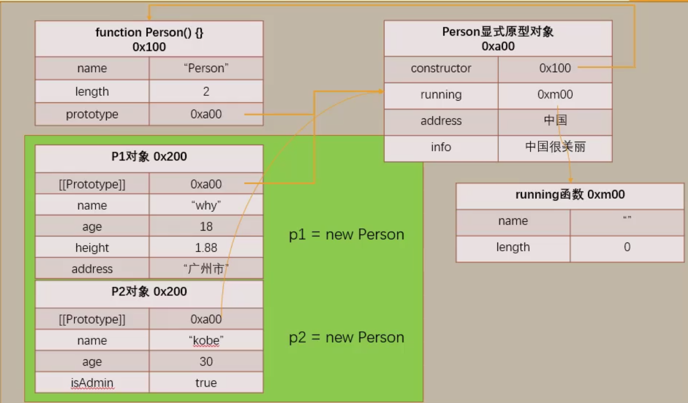
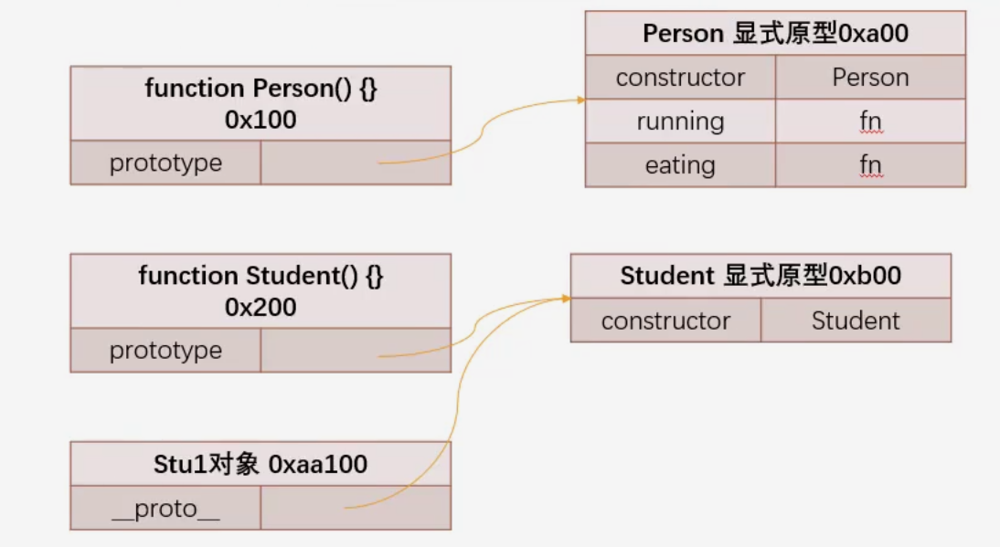
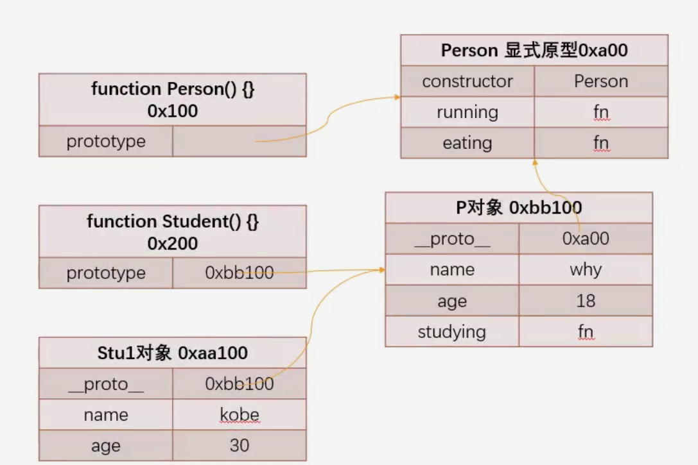

# 面向对象原型继承

## 对象的原型

JS中**每个对象**都有一个特殊的内置属性[[prototype]]，这个特殊的对象可以指向另外一个对象。

获取对象对应原型的标准方式是 `Object.getPrototypeOf(Obj)`，优先使用这种方式获取对象原型。

所有的对象都拥有自己的原型，默认指向自己的构造函数。

```js
      var obj = {
        name: "a",
        age: 18
      };

      /* 获取对象的原型 */
      //   非标准
      console.log(obj.__proto__);
      //   标准
      Object.getPrototypeOf(obj);
```

### 对象属性的查找

如果我们通过 引用对象的属性key来获取一个value时，其会触发对象访问描述符的`[[get]]`的操作。

它会优先在自己的对象之中查找，如果找到直接返回。

如果没有找到该属性，那么JS引擎会跑到这个对象的[[prototype]]内置属性指向的对象上的属性。

如果在原型对象上找不到，那么其会继续沿着原型链继续在其原型对象上查找，直到查找到Object原型对象。

如果最后始终没找到，则返回`undefined`。

 

## 函数的原型prototype

所有的函数都拥有一个prototype的属性，我们一般称之为显式原型。

prototype作为函数独有的属性，对象并不存在该属性。

### 显式原型

函数存在name,length和prototype属性，而prototype就是函数的显式原型。

如果函数在prototype上面添加了一个属性，就会导致所有由该函数构造而来的对象都会存在该属性。

### new操作符

我们在new 一个构造函数的时候，我们会执行以下步骤:

1. 创建对象
2. 将这个空对象赋值给this
3. 将函数的显示原型赋值给这个对象作为它的隐式原型
4. 执行函数体内的代码
5. 返回该对象

上述操作步骤的第三步，从代码角度来说就是将函数的`prototype`原型赋值给空的对象的`[[prototype]]`，也可以说是对象的`__proto__`。

函数原型存在的意义就是使构造函数创建出来的多个对象拥有共同的值(函数或者属性)，我们可以将它放在**构造函数的显式原型**上面，使得这个显式原型赋值给创建出来的对象的**隐式原型**。

**由构造函数创建出来的所有对象，都能够共享这些值。**

```js
    function Person(name, age) {
      this.name = name
      this.age = age
    }

    Person.prototype.running = function() {
      console.log(`${this.name} running~`)
    }

    Person.prototype.eating = function() {
      console.log(`${this.name} eating~`)
    }

    function Student(name, age, sno) {
      Person.call(this, name, age)
      this.sno = sno
    }

    Student.prototype = new Person()

    Student.prototype.studying = function() {
      console.log(`${this.name} studying`)
    }

    var stu = new Student("why", 18, 111)
    stu.running()
    stu.eating()
    stu.studying()
```

一般不要把属性作为共享使用的原型上面的值，因为属性一般作为对象/函数的私有属性，我们一般只共享函数。

#### constructor

prototype是一个原型对象，它的里面存在一个属性称之为 `constructor`。

默认情况下，函数的`prototype.constructor`指向函数本身(注意不是指向函数的显式原型prototype)，这是一层循环引用。


##  创建函数的内存表现

```js
    function Person(name, age) {
      this.name = name
      this.age = age
    }

    Person.prototype.running = function() {
      console.log("running~")
    }

    var p1 = new Person("why", 18)
    var p2 = new Person("kobe", 30)

    // 进行操作
    console.log(p1.name)
    console.log(p2.name)

    p1.running()
    p2.running()

    // 新增属性
    Person.prototype.address = "中国"
    p1.__proto__.info = "中国很美丽!"

    p1.height = 1.88
    p2.isAdmin = true

    // 获取属性
    console.log(p1.address)
    console.log(p2.isAdmin)
    console.log(p1.isAdmin)
    console.log(p2.info)

    // 修改address
    p1.address = "广州市"
    console.log(p2.address)

```

如果原型对象存在某个属性(`address`)，而对应的构造对象不存在该属性，那么执行 ` p1.address = "广州市"`的时候，它不不会去修改对应的原型对象上已有的属性，而是直接在构造对象上面创建该属性。

函数和显示原型都是一起创建出来的。



一旦变更原型对象，原有原型对象因为失去了关联索引就会被垃圾回收，但是请注意：**永远不要随便修改一个函数的原型对象**。

另外，使用 `Object.keys()`无法获取函数的prototype上面的 `constructor`，但是如果你更改了函数的 prototype指向对象，并且手动加了 `constructor`，是能够获取到 `constructor`。

如果你一定要更改prototype，那么你可以通过函数的属性描述符来添加 `constructor`。


# 面向对象的特性

## **继承**

继承就是从一个父类之中，通过继承对应的属性或方法来生成一个子类，来继承父类之中所有的属性和方法。

### 对象的原型链

```js
//1.{}的本质
var info = {}
//相当于
var info = new Object()
console.log(info.__proto__ === Object.prototype)
   // 查找顺序
    // 1.obj上面查找
    // 2.obj.__proto__上面查找
    // 3.obj.__proto__.__proto__ -> null 上面查找(undefined)
```

字面量创建一个空对象等效于 `new Object()`，而`Object`函数的prototype是原型链上面顶级的原型对象。

`Object.prototype.__proto__`最终指向null，这是一切原型链的查找终点。

如果我们对现有代码进行改造，变更`obj.__proto__`的指向对象，原有的原型链关联就会被切断。 

但是如果查找在`obj.__proto`__依然找不到需要的属性时，它会继续沿着`obj.__proto__`继续查找，实际上还是返回到了`Object.prototype`上面沿着原有的原型链继续查找。

  实际上`__proto__`是一个非常脆弱的属性 ，因为我们可以随意变更该属性。

```js
    // 3.对现有代码进行改造
    obj.__proto__ = {
      // message: "Hello aaa"
    }

    obj.__proto__.__proto__ = {
      message: "Hello bbbb"
    }

    obj.__proto__.__proto__.__proto__ = {
      message: "Hello ccc"
    }

    console.log(obj.message)
```

### 默认方法继承关系



### 借用构造函数继承

```js
    // 定义Person构造函数(类)
    function Person(name, age, height, address) {
      this.name = name
      this.age = age
      this.height = height
      this.address = address
    }

    Person.prototype.running = function() {
      console.log("running~")
    }
    Person.prototype.eating = function() {
      console.log("eating~")
    }

    // 定义学生类
    function Student(name, age, height, address, sno, score) {
      // 重点: 借用构造函数
      Person.call(this, name, age, height, address)
      // this.name = name
      // this.age = age
      // this.height = height
      // this.address = address

      this.sno = sno
      this.score = score
    }

    // 方式一: 父类的原型直接赋值给子类的原型
    // 缺点: 父类和子类共享通一个原型对象, 修改了任意一个, 另外一个也被修改
    // Student.prototype = Person.prototype

    // 方式二: 创建一个父类的实例对象(new Person()), 用这个实例对象来作为子类的原型对象
    var p = new Person("why", 18)
    Student.prototype = p

    // Student.prototype.running = function() {
    //   console.log("running~")
    // }
    // Student.prototype.eating = function() {
    //   console.log("eating~")
    // }
    Student.prototype.studying = function() {
      console.log("studying~")
    }

    // 创建学生
    var stu1 = new Student("kobe", 30, 111, 100)
    var stu2 = new Student("james", 25, 111, 100)
    stu1.running()
    stu1.studying()

    console.log(stu1.name, stu1.age)
    console.log(stu1)
    console.log(stu2.name, stu2.age)
```

`  Person.call(this, name, age, height, address)`，我们在 `new Student()`的时候，会把空对象赋值this，我们在调用`Person`的时候，利用call方法把this指定给`stu`对象。



#### 借用构造函数继承的缺陷

1.在这种调用方式中，会调用两次父类构造函数

- 一次是创建子类原型`var p = new Person("why", 18)`时，一次是在子类构造函数内部利用call调用。

2.创建出来的stu1或者stu2子类实例，事实上都会拥有两个父类的属性。

- 每个`Student`实例都会有`Person`的属性（通过`Person.call(this, name, age, height, address)`继承）和`Student`自己的属性（`sno`和`score`）。
- 当我们创建一个新的`Student`实例时，我们首先调用`Person`构造函数，将`Person`的属性复制到新的`Student`实例中。然后，我们添加`Student`特有的属性。
- 这样，每个`Student`实例都会有`Person`的属性（`name`、`age`、`height`和`address`）和`Student`自己的属性（`sno`和`score`）。这就是为什么说每个`Student`实例都会拥有两个父类的属性。
- 同时，通过`Student.prototype = p`，`Student`实例也会继承`Person`原型上的方法（`running`和`eating`），并且`Student`原型上的方法（`studying`）也会被`Student`实例继承。

###  寄生组合式继承

正常来说，我们期望Student拥有自己的显式原型，同时它的隐式原型指向Person，而且我们不希望得到 `Student.prototype = p`这种奇怪的调用法则。

我们应该满足一下三个条件：

1. 必须创建一个对象
2. 这个对象的隐式原型必须指向父类的显式原型
3. 将这个对象赋值给子类的显式原型

我们可以利用 `Object.setPrototypeOf(目标对象，原型对象)`来为目标对象的`prototype`设置一个函数的显式原型，通常目标对象是一个空对象。

我们可以引申出一个做法，那就是使用 `Object.create(原型对象)`。

```js
    function createObject(o) {
      function F() {}
      F.prototype = o
      return new F()
    }

    // 将Subtype和Supertype联系在一起
    // 寄生式函数
    function inherit(Subtype, Supertype) {
      Subtype.prototype = createObject(Supertype.prototype)
      Object.defineProperty(Subtype.prototype, "constructor", {
        enumerable: false,
        configurable: true,
        writable: true,
        value: Subtype
      })
    }

    /*
    满足什么条件:
      1.必须创建出来一个对象
      2.这个对象的隐式原型必须指向父类的显式原型
      3.将这个对象赋值给子类的显式原型
    */
    function Person(name, age, height) {}
    function Student() {}

    inherit(Student, Person)
    
    // 1.之前的做法: 但是不想要这种做法
    // var p = new Person()
    // Student.prototype = p

    // 2.方案一:
    var obj = {}
    // obj.__proto__ = Person.prototype
    Object.setPrototypeOf(obj, Person.prototype)
    Student.prototype = Person.prototype

    // 3.方案二:
    // function F() {}
    // F.prototype = Person.prototype
    // Student.prototype = new F()

    // 4.方案三:
    var obj = Object.create(Person.prototype)
    console.log(obj.__proto__ === Person.prototype)
    Student.prototype = obj
```

### 最终兵器继承方案

```js
    // 寄生组合式继承
    // 原型链/借用/原型式(对象之间)/寄生式函数
    function Person(name, age, height) {
      this.name = name
      this.age = age
      this.height = height
    }

    Person.prototype.running = function() {
      console.log("running~")
    }
    Person.prototype.eating = function() {
      console.log("eating~")
    }


    function Student(name, age, height, sno, score) {
      Person.call(this, name, age, height)
      this.sno = sno
      this.score = score
    }

    inherit(Student, Person)
    Student.prototype.studying = function() {
      console.log("studying")
    }

    // 创建实例对象
    var stu1 = new Student("why", 18, 1.88, 111, 100)
```

```js
//inherit.js 
	function createObject(o) {
      function F() {}
      F.prototype = o
      return new F()
    }

    // 将Subtype和Supertype联系在一起
    // 寄生式函数
    function inherit(Subtype, Supertype) {
      Subtype.prototype = createObject(Supertype.prototype)
      Object.defineProperty(Subtype.prototype, "constructor", {
        enumerable: false,
        configurable: true,
        writable: true,
        value: Subtype
      })
    }
```


## 封装

我们将属性和方法封装到一个类(或者是构造函数)中，可以称之为封装，以此来批量生成拥有相同属性或方法的对象。

## 多态

不同的对象在执行时表现出不同的形态。

总结来说，就是不同的数据类型进行同一个操作，表现出不同的行为，就是一种多态的表现。

```js
    // 继承是多态的前提
    // shape形状
    class Shape {
      getArea() {}
    }

    class Rectangle extends Shape {
      constructor(width, height) {
        super()
        this.width = width
        this.height = height
      }

      getArea() {
        return this.width * this.height
      }
    }

    class Circle extends Shape {
      constructor(radius) {
        super()
        this.radius = radius
      }

      getArea() {
        return this.radius * this.radius * 3.14
      }
    }

    var rect1 = new Rectangle(100, 200)
    var rect2 = new Rectangle(20, 30)
    var c1 = new Circle(10)
    var c2 = new Circle(15)

    // 表现形式就是多态
    /*
      在严格意义的面向对象语言中, 多态的是存在如下条件的:
        1.必须有继承(实现接口)
        2.必须有父类引用指向子类对象
    */
    function getShapeArea(shape) {
      console.log(shape.getArea())
    }

    getShapeArea(rect1)
    getShapeArea(c1)
```

在上述代码中，`getShapeArea`接收一个参数，这个参数我们可以传入代表不同形状的对象实例，而不同形状的对象实例对应的类存在继承关系，这就符合了实现多态的条件。

实际上，JS基于其灵活的语言风格，处处都是多态。


# 面向对象的ES6继承

## 原型继承关系

我们需要明确一点，那就是函数 `function` 实际上是 `Function`所构造出来的实例，这是一种全局类型的函数类型对象，和`Object`和`Array`是相似的。

所以，我们创建的函数的隐式原型(具体表现为`fn.__proto__`)实际关联的是 `Function.prototype`。

同时，`Function.prototype`的隐式原型实际指向的也是 `Object.prototype`。

`Object`作为一个函数对象，它也有自己的隐式原型(具体表现为`Object.__proto__`)，而它的隐式原型指向了 `Function.prototype`,因为我们创建对象的过程其实等效于 `new Object()`，`Object`作为函数的显式原型指向自己的`prototype`，而同时作为对象的隐式原型指向`Function.prototype`。

`Object`既然可以被作为函数使用，那就说明了它也是由`Function`构造而成的，两者的原型链互相构造关联关系。

**总结：`Object`是Function的父类，而`Function`是`Object`的构造函数。**


**请记住，函数对象既存在显式原型，也存在隐式原型。**

**所有的普通对象只存在隐式原型，它们的隐式原型的终点必然是`Object`的显式原型`Object.prototype`。**


### 误区

如果一个函数没有定义某个内部方法，而函数的显式原型则定义了该方法，直接从函数上获取该内部方法，是无法获取到该内部方法的。

```js
function foo(age){
this.age=age
}
foo.prototype.running=function(){
  console.log("running")
}
foo.running() //TypeError: foo.running is not a function
```

只有建立在基于该构造函数构建的实例上，才能够通过隐式原型`[[prototype]]`原型链获取该方法。

没有实例对象的情况下，不可以通过函数直接调用函数的显式原型上的方法，上面的方法一般称之为实例方法。


# Class类


## 类的定义

当我们默认去调用new class类来创建对象时，如果希望能够传入参数来进行构建，我们需要通过自定义class类的`constructor()`方法来进行构建。

```js
    // 编程: 高内聚低耦合
    class Person {
      // 1.类中的构造函数
      // 当我们通过new关键字调用一个Person类时, 默认调用class中的constructor方法
      constructor(name, age) {
        this.name = name
        this.age = age
      }

      // 2.实例方法
      // 本质上是放在Person.prototype
      running() {
        console.log(this.name + " running~")
      }
      eating() {
        console.log(this.name + " eating~")
      }
    }

    // 创建实例对象
    var p1 = new Person("why", 18)

    // 使用实例对象中属性和方法
    console.log(p1.name, p1.age)
    p1.running()
    p1.eating()
```

class类没有必要区分定义显式原型和内部方法，统一使用类里面的实例方法即可，**class内部的方法本质上存放于`Person`的`prototype`**。

所以同理，我们一样无法通过`Person`直接获取其实例方法，必须借助实例对象或者`Person.prototype`来获取对应的实例方法。


### 总结

如果我们希望在创建对象的时候给类传递一些参数，这个时候应该如何做呢？

- 每个类都可以有一个自己的构造函数（方法），这个方法的名称是固定的constructor；
- **当我们通过new操作符，操作一个类的时候会调用这个类的构造函数constructor；**
- 每个类只能有一个构造函数，如果包含多个构造函数，那么会抛出异常；

**当我们通过new关键字操作类的时候，会调用这个constructor函数，并且执行如下操作：**

1. 在内存中创建一个新的对象（空对象）；
2. 这个对象内部的[[prototype]]属性会被赋值为该类的prototype属性；
3. 构造函数内部的this，会指向创建出来的新对象；
4. 执行构造函数的内部代码（函数体代码）；
5. 如果构造函数没有返回非空对象，则返回创建出来的新对象；


## class和function的区别

class实际上是function类的一种语法糖，本质上就是function，这也是为什么JS里面不存在所谓的类。

```js
    // function定义类
    function Person1(name, age) {
      this.name = name
      this.age = age
    }

    Person1.prototype.running = function() {}
    Person1.prototype.eating = function() {}

    var p1 = new Person1("why", 18)
    console.log(p1.__proto__ === Person1.prototype)
    console.log(Person1.prototype.constructor)
    console.log(typeof Person1) // function

    // 不同点: 作为普通函数去调用
    Person1("abc", 100)

    // class定义类
    class Person2 {
      constructor(name, age) {
        this.name = name
        this.age = age
      }

      running() {}
      eating() {}
    }

    var p2 = new Person2("kobe", 30)
    console.log(p2.__proto__ === Person2.prototype)
    console.log(Person2.prototype.constructor)
    console.log(typeof Person2)

    // 不同点: class定义的类, 不能作为一个普通的函数进行调用
    Person2("cba", 0)
```

实际上我们实现 `typeof Class类`获取的就是一个 `function`，这说明了**class类本质上就是一个`function`**。

**它们两者的区别在于class类不可以作为普通函数来进行调用，只能够通过new来作为构造函数来调用。**


### 类的访问器方法

```js
    class Rectangle {
      constructor(x, y, width, height) {
        this.x = x
        this.y = y
        this.width = width
        this.height = height
      }

      get position() {
        return { x: this.x, y: this.y }
      }

      get size() {
        return { width: this.width, height: this.height }
      }
    }

    var rect1 = new Rectangle(10, 20, 100, 200)
    console.log(rect1.position)
    console.log(rect1.size)
```

我们可以直接利用get来定义类内部的部分访问器方法，就可以直接获取对应的封装对象。

它和常规定义类内部方法的区别在于它是以属性的方式进行获取，而非以函数的方法进行调用。


### 类的静态方法

静态方法可以不通过实例，通过一个关键字`static`来实现类似于在函数里面直接定义方法的效果：

```js
    var names = ["abc", "cba", "nba", "mba"]
    class Person {
      constructor(name, age) {
        this.name = name
        this.age = age
      }

      // 实例方法
      running() {
        console.log(this.name + " running~")
      }
      eating() {}

      // 类方法(静态方法)
      static randomPerson() {
        console.log(this)
        var randomName = names[Math.floor(Math.random() * names.length)]
        return new this(randomName, Math.floor(Math.random() * 100))
      }
    }
    var p1 = new Person()
    p1.running()
    p1.eating()
    var randomPerson = Person.randomPerson()
    console.log(randomPerson)
```

在类中调用`this`实际上指向类本身，这意味着你可以使用`new this`来替代`new Person`。


## 类的继承extends

我们可以通过`extends`关键字来实现类之间的继承，如果希望能够继承属性，我们还需要进行传参的定义，并且需要在`constructor(){...}`里面定义`super(传参)`来实现类之间参数的继承。

```js
    // 定义父类
    class Person {
      constructor(name, age) {
        this.name = name
        this.age = age
      }

      running() {
        console.log("running~")
      }
      eating() {
        console.log("eating~")
      }

    }

    class Student extends Person {
      constructor(name, age, sno, score) {
        // this.name = name
        // this.age = age
        super(name, age)
        this.sno = sno
        this.score = score
      }

      // running() {
      //   console.log("running~")
      // }
      // eating() {
      //   console.log("eating~")
      // }

      studying() {
        console.log("studying~")
      }
    }

    var stu1 = new Student("why", 18, 111, 100)
    stu1.running()
    stu1.eating()
    stu1.studying()
```


### super关键字

请注意，在 `constructor`里面调用super关键字时，务必在使用this之前先利用super调用需要继承的属性。

super的使用位置有以下三个：

1. 子类的构造方法
2. 实例方法
3. 静态方法

super最关键的定义还是子类的构造方法，我们常用super来实现类之间属性的继承


#### 子类重写父类方法

我们可以通过extends继承父类后，在子类中重新编写父类内部的方法，实现对父类方法的重写，这种重写不会影响父类原本的方法定义，同时重写分为完全重写和部分重写，我们可以看一下完全重写的代码：

```js
    class Student extends Person {
      constructor(name, age, sno, score) {
        // this.name = name
        // this.age = age
        super(name, age)
        this.sno = sno
        this.score = score
      }
//直接重新定义Person中的running方法
      running(){}
    }
```

如果我们需要部分重写方法，我们只需要先重新定义父类中的方法操作，然后写入我们希望自定义的某些代码片段，然后在重定义的方法**内部**通过super调用方法来实现父类方法的全部继承：

```js
    class Animal {
      running() {
        console.log("running")
      }
      eating() {
        console.log("eating")
      }

      static sleep() {
        console.log("static animal sleep")
      }
    }

    class Dog extends Animal {
      // 子类如果对于父类的方法实现不满足(继承过来的方法)
      // 重新实现称之为重写(父类方法的重写)
      running() {
        console.log("dog四条腿")
        // 调用父类的方法
        super.running()
        // console.log("running~")
        // console.log("dog四条腿running~")
      }

      static sleep() {
        console.log("趴着")
        super.sleep()
      }
    }
```

同样的，可以通过上面的代码得知：子类也可以通过super来实现父类的静态方法的继承。


## 继承内部方法

如果我们期望通过继承内置类，既获取了内置类的内部方法，又扩展了部分自定义的方法，那我们也可以通过继承内部类并且结合自定义部分方法来实现：

```js
    // 1.创建一个新的类, 继承自Array进行扩展
    class HYArray extends Array {
      get lastItem() {
        return this[this.length - 1]
      }

      get firstItem() {
        return this[0]
      }
    }

    var arr = new HYArray(10, 20, 30)
    console.log(arr)
    console.log(arr.length)
    console.log(arr[0])
    console.log(arr.lastItem)
    console.log(arr.firstItem)

    // 2.直接对Array进行扩展
    Array.prototype.lastItem = function() {
      return this[this.length - 1]
    }

    var arr = new Array(10, 20, 30)
    console.log(arr.__proto__ === Array.prototype)
    console.log(arr.lastItem())
```

