# 异步函数

## 异步请求代码结构

我们之前处理函数内部的异步请求/处理完成后的回调往往是通过回调函数或者Promise来完成的：

```js
     // 1.设计这样的一个函数
    function execCode(counter, successCallback, failureCallback) {
      // 异步任务
      setTimeout(() => {
        if (counter > 0) { // counter可以计算的情况 
          let total = 0
          for (let i = 0; i < counter; i++) {
            total += i
          }
          // 在某一个时刻只需要回调传入的函数
          successCallback(total)
        } else { // 失败情况, counter有问题
          failureCallback(`${counter}值有问题`)
        }
      }, 3000)
    }

    // 2.ES5之前,处理异步的代码都是这样封装
    execCode(100, (value) => {
      console.log("本次执行成功了:", value)
    }, (err) => {
      console.log("本次执行失败了:", err)
    })
```

```javascript
    function execCode(counter) {
      const promise = new Promise((resolve, reject) => {
        // 异步任务
        setTimeout(() => {
          if (counter > 0) { // counter可以计算的情况 
            let total = 0
            for (let i = 0; i < counter; i++) {
              total += i
            }
            // 成功的回调
            resolve(total)
          } else { // 失败情况, counter有问题
            // 失败的回调
            reject(`${counter}有问题`)
          }
        }, 3000)
      })
      
      return promise
    }

    execCode(255).then(value => {
      console.log("成功:", value)
    }).catch(err => {
      console.log("失败:", err)
    })

```

普通的回调函数需要我们在调用函数的时候，为其定义一个成功回调或者失败回调，而Promise调用则是需要构造一个Promise函数，并异步地通过thenable输出其决议结果。

如果我们应用网络请求来解决异步处理，我们常常会设计一个函数，里面会返回一个Promise请求的结果。

而我们通常把网络请求放在Promise的内部来处理，等待网络请求回调输出以后，再通过thenable输出请求结果。

我们可以利用Promise的特性，在外层实现层层的thenable输出和调用，避免在请求的thenable内部形成回调地狱。

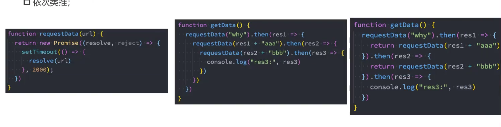

如果我们期望进一步进行优化，那么我们可以采用 `async await`的方式来优化链式调用的请求结构。

但是在此之前，我们应该回顾一下生成器的操作方式：

```javascript
// 封装请求的方法：url=>promise(result)
function requestData(value) {
  return new Promise(resolve => {
    setTimeout(() => {
      resolve(value);
    }, 2000);
  });
}

function* getData() {
  const res1 = yield requestData("a");
  const res2 = yield requestData(res1 + "b");
  const res3 = requestData(res2 + "c");
  console.log(res3);
}

const generator = getData();
generator.next().value.then(res => {
  //   console.log("res1:", res);
  // 把res1传递给generator继续向下执行，作为参数传递给下面的yield
  generator.next(res1).value.then(res2 => {
    generator.next(res2).value.then(res3 => {
      generator.next(res3);
    });
  });
});

```

我们可以利用生成器的特性，在每一次的异步请求中将执行的结果作为参数传递给下一次`next()`执行的参数，传递给生成器的执行过程中，作为下一个`yield`的传参。

接下来，我们会对上一段代码利用`async/await`生成最终版本：

```javascript
// 封装请求的方法：url=>promise(result)
function requestData(value) {
  return new Promise(resolve => {
    setTimeout(() => {
      resolve(value);
    }, 2000);
  });
}

async function getData() {
  const res1 = await requestData("a");
  const res2 = await requestData(res1 + "b");
  const res3 = await requestData(res2 + "c");
  console.log(res3);
}
```

## 异步函数的返回值

异步函数存在返回值：

1. 异步函数可以有返回值，但是异步函数的返回值相当于被包裹在了`Promise.resolve`里面。
2. 如果我们的异步函数的返回值是Promise，状态将由Promise来决定。
3. 如果异步函数的返回值是一个对象并且实现了thenable，那么会由对象的then方法来决定。

```js
async function foo2() {
  // 1.返回一个普通的值
  // => Promise.resolve(100)
  // return ['111','222','333']

  // 2.返回一个Promise实例
  //   return new Promise((resolve, reject) => {
  //     setTimeout(() => {
  //       resolve("bbb");
  //     }, 3000);
  //   });

  // 3.返回一个thenable对象
  return {
    then: function (resolve, reject) {
      setTimeout(() => {
        resolve("ccc");
      }, 3000);
    }
  };
}
foo2.then(res => {
  console.log(res);
});

```

## 异步函数异常处理

和普通函数不一样，如果异步函数产生异常，那么它的输出能够通过 `catch`进行错误的捕获和处理，而不是直接抛到浏览器报错：

```javascript
// 如果异步函数中存在一个异常，这个异常不会被浏览器立即处理
// 它会进行一个如下处理：Promise.reject(error)
async function foo2() {
  console.log("aaaa");
    console.log("bbbb");
    // 异常错误
    "abc".filter()
  console.log("cccc");

  return 123;
}
foo2
  .then(res => {
    console.log(res);
  })
  .catch(err => {
    console.log(err);
  });

```

这意味着我们可以继续执行后续的代码，当然我们也可以通过 `throw new Error()`手动来抛出异常。


# async/await

## await关键字的使用

await后面通常跟的是表达式，跟着一个普通的值没有太大的意义。

await后面的表达式如果是一个Promise，await才会发挥它的作用。

**await会等待Promise的状态变成fullfilled，获取到对应的决议值后才会继续执行后续的代码。**

```javascript
    // 2.await关键字
    // await条件: 必须在异步函数中使用
    function bar() {
      console.log("bar function")
      return new Promise(resolve => {
        setTimeout(() => {
          resolve(123)
        }, 100000)
      })
    }

    async function foo() {
      console.log("-------")
      // await后续返回一个Promise, 那么会等待Promise有结果之后, 才会继续执行后续的代码
      const res1 = await bar()
      console.log("await后面的代码:", res1)
      const res2 = await bar()
      console.log("await后面的代码:", res2)

      console.log("+++++++")
    }

    foo()
```

如果await后面的Promise决议是一个rejected，那么整个async函数就会抛出一个异常，我们可以通过catch来捕获async函数抛出的异常：

```javascript
    function requestData(url) {
      return new Promise((resolve, reject) => {
        setTimeout(() => { 
           reject("error message")
        }, 2000);
      })
    }

    async function getData() {
      //出现异常则会抛出给外层的catch进行捕获
      const res1 = await requestData("why")
      console.log("res1:", res1)

      const res2 = await requestData(res1 + "kobe")
      console.log("res2:", res2)
    }

    getData().catch(err => {
      console.log("err:", err)
    })
```


# 进程和线程

进程（process）：计算机已经运行的程序，是操作系统管理程序的一种方式；  

线程（thread）：操作系统能够运行运算调度的最小单位，通常情况下它被包含在进程中；

每个程序至少有一个进程，因为程序可能是多进程的。

**我们进一步加强理解：**

- 进程：我们可以认为，启动一个应用程序，就会默认启动一个进程（也可能是多个进程）； 
- 线程**：每一个进程中，都会启动至少一个线程用来执行程序中的代码**，这个线程被称之为主线程；
- 所以我们也可以说进程是线程的容器； 

再用一个形象的例子解释： 

- 操作系统类似于一个大工厂；
- 工厂中里有很多车间，这个车间就是进程；
- 每个车间可能有一个以上的工人在工厂，这个工人就是线程；

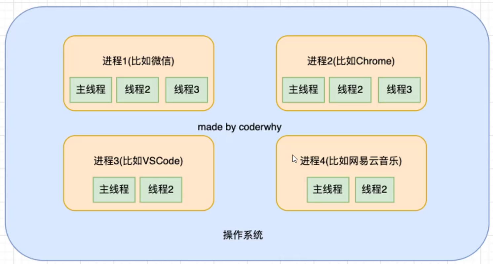


# 事件循环

## 浏览器的事件循环

JavaScript实际上是单线程的，JS的线程应该有自己的容器：浏览器或者Node。

 浏览器是一个多进程的程序，常常以网页的数量来量化进程的数量。

每个进程中又包括了多个线程，在这多个线程中，有一个线程是专门用于处理JS代码的。

所以真正耗时的操作，实际上并不是由JavaScript线程在执行的： 

- 浏览器的每个进程是多线程的，那么其他线程可以来完成这个耗时的操作； 
- 比如网络请求、定时器，我们只需要在特性的时候执行应该有的回调即可；

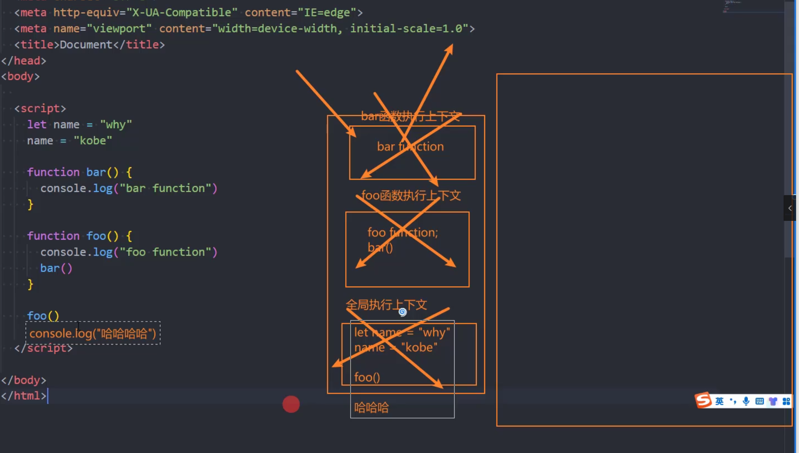

执行上下文栈会按顺序单次执行各个代码，不会出现同时执行多个代码，这就是为什么JS是单线程执行的。

如果我们碰见了一个定时器，那么这个定时器就会开始计时，**这一类延迟执行的代码不会由JS来执行，而是由浏览器来执行，JS会继续向下执行后续的代码。**


比如说一个setTimeOut定时器，其拥有两个函数，setTimeOut作为第一个函数其实是浏览器提供的函数，由浏览器的其它线程来执行。

```javascript
    console.log("Hello World")
    let message = "aaaa"
    message = "bbbb"

    setTimeout(() => {
      console.log("10s后的setTimeout")
    }, 0);

    console.log("Hello JavaScript")
    console.log("代码继续执行~~~")
    console.log("-------------")
```

- 中间我们插入了一个setTimeout的函数调用； 
- 这个函数被放到入调用栈中，执行会立即结束，并不会阻塞后续代码的执行；

而setTimeOut在内存中的表现是setTimeOut的执行上下文会被浏览器的其它线程接手，随后setTimeOut被执行上下文栈弹出。

在计时结束后，setTimeOut内部的回调函数会被放入一个独立的队列结构(queue)里面，这个队列我们称之为 **事件队列**。(注意这个操作是在时间结束以后才操作。)

**队列结构的特点就是：先进先出。**

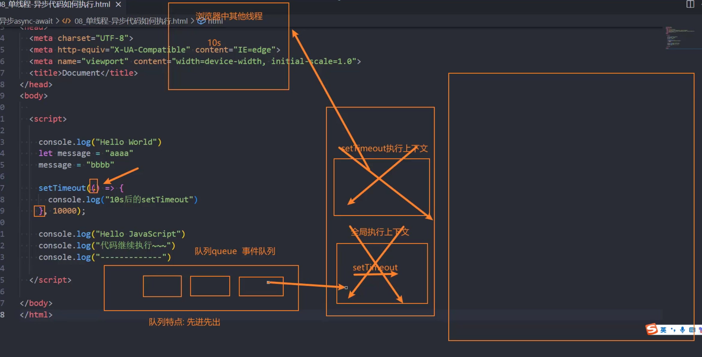

 也就是整个代码执行顺序就是依次往下执行，碰到定时器时则交给浏览器其它线程处理。

然后主线程代码会继续向下执行。时间到了以后setTimeOut内部的函数会被塞入事件队列，等待主线程代码执行完毕后，**依据先进先出原则取出到执行上下文栈执行。**

**事件队列里面的代码，必须等待主线程代码执行完成以后才会执行。**

同时请注意:事件的触发回调也会被浏览器加入事件队列，比如浏览器的按钮点击的回调事件：

```javascript
    const btn = document.querySelector("button")
    btn.onclick = function() {
      console.log("btn click event")
    }
```

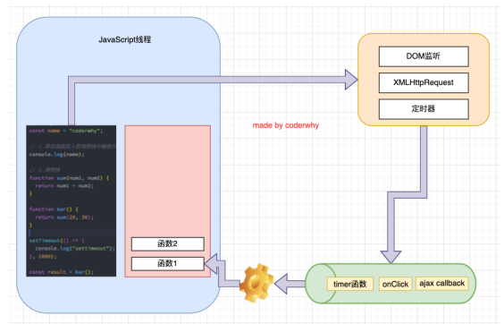


## 宏任务和微任务

```javascript
    console.log("script start")

    // function bar() {
    //   console.log("bar function")
    // }

    // function foo() {
    //   console.log("foo function")
    //   bar()
    // }
    // foo()

    // 定时器
    setTimeout(() => {
      console.log("setTimeout0")
    }, 0)
    setTimeout(() => {
      console.log("setTimeout1")
    }, 0)

    // Promise中的then的回调也会被添加到队列中
    console.log("1111111")
    new Promise((resolve, reject) => {
      console.log("2222222")
      console.log("-------1")
      console.log("-------2")
      resolve()
      console.log("-------3")
    }).then(res => {
      console.log("then传入的回调: res", res)
    })
    console.log("3333333")

    console.log("script end")

```

Promise的回调函数会在主线程中执行，但是thenable里面的执行代码会被放入事件队列中执行，thenable是一个微任务。

直到执行上下文栈里面主线程的任务被清空以后，才会执行事件队列里面的任务。

而setTimeOut则是一个宏任务(macrotask)，它会等待**主线程任务+微任务**执行完成之后，才会在下一轮执行。

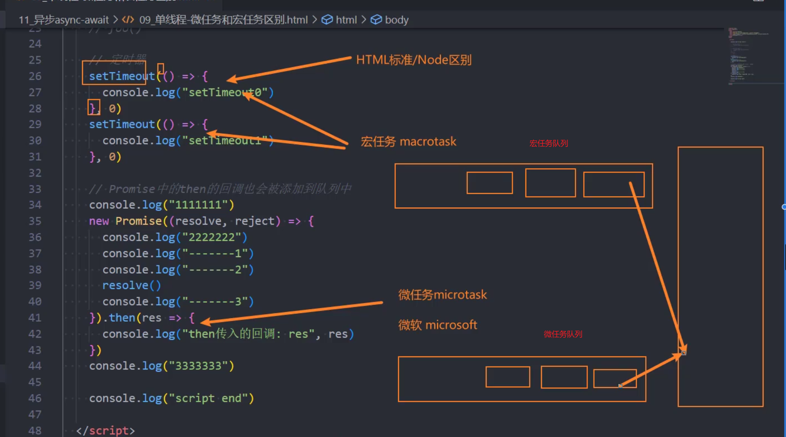

宏任务和微任务都会产生独立的队列：

- 宏任务队列（macrotask queue）：**ajax、setTimeout、setInterval、DOM监听**、UI Rendering等 
- 微任务队列（microtask queue）：**Promise的then回调**、 Mutation Observer API、queueMicrotask()等


**那么事件循环对于两个队列的优先级是怎么样的呢？** 

1. main script中的代码优先执行（编写的顶层script代码）； 

2. 在执行任何一个宏任务之前（不是队列，是一个宏任务），都会先查看微任务队列中是否有任务需要执行 

   ✓ 也就是宏任务执行之前，必须保证微任务队列是空的；

   ✓ 如果不为空，那么就优先执行微任务队列中的任务（回调）；

**总结：在执行宏任务队列之前，必须保证微任务队列被清空后，才能执行宏任务队列。**


### 面试题一

```javascript
    console.log("script start")

    setTimeout(function () {
      console.log("setTimeout1");
      new Promise(function (resolve) {
        resolve();
      }).then(function () {
        new Promise(function (resolve) {
          resolve();
        }).then(function () {
          console.log("then4");
        });
        console.log("then2");
      });
    });

    new Promise(function (resolve) {
      console.log("promise1");
      resolve();
    }).then(function () {
      console.log("then1");
    });

    setTimeout(function () {
      console.log("setTimeout2");
    });

    console.log(2);

    queueMicrotask(() => {
      console.log("queueMicrotask1")
    });

    new Promise(function (resolve) {
      resolve();
    }).then(function () {
      console.log("then3");
    });

    console.log("script end")
```

本轮面试题的核心在于在setTimeOut2执行之前，setTimeOut1内部的微任务必须全部执行完成后，才会选择执行setTimeOut2里面的代码。

**无论本轮宏任务内部的微任务有多少轮，都必须把微任务彻底执行完毕后，才能执行下一轮宏任务。**

### 面试题二

```javascript

    async function async1 () {
      console.log('async1 start')
      await async2();
      console.log('async1 end')
    }

    async function async2 () {
      console.log('async2')
    }

    console.log('script start')

    setTimeout(function () {
      console.log('setTimeout')
    }, 0)
    
    async1();
    
    new Promise (function (resolve) {
      console.log('promise1')
      resolve();
    }).then (function () {
      console.log('promise2')
    })

    console.log('script end')
```

本轮面试题的关键在于`async2()`会在第一轮执行中被执行，而`await async2()`后面的 ` console.log('async1 end')`会被放入微任务队列。

之所以会出现这样的现象，本质原因就是await后面的表达式是一个async函数，它被await激发后，它的内部会默认返回一个 `return undefined=>Promise.resolve(undefined)`。

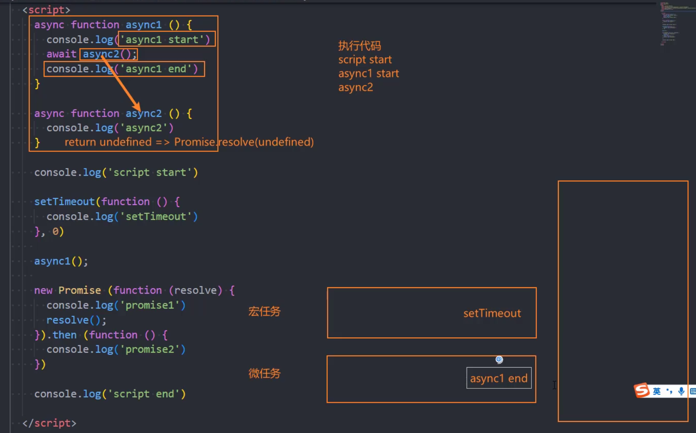


### 面试题三

第二轮宏任务执行，注意本段代码是下面改进代码的初始版本：

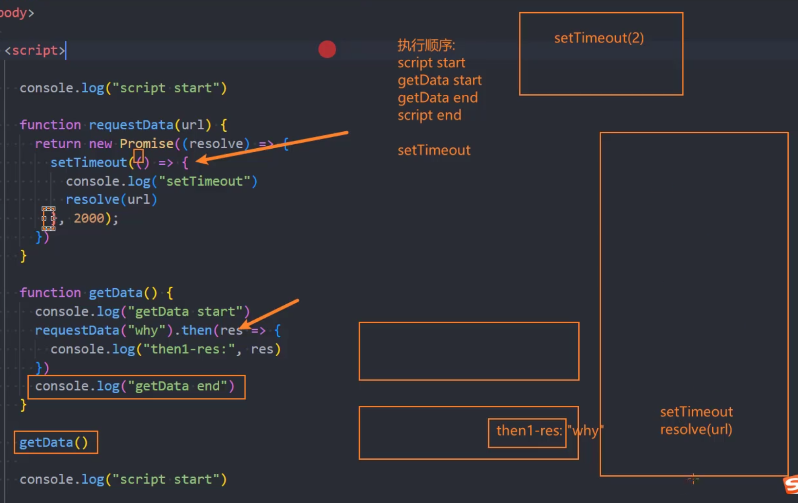

改进后的代码：

```javascript
<!DOCTYPE html>
<html lang="en">
<head>
  <meta charset="UTF-8">
  <meta http-equiv="X-UA-Compatible" content="IE=edge">
  <meta name="viewport" content="width=device-width, initial-scale=1.0">
  <title>Document</title>
</head>
<body>
  
  <script>

    console.log("script start")

    function requestData(url) {
      console.log("requestData")
      return new Promise((resolve) => {
        setTimeout(() => {
          console.log("setTimeout")
            //关键中的关键，重点中的重点(下面这行会决定了await后面的代码将作为其resolve()的结果输出thenable回调，必须强制等待)
          resolve(url)
        }, 2000);
      })
    }

    // 2.await/async
    async function getData() {
      console.log("getData start")
      const res = await requestData("why")
      
      console.log("then1-res:", res)
      console.log("getData end")
    }

    getData()
    
    console.log("script end")

    // script start
    // getData start
    // requestData
    // script end

    // setTimeout

    // then1-res: why
    // getData end

  </script>

</body>
</html>
```

本轮面试题的关键在于 `requestData(url)`里面是一个setTimeOut，所以导致了它的thenable在第一轮执行中不会被加入微任务队列，必须等到setTimeOut的定时器到期后，才会把内部的函数推入微任务队列。

切记！这一次的微任务队列中的执行，相当于是第二轮宏任务执行完成后，第三轮开始的微任务队列。

原因就在于第二轮宏任务是作为`Promise.resolve()`的返回结果，而await后面的代码从机制上属于`Promise.resolve()`的thenable回调，必须等待这一轮宏任务执行完成后才会进行thenable回调输出。

**区分面试题一中的后面的宏任务必须等待前面的宏任务中的微任务清空后才会执行，这里则是单一宏任务中的微任务必须等待宏任务的`Promise.resolve()`必须执行完毕。**

```javascript
     console.log("then1-res:", res)
      console.log("getData end")
```

上述代码在await之后，它的本质上就是以下代码：

```javascript
requestData("why").then((res)=>{
     console.log("then1-res:", res)
     console.log("getData end")
})
```

它是一个微任务队列里面的任务，不是普通的执行代码。

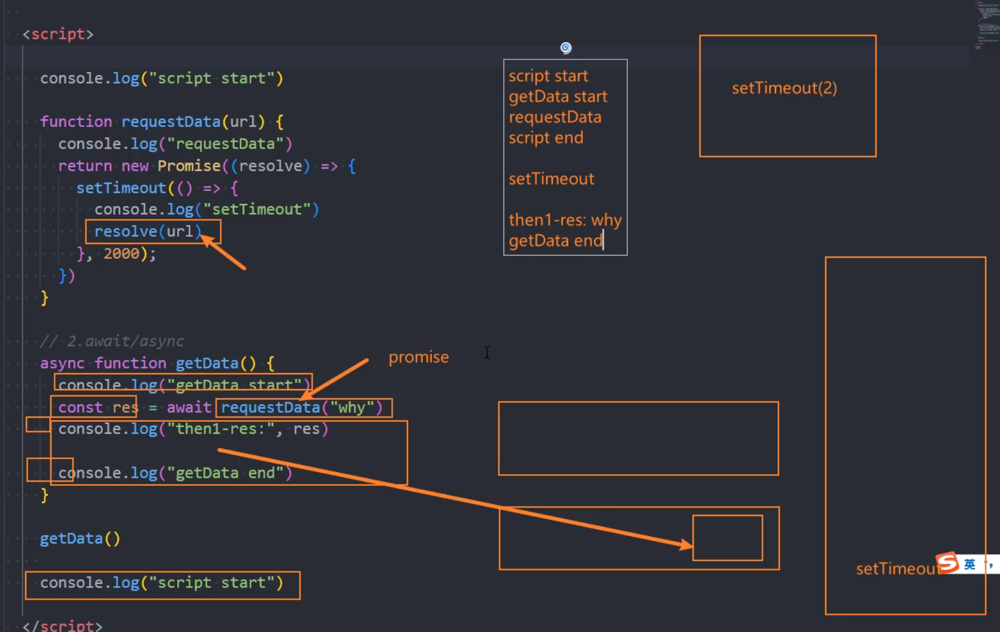

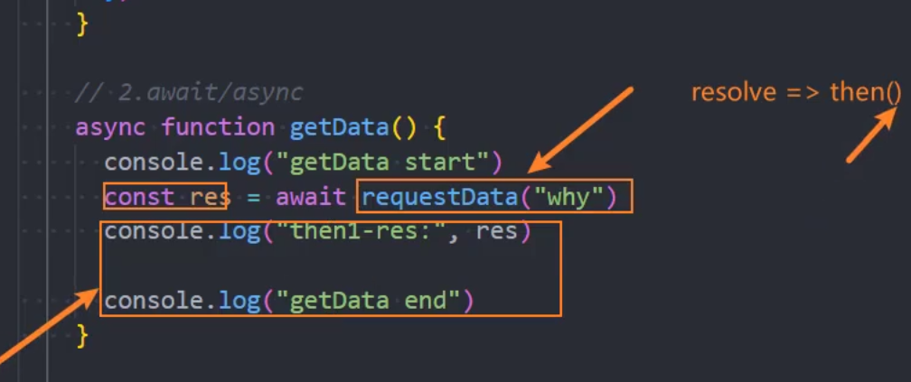

**await等待的是Promise.resolve()的结果，后面的代码应该视作thenable的输出结果。**


# 错误处理

## throw

我们可以通过throw手动地抛出异常：

- throw语句用于抛出一个用户自定义的异常； 
- 当遇到throw语句时，当前的函数执行会被停止（throw后面的语句不会执行）；

我们通过以下代码来实践throw:

```javascript
    function sum(num1, num2) {
      if (typeof num1 !== "number") {
        throw "type error: num1传入的类型有问题, 必须是number类型"
      }

      if (typeof num2 !== "number") {
        throw "type error: num2传入的类型有问题, 必须是number类型"
      }

      return num1 + num2
    }
```

我们可以自己封装一个Error类，但是JS已经提供了一个Error原生对象给我们使用，这个对象还能够定位错误的位置，我们直接使用JS提供的Error原生对象就可以实现手动抛出报错：

```javascript
    class HYError {
      constructor(message, code) {
        this.errMessage = message
        this.errCode = code
      }
    }

    // throw抛出一个异常
    // 1.函数中的代码遇到throw之后, 后续的代码都不会执行
    // 2.throw抛出一个具体的错误信息
    function foo() {
      console.log("foo function1")
      // 1.number/string/boolean
      // throw "反正就是一个错误"

      // 2.抛出一个对象
      // throw { errMessage: "我是错误信息", errCode: -1001 }
      // throw new HYError("错误信息", -1001)

      // 3.Error类: 错误函数的调用栈以及位置信息
      throw new Error("我是错误信息")

      console.log("foo function2")
      console.log("foo function3")
      console.log("foo function4")
    }

    function bar() {
      foo()
    }

    bar()
```

`new Error()`一般只接受一个参数，多是一个string类型的字符串。


## try catch

throw只负责手动抛出错误，而不处理错误，其实不是一个合适的错误捕获机制。

抛出的异常会发送给函数的调用者，如果函数的调用者不处理，那么就会层层向外抛出异常，如果到了全局都不处理异常，那么全局的代码就不会继续向下执行了。

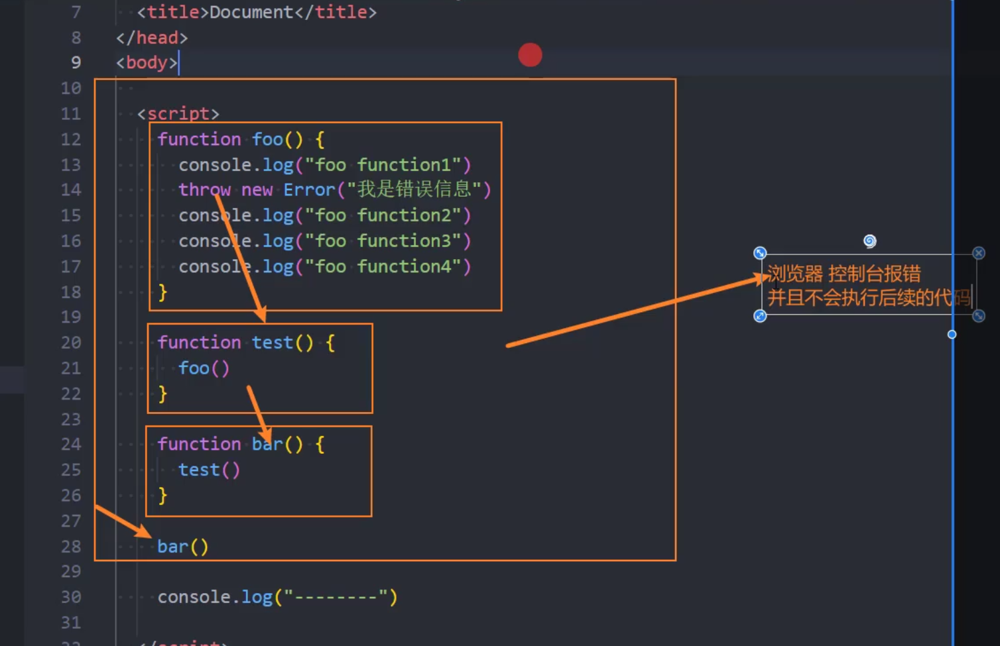

所以我们必须使用try catch捕获和处理异常，把可能出现异常的代码放入try的代码块里面，一旦出现异常就利用catch捕获和处理异常，确保代码能够正常向下执行：

```javascript
    function foo() {
      console.log("foo function1")
      throw new Error("我是错误信息")
      console.log("foo function2")
      console.log("foo function3")
      console.log("foo function4")
    }

    function test() {
      // 自己捕获了异常的话, 那么异常就不会传递给浏览器, 那么后续的代码可以正常执行
      try {
        foo()
        console.log("try后续的代码")
      } catch(error) {
        console.log("catch中的代码")
        // console.log(error)
      } finally {
        console.log("finally代码")
      }
    }

    function bar() {
      test()
    }

    bar()

    console.log("--------")
```

但是对于产生异常并抛出异常的函数内部执行体来说，一旦产生了异常，内部执行体就停留在异常抛出的位置，不会继续执行函数内部的代码了，**但是主进程的代码依旧会执行向下处理**。

总之这个异常必须捕获和处理，防止溢出到浏览器产生报错，影响代码的继续执行。

finally是无论是否出现错误都会执行的代码，在thenable中也是同理。

catch可以独立作为代码块存在，ES9+允许省略catch作为函数的error传参机制。
