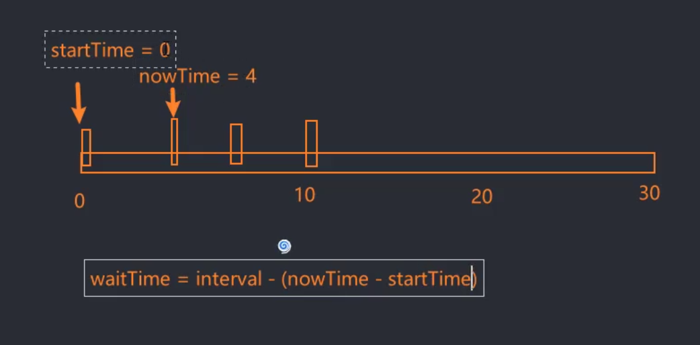

# 防抖和节流

## 防抖(debounce)

如果频繁触发某一事件，则该事件不执行，而是会等待一段时间才触发。

当事件密集触发时，函数的触发会被频繁的推迟。

只有等待了一段时间也没有事件触发，才会真正的执行响应函数。

**大白话就是你越催我越不干活，只有你不催了我才执行你的命令。**

### 使用场景

防抖的应用场景很多： 

➢输入框中频繁的输入内容，搜索或 者提交信息； 

➢频繁的点击按钮，触发某个事件； 

➢监听浏览器滚动事件，完成某些特 定操作； 

➢用户缩放浏览器的resize事件


### 手动实现防抖的基本实现

如果我们需要自己实现一个防抖函数，我们至少需要考虑三点：

1.首先至少需要两个参数：

- 参数一：会掉的函数
- 参数二：延时时间delay

2.有什么用的返回值

3.内部如何实现

```js
      /* 防抖处理代码 */
      // 1.获取input元素
      const inputEl = document.querySelector("input");

      function hydebounce(cbFn, delay) {
        // 1.用于记录上一次事件触发的timer
        let timer = null;
        const _debounce = () => {
          setTimeout(() => {
            cbFn();
          }, delay);
        };
        // 返回一个新函数
        return _debounce;
      }

      //   2.监听input元素的输入
      let counter = 1;
      inputEl.oninput = hydebounce(function () {
        console.log(`发送了网络请求${counter++}`, this.value);
      }, 1500);
```

如果我们仅仅采取定时器操作，而不对上一次触发进行清除操作，就会导致定时器到期后频繁触发事件。


为了清除上一个定时器事件，所以我们需要利用闭包来在防抖函数执行体的外层来定义一个timer来获取对应的定时器。

因为闭包的原理，timer可以在第二次触发的时候获取上一次的timer指向的定时器执行体。

一旦出现重复触发，可以在重新对timer进行定时器的赋值之前，清除上一次的定时器执行体，防止cbFn如期执行：

```javascript
      function hydebounce(cbFn, delay) {
        // 1.用于记录上一次事件触发的timer
        let timer = null;
        // 2.触发事件时的执行函数
        const _debounce = () => {
          // 2.1 如果再次触发事件，清除上一次的timer
          if (timer) clearTimeout(timer);
          // 2.2 延迟去执行对应的cbFn函数(传入的回调函数)
          timer = setTimeout(() => {
            cbFn();
            // 重置timer
            timer = null;
          }, delay);
        };
        // 返回一个新函数
        return _debounce;
      }
```

如果没有再一次的事件触发，那么定时器执行体到期后自动执行。

在函数执行完成后，应该定义`timer=null`，清空timer。


### this绑定

```javascript
      function hydebounce(cbFn, delay) {
        // 1.用于记录上一次事件触发的timer
        let timer = null;
        // 2.触发事件时的执行函数
        const _debounce = () => {
          // 2.1 如果再次触发事件，清除上一次的timer
          if (timer) clearTimeout(timer);
          // 2.2 延迟去执行对应的cbFn函数(传入的回调函数)
          timer = setTimeout(() => {
            cbFn();
            // 重置timer
            timer = null;
          }, delay);
        };
        // 返回一个新函数
        return _debounce;
      }
```


在 JavaScript 中，事件处理函数的 `this` 默认指向触发事件的元素。然而，在你的代码中，你使用了箭头函数 `_debounce`，箭头函数的 `this` 不会被绑定为事件触发元素，而是会继承自外层作用域。

具体来说，在 `_debounce` 函数内部，`this` 的指向取决于函数 `_debounce` 被调用时所处的上下文。在这里，`_debounce` 是在全局作用域下定义的，因此它的 `this` 指向全局对象 `window`。

```javascript
inputEl.oninput = hydebounce(function () {
        console.log(`发送了网络请求${counter++}`, this.value);
      }, 1500);
```

这里我们可以得知`oninput`明确指向的是`hydebounce`函数的返回值，也就是`_debounce`，这里会达成一个对象的隐式绑定原则，`__debounce`绑定的对象直指 `inputEl.oninput` 。

所以我们需要把`_debounce`改装为普通函数，使得内部的箭头函数在外层作用域查找this的时候，发现外层函数作用域的this根据隐式绑定原则指向`inputEl.oninput`，至此可以获取我们期望的this指向：

```javascript
      function hydebounce(cbFn, delay) {
        // 1.用于记录上一次事件触发的timer
        let timer = null;
        // 2.触发事件时的执行函数
        const _debounce = function () {
          // 2.1 如果再次触发事件，清除上一次的timer
          if (timer) clearTimeout(timer);
          // 2.2 延迟去执行对应的cbFn函数(传入的回调函数)
          timer = setTimeout(() => {
            cbFn.apply(this);
            // 重置timer
            timer = null;
          }, delay);
        };
        // 返回一个新函数
        return _debounce;
      }
```

当然我们也可以进行传参的补充设计：

```javascript
      /* 防抖处理代码 */
      // 1.获取input元素
      const inputEl = document.querySelector("input");

      function hydebounce(cbFn, delay) {
        // 1.用于记录上一次事件触发的timer
        let timer = null;
        // 2.触发事件时的执行函数
        const _debounce = function (...args) {
          // 2.1 如果再次触发事件，清除上一次的timer
          if (timer) clearTimeout(timer);
          // 2.2 延迟去执行对应的cbFn函数(传入的回调函数)
          timer = setTimeout(() => {
            cbFn.apply(this, args);
            // 重置timer
            timer = null;
          }, delay);
        };
        // 返回一个新函数
        return _debounce;
      }

      //   2.监听input元素的输入
      let counter = 1;
      inputEl.oninput = hydebounce(function (event) {
        console.log(`发送了网络请求${counter++}`, this.value, event);
        console.log(this);
      }, 1500);
```

### 中止防抖

如果用户在输入内容，但防抖执行体未发起网络请求时，进行了页面跳转，那么就不应该再触发执行防抖输出的请求。

```javascript
<!DOCTYPE html>
<html lang="en">
  <head>
    <meta charset="UTF-8" />
    <meta name="viewport" content="width=device-width, initial-scale=1.0" />
    <title>Document</title>
  </head>
  <body>
    <input type="text" />
    <button class="cancel">cancel</button>
    <script>
      /* 防抖处理代码 */
      // 1.获取input元素
      const inputEl = document.querySelector("input");
      const cancelBtn = document.querySelector(".cancel");
      function hydebounce(cbFn, delay) {
        // 1.用于记录上一次事件触发的timer
        let timer = null;
        // 2.触发事件时的执行函数
        const _debounce = function (...args) {
          // 2.1 如果再次触发事件，清除上一次的timer
          if (timer) clearTimeout(timer);
          // 2.2 延迟去执行对应的cbFn函数(传入的回调函数)
          timer = setTimeout(() => {
            cbFn.apply(this, args);
            // 重置timer
            timer = null;
          }, delay);
        };
        // 3.给_debounce绑定一个取消的函数
        _debounce.cancel = function () {
          clearTimeout(timer);
          timer = null;
        };
        // 返回一个新函数
        return _debounce;
      }

      //   2.监听input元素的输入
      let counter = 1;
      const debounceFn = hydebounce(function (event) {
        console.log(`发送了网络请求${counter++}`, this.value, event);
        console.log(this);
      }, 1500);
      inputEl.oninput = debounceFn;
      cancelBtn.onclick = function () {
        debounceFn.cancel();
      };
    </script>
  </body>
</html>

```

### 立即执行功能

在第一次触发时，先执行一次函数，后续的触发再执行防抖策略。

比如我们输入"macbook"，输入m的时候就先执行一次函数，我们可以通过额外传递一个参数给防抖函数，来选择性地执行这个功能。

我们在设计这个立即执行功能时，应该奉行“一个函数做一件事情，一个变量用于记录一种状态”，不要试图用一个函数/一个状态去执行多类操作。

所以我们需要采用另外一个独立变量 `isInvoke` 来做立即执行函数的状态控制器。

```javascript
      /* 防抖处理代码 */
      // 1.获取input元素
      const inputEl = document.querySelector("input");
      const cancelBtn = document.querySelector(".cancel");
      function hydebounce(cbFn, delay, immediate = false) {
        // 1.用于记录上一次事件触发的timer
        let timer = null;
        let isInvoke = false;
        // 2.触发事件时的执行函数
        const _debounce = function (...args) {
          // 2.1 如果再次触发事件，清除上一次的timer
          if (timer) clearTimeout(timer);
          // 假设第一次操作不需要延迟
          if (immediate && !isInvoke) {
            cbFn.apply(this, args);
            isInvoke = true;
            return;
          }
          // 2.2 延迟去执行对应的cbFn函数(传入的回调函数)
          timer = setTimeout(() => {
            cbFn.apply(this, args);
            // 重置timer
            timer = null;
            // 重置立即执行状态控制器
            isInvoke = false;
          }, delay);
        };
        // 3.给_debounce绑定一个取消的函数
        _debounce.cancel = function () {
          clearTimeout(timer);
          timer = null;
          // 重置立即执行状态控制器
          isInvoke = false;
        };
        // 返回一个新函数
        return _debounce;
      }

      //   2.监听input元素的输入
      let counter = 1;
      const debounceFn = hydebounce(
        function (event) {
          console.log(`发送了网络请求${counter++}`, this.value, event);
          console.log(this);
        },
        1500,
        true
      );
      inputEl.oninput = debounceFn;
      cancelBtn.onclick = function () {
        debounceFn.cancel();
      };
```

### 获取返回值

我们可以通过回调函数来获取执行体函数中预设的返回值结果：

```javascript
          /* 防抖处理代码 */
      // 1.获取input元素
      const inputEl = document.querySelector("input");
      const cancelBtn = document.querySelector(".cancel");
      function hydebounce(cbFn, delay, immediate = false) {
        // 1.用于记录上一次事件触发的timer
        let timer = null;
        let isInvoke = false;
        // 2.触发事件时的执行函数
        const _debounce = function (...args) {
          return new Promise((resolve, reject) => {
            // 2.1 如果再次触发事件，清除上一次的timer
            if (timer) clearTimeout(timer);
            let res = undefined;
            // 假设第一次操作不需要延迟
            if (immediate && !isInvoke) {
              res = cbFn.apply(this, args);
              resolve(res);
              isInvoke = true;
              return;
            }
            // 2.2 延迟去执行对应的cbFn函数(传入的回调函数)
            timer = setTimeout(() => {
              res = cbFn.apply(this, args);
              resolve(res);

              // 重置timer
              timer = null;
              // 重置立即执行状态控制器
              isInvoke = false;
            }, delay);
          });
        };
        return _debounce;
       // 3.给_debounce绑定一个取消的函数
          _debounce.cancel = function () {
            clearTimeout(timer);
            timer = null;
            // 重置立即执行状态控制器
            isInvoke = false;
          };
      }
      //   2.监听input元素的输入
      let counter = 1;
      const debounceFn = hydebounce(
        function (name, age, height) {
          console.log("+++++++++", name, age, height);
          return "yes rpg";
        },
        1000,
        false
      );
      debounceFn("why", "123", 18).then(res => {
        console.log(res);
      });
      debounceFn("why", "123", 18).then(res => {
        console.log(res);
      });
      debounceFn("why", "123", 18).then(res => {
        console.log(res);
      });  
```

我们可以进一步增加错误捕获机制：

```javascript
function hydebounce(cbFn, delay, immediate = false) {
  // 1.用于记录上一次事件触发的timer
  let timer = null;
  let isInvoke = false;
  // 2.触发事件时的执行函数
  const _debounce = function (...args) {
    return new Promise((resolve, reject) => {
      try {
        // 2.1 如果再次触发事件，清除上一次的timer
        if (timer) clearTimeout(timer);
        let res = undefined;
        // 假设第一次操作不需要延迟
        if (immediate && !isInvoke) {
          res = cbFn.apply(this, args);
          resolve(res);
          isInvoke = true;
          return;
        }
        // 2.2 延迟去执行对应的cbFn函数(传入的回调函数)
        timer = setTimeout(() => {
          res = cbFn.apply(this, args);
          resolve(res);

          // 重置timer
          timer = null;
          // 重置立即执行状态控制器
          isInvoke = false;
        }, delay);
      } catch (error) {
        console.log(error);
      }
    });
  };
  // 3.给_debounce绑定一个取消的函数
  _debounce.cancel = function () {
    clearTimeout(timer);
    timer = null;
    // 重置立即执行状态控制器
    isInvoke = false;
  };
  return _debounce;
}

export default hydebounce;

```


## 节流(throttle)

节流执行机制是一个“很懒”的机制，如果没有尾部控制，那么在超出间隔时间后，你不触控它也不会主动执行。


节流的精准描述：

- 当事件触发时，会执行这个事件的响应函数； 
- 如果这个事件会被频繁触发，那么节流函数会按照一定的频率来执行函数； 
- 不管在这个中间有多少次触发这个事件，执行函数的频繁总是固定的；

**大白话说就是不管你触发了多少次，我只会在固定间隔的单位时间内执行，如果你超出间隔时间依然有触发，那我就继续执行。如果在间隔时间内触发，我就不执行。**

节流会在固定时间，固定频率内去执行用户的触发。


防抖则是你如果频繁触发，我就不执行，最后等你不触发了我才执行一次。

### 节流时间段

第一阶段：



第二阶段：


第三阶段：


我们需要一个公式来计算执行节流函数的执行体，分别有三个关键参数：startTime,nowTime,waitTime。

waitTime控制了节流函数的执行，而startTime和nowTime的**差额**决定了节流函数的执行时机。

```javascript
    <script>
      function hythrottle(fn, interval) {
        let startTime = 0;
        const _throttle = function (...args) {
          const nowTime = new Date().getTime();
          const waitTime = interval - (nowTime - startTime);
          if (waitTime <= 0) {
            fn.apply(this, args);
            console.log(event);
            startTime = nowTime;
          }
        };
        return _throttle;
      }
    </script>

    <script>
      // 节流操作
      const inputEl = document.querySelector("input");
      //   2.监听input元素的输入
      let counter = 1;
      inputEl.oninput = hythrottle(function (event) {
        console.log(`发送了网络请求${counter++}`, this.value, event);
        console.log(this);
      }, 3000);
    </script>
```

### 立即执行的控制

默认情况下，第一次触发节流事件会立刻执行。

如果我们期望控制立即执行，那么我们就应该为其设置一个控制器，通过这个控制器结合初始状态(startTime为0)的判断，来手动的设置startTime的值使后面的执行体达不到执行条件：

```javascript
      function hythrottle(fn, interval, immediate = true) {
        let startTime = 0;
        const _throttle = function (...args) {
          // 1.获取当前时间
          const nowTime = new Date().getTime();
          // 对立即执行的默认机制 进行控制
          if (!immediate && startTime === 0) {
            startTime = nowTime;
            
          }
          // 2.计算需要等待的时间来控制函数的执行
          const waitTime = interval - (nowTime - startTime);
          if (waitTime <= 0) {
            fn.apply(this, args);
            console.log(event);
            startTime = nowTime;
          }
        };
        return _throttle;
      }
```

### 尾部执行控制(了解)

如果我们期望在节流函数的最后依然能够执行一次，最好的思路应该是从一开始就设置一个定时器。

初始状态：


我们会在一开始就设置一个定时器，定时器会在间隔时间到期时自动执行，但是如果用户在间隔时间到期的时候触发了点击，那么定时器就会被取消(因为函数已经被执行)。

如果用户在间隔时间到期之后触发了点击，下一轮定时器从第二轮的起始点开始。

第二轮节流：


同理，也是从第二轮的起始点设置一个定时器，但是如果间隔时间到期时用户精准地触发了点击，那么上一轮定时器就会被取消(因为函数已经被执行)。如果用户在间隔时间到期之后再次触发点击，那么下一轮定时器从第三个起始点开始。


我们在判断是否执行尾部时，如果用户频繁触发，那么我们只根据用户第一次触发的时机为准，后续触发直接忽略。

**总结：尾部控制定时器的执行时机的等待时间，应该是最后一次执行的间隔时间到期的剩余时间，一旦到期就执行该函数。**

```javascript
    <script>
      function hythrottle(fn, interval, { leading = true, trailing = true } = {}) {
        let startTime = 0;
        // 尾部控制定时器
        let timer = null;
        const _throttle = function (...args) {
          // 1.获取当前时间
          const nowTime = new Date().getTime();
          // 对立即执行的默认机制 进行控制
          if (!leading && startTime === 0) {
            startTime = nowTime;
          }
          // 2.计算需要等待的时间来控制函数的执行
          const waitTime = interval - (nowTime - startTime);
          if (waitTime <= 0) {
            // 极限情况下用户触发时机刚刚好是间隔时间的到期时机的判断
            if (timer) clearTimeout(timer);
            fn.apply(this, args);
            timer = null;
            startTime = nowTime;
          } else {
            // 3.判断是否需要执行尾部
            if (trailing && !timer) {
              timer = setTimeout(() => {
                fn.apply(this, args);
                startTime = new Date().getTime();
                timer = null;
              }, waitTime);
            }
          }
        };
        return _throttle;
      }
    </script>

    <script>
      // 节流操作
      const inputEl = document.querySelector("input");
      //   2.监听input元素的输入
      let counter = 1;
      inputEl.oninput = hythrottle(
        function (event) {
          console.log(`发送了网络请求${counter++}`, this.value, event);
          console.log(this);
        },
        3000,
        { trailing: true }
      );
    </script>
```

### 取消尾部执行(了解)

```javascript
    <script>
      function hythrottle(fn, interval, { leading = true, trailing = true } = {}) {
        let startTime = 0;
        // 尾部控制定时器
        let timer = null;
        const _throttle = function (...args) {
          // 1.获取当前时间
          const nowTime = new Date().getTime();
          // 对立即执行的默认机制 进行控制
          if (!leading && startTime === 0) {
            startTime = nowTime;
          }
          // 2.计算需要等待的时间来控制函数的执行
          const waitTime = interval - (nowTime - startTime);
          if (waitTime <= 0) {
            // 极限情况下用户触发时机刚刚好是间隔时间的到期时机的判断
            if (timer) clearTimeout(timer);
            fn.apply(this, args);
            timer = null;
            startTime = nowTime;
          } else {
            // 3.判断是否需要执行尾部
            if (trailing && !timer) {
              timer = setTimeout(() => {
                fn.apply(this, args);
                startTime = new Date().getTime();
                timer = null;
              }, waitTime);
            }
          }
        };
        _throttle.cancel = function () {
          if (timer) clearTimeout(timer);
          startTime = 0;
          timer = null;
        };
        return _throttle;
      }
    </script>

    <script>
      // 节流操作
      const inputEl = document.querySelector("input");
      const cancelBtn = document.querySelector(".cancel");
      //   2.监听input元素的输入
      let counter = 1;
      const throttleFn = hythrottle(
        function (event) {
          console.log(`发送了网络请求${counter++}`, this.value, event);
          console.log(this);
        },
        3000,
        { trailing: true }
      );
      inputEl.oninput = throttleFn;
      cancelBtn.onclick = function () {
        throttleFn.cancel();
      };
    </script>
```

### 获取返回值(了解)

```javascript
    <script>
      function hythrottle(fn, interval, { leading = true, trailing = true } = {}) {
        let startTime = 0;
        // 尾部控制定时器
        let timer = null;
        const _throttle = function (...args) {
          return new Promise((resolve, reject) => {
            try {
              // 1.获取当前时间
              const nowTime = new Date().getTime();
              // 对立即执行的默认机制 进行控制
              if (!leading && startTime === 0) {
                startTime = nowTime;
              }
              // 2.计算需要等待的时间来控制函数的执行
              const waitTime = interval - (nowTime - startTime);
              if (waitTime <= 0) {
                // 极限情况下用户触发时机刚刚好是间隔时间的到期时机的判断
                if (timer) clearTimeout(timer);
                const res = fn.apply(this, args);
                resolve(res);
                timer = null;
                startTime = nowTime;
              } else {
                // 3.判断是否需要执行尾部
                if (trailing && !timer) {
                  timer = setTimeout(() => {
                    const res = fn.apply(this, args);
                    resolve(res);
                    startTime = new Date().getTime();
                    timer = null;
                  }, waitTime);
                }
              }
            } catch (error) {
              console.log("error", error);
            }
          });
        };
        _throttle.cancel = function () {
          if (timer) clearTimeout(timer);
          startTime = 0;
          timer = null;
        };
        return _throttle;
      }
    </script>

    <script>
      //   2.监听input元素的输入
      let counter = 1;
      const throttleFn = hythrottle(
        function (event) {
          console.log(`发送了网络请求${counter++}`, this.value, event);
          console.log(this);
          return event;
        },
        3000,
        { trailing: true }
      );
      throttleFn("haruhi").then(res => {
        console.log(res);
      });
      setTimeout(() => {
        throttleFn("haruhi").then(res => {
          console.log(res);
        });
      }, 4000);
    </script>
```

# 深拷贝

深拷贝相比浅拷贝更加消耗内存，**深拷贝的核心是函数内部的递归操作**。

如果我们采用 `JSON.parse(JSON.stringify(obj))`来进行深拷贝，那么它无法拷贝对象内的**函数、正则表达式、Symbol属性**，它会直接把这些类型在拷贝的过程中直接删除。

同时存在一个需要重视的现象：对象可以在内部定义对象自身的引用，这种情况下`JSON.parse(JSON.stringify(obj))`也无法处理这种循环引用自身的情况。

## 实现深拷贝

在深拷贝中，需要注意几个事项：

1. 如果拷贝的目标是一个普通的值，直接返回即可，这是第一层判断。
2. 我们可以创建一个函数，用于判别深拷贝函数传参传进来的值的类型。
3. 需要区分null,object,function,array ,它们都是一种对象类型

我们在使用typeof判断的时候，必须注意不同对象类型的判断标准：

- null=>object
- function=>function
- array/object=>object

所以我们的对象判断函数应该写作如下：

```javascript
      function isObject(value) {
        // null,object,function,array 都是一种对象类型
        const valueType = typeof value;
        return value !== null && (valueType === "object" || 				valueType === "function");
      }
```

接下来我们来看深拷贝函数的内部实现，如果在for遍历拷贝的过程中，对应的属性是一个对象，那么我们就应该**通过递归来将这个对象再一次进行深拷贝**。

通过这个递归结合深拷贝函数第一步非对象直接返回值的操作，我们可以依次对基本数据类型进行赋值操作。

*如果思路不清晰，可以考虑打个debug自己研究一下。*

```javascript
    <script src="./js/is_object.js"></script>
    <script>
      import isObject from "./js/is_object";
      // 封装深拷贝函数
      function deepCopy(originValue) {
        // 1.如果是基本的数据值，直接返回
        if (!isObject(originValue)) {
          return originValue;
        }

        // 2.如果是对象类型，才需要创建对象
        const newObj = {};
        for (const key in originValue) {
          newObj[key] = deepCopy(originValue[key]);
        }
        return newObj;
      }
      const info = {
        name: "why",
        age: 18,
        friend: {
          name: "haruhi",
          age: 16,
          address: {
            name: "tokyo",
            detail: "beigao"
          }
        }
      };
      const deepObj = deepCopy(info);
      console.log((deepObj.friend.name = "mikasa"));
      console.log(info.friend.name);
    </script>
```

### 数组的深拷贝

我们需要通过`Array.isArray(obj)`来判断传入的对象是不是数组，需要注意`typeof`判别数组和普通对象都是返回一个`object`类型的。

```javascript
      // 封装深拷贝函数
      function deepCopy(originValue) {
        // 1.如果是基本的数据值，直接返回
        if (!isObject(originValue)) {
          return originValue;
        }

        // 2.如果是对象类型，才需要创建对象
        const newObj = Array.isArray(originValue) ? [] : {};
        for (const key in originValue) {
          newObj[key] = deepCopy(originValue[key]);
        }
        return newObj;
      }
      const books = [
        { name: "js", price: 30 },
        { name: "css", price: 40 },
        { name: "html", price: 50 }
      ];
      const deepObj = deepCopy(books);
      deepObj[0].name = "javascript";
      console.log(books);
```

## 其它类型的深拷贝

### Set

set类型是不支持for...in遍历的。

比如我们期望对set也进行一个拷贝，我们需要使用`instanceOf`来判断是否是Set类型。

同时如果set里面存在对象属性，我们必须使用深拷贝函数来进行处理，所以综合来看我们可以直接通过 `new Set(deepCopy(...))`来处理set里面的各种属性：

```javascript
      // 封装深拷贝函数
      function deepCopy(originValue) {
        // 1.如果是基本的数据值，直接返回
        if (!isObject(originValue)) {
          return originValue;
        }
        // 2.如果是set类型，我们需要使用instanceOf来判断是否是Set类型
        if (originValue instanceof Set) {
          const newSet = new Set();
          for (const value of originValue) {
            newSet.add(deepCopy(value));
          }
          return newSet;
        }
        // 3.如果是对象类型，才需要创建对象
        const newObj = Array.isArray(originValue) ? [] : {};
        for (const key in originValue) {
          newObj[key] = deepCopy(originValue[key]);
        }
        return newObj;
      }
      const set = new Set(["a", "b", "c"]);
      const info = {
        name: "why",
        age: 18,
        friend: {
          name: "haruhi",
          age: 16,
          address: {
            name: "tokyo",
            detail: "beigao"
          }
        },
        set: set
      };
      const deepObj = deepCopy(info);
```

对set的拷贝处理应该置于普通对象的拷贝处理的前面，完成set的拷贝处理后通过return拷贝完成的set，直接退出本轮执行。

### 函数

函数无需深拷贝，函数是用于执行的，正常开发流程中不会随便对函数进行自有属性的增删改查。

```javascript
      function deepCopy(originValue) {
        // 1.如果是基本的数据值，直接返回
        if (!isObject(originValue)) {
          return originValue;
        }
        // 2.如果是set类型，我们需要使用instanceOf来判断是否是Set类型
        if (originValue instanceof Set) {
          const newSet = new Set();
          for (const value of originValue) {
            newSet.add(deepCopy(value));
          }
          return newSet;
        }
        // 3.如果函数是function类型，无需深拷贝处理，直接返回
        if (typeof originValue === "function") {
          return originValue;
        }
        // 4.如果是对象类型，才需要创建对象
        const newObj = Array.isArray(originValue) ? [] : {};
        for (const key in originValue) {
          newObj[key] = deepCopy(originValue[key]);
        }
        return newObj;
      }
```

### Symbol

如果拷贝的值是symbol类型，那么也需要进行全新的创建处理，因为直接浅拷贝其实会导致两个对象依然调用同一个Symbol，同时考虑symbol的description存在，我们也应该考虑携带过来。

最后symbol如果是一个key，直接拷贝的话这个数据也是不会被写入对象的，深拷贝函数只能遍历普通的key，所以我们必须单独遍历symbol。

```javascript
      // 封装深拷贝函数
      function deepCopy(originValue) {
        // 0.如果是Symbol类型，无需深拷贝处理，创建一个新的Symbol
        if (typeof originValue === "symbol") {
          return Symbol(originValue.description);
        }
        // 1.如果是基本的数据值，直接返回
        if (!isObject(originValue)) {
          return originValue;
        }
        // 2.如果是set类型，我们需要使用instanceOf来判断是否是Set类型
        if (originValue instanceof Set) {
          const newSet = new Set();
          for (const value of originValue) {
            newSet.add(deepCopy(value));
          }
          return newSet;
        }
        // 3.如果函数是function类型，无需深拷贝处理，直接返回
        if (typeof originValue === "function") {
          return originValue;
        }

        // 4.如果是对象类型，才需要创建对象
        const newObj = Array.isArray(originValue) ? [] : {};
        for (const key in originValue) {
          newObj[key] = deepCopy(originValue[key]);
        }
        // 单独对普通对象遍历无法获取的symbol进行检查性质的遍历
        // 获取symbol类型的key
        const symbolKeys = Object.getOwnPropertySymbols(originValue);
        for (const symbolKey of symbolKeys) {
          // 我们对symbol的value进行深拷贝处理
          newObj[Symbol(symbolKey.description)] = deepCopy(originValue[symbolKey]);
        }
        return newObj;
      }
      const set = new Set(["a", "b", "c"]);
      const title = Symbol("desc");
      const info = {
        name: "why",
        age: 18,
        friend: {
          name: "haruhi",
          age: 16,
          address: {
            name: "tokyo",
            detail: "beigao"
          }
        },
        // 1.特殊类型Set
        set: set,
        // 2.特殊类型function
        sayHello: function () {
          console.log("hello");
        },
        // 3.特殊类型Symbol
        symbolKey: Symbol("why"),
        // 4.symbol类型的key
        [title]: "test"
      };
      const deepObj = deepCopy(info);
      console.log(deepObj);
```

## 循环引用的处理

如果对象内部存在自己的引用，会导致对象在深拷贝的过程中卡死在下面的代码中，导致无限递归，最后调用栈原地升天:

```javascript
        for (const key in originValue) {
          newObj[key] = deepCopy(originValue[key]);
        }
```

我们应该考虑在创建对应拷贝对象的时候，直接在里面创建被拷贝对象的循环引用的key值，指向这个拷贝对象：


我们可以通过Map来实现使得循环引用的key指向拷贝的目标对象，并结合map判断是否已经进行了`map.set()`，如果已经进行了指向设置，那么直接返回即可。

也就是说，我们可以通过在外界创建一个map，来管理这个循环引用对象，如果执行了深拷贝，那么就先把循环引用属性放入外界创建的map里面。

后续在深拷贝的遍历中检查到了这个循环引用属性，就把它返回出来，避免遍历过程中循环引用。

**map会把后续所有视作对象的值都存入到map里面，避免对此类对象进行重复的拷贝操作。**

同时我们应该考虑一件事情，那就是我们应该如何合理地处理map，本身map也有强引用，我们应该把map变更为`WeakMap`来避免强引用，将其变更为弱引用。

### 优化处理

我们要摒弃上面在外层创建map的做法，如果在`deepCopy`里面创建`WeakMap`，会导致其每次递归都会创建一个`WeakMap`，所以我们应该把`WeakMap`作为一个`deepCopy`的参数。

为了保证我们每一次递归使用的都是相同的 `WeakMap`，我们需要在遍历的时候将上一次递归的 `WeakMap`传入到下一次递归的传参里面，实现同一个 `WeakMap`的公共调用。

```javascript
      function deepCopy(originValue，map=new WeakMap()) {
        // 0.如果是Symbol类型，无需深拷贝处理，创建一个新的Symbol
        if (typeof originValue === "symbol") {
          return Symbol(originValue.description);
        }
        // 1.如果是基本的数据值，直接返回
        if (!isObject(originValue)) {
          return originValue;
        }
        // 2.如果是set类型，我们需要使用instanceOf来判断是否是Set类型
        if (originValue instanceof Set) {
          const newSet = new Set();
          for (const value of originValue) {
            newSet.add(deepCopy(value));
          }
          return newSet;
        }
        // 3.如果函数是function类型，无需深拷贝处理，直接返回
        if (typeof originValue === "function") {
          return originValue;
        }
        // 通过map.get()检查是否已经拷贝过
        if (map.get(originValue)) {
          return map.get(originValue);
        }
        // 4.如果是对象类型，才需要创建对象
        const newObj = Array.isArray(originValue) ? [] : {};
        // 通过map.set()方法将原对象和新对象进行映射
        map.set(originValue, newObj);

        for (const key in originValue) {
          newObj[key] = deepCopy(originValue[key],map);
        }
        // 单独对普通对象遍历无法获取的symbol进行检查性质的遍历
        // 获取symbol类型的key
        const symbolKeys = Object.getOwnPropertySymbols(originValue);
        for (const symbolKey of symbolKeys) {
          // 我们对symbol的value进行深拷贝处理
          newObj[Symbol(symbolKey.description)] = deepCopy(originValue[symbolKey],map);
        }
        return newObj;
      }
```

这样还可以完美实现函数调用结束时，对应的 `WeakMap` 会跟随函数一起同步销毁回收。


# 事件总线

事件总线是为了实现跨组件/跨文件的数据传输或事件调用。

```html
  <body>
    <!-- nav.vue -->
    <button class="nav-btn">nav button</button>
    <script>
      // 类EventBus=>事件总线对象

      // 使用过程
      const eventBus = new EventBus();

      // 假设在aside.vue组件中监听事件
      eventBus.on("navclick", () => {
        console.log("aside组件监听到了navClick事件");
      });

      //   假设在nav.vue
      const navBtnEl = document.querySelector(".nav-btn");
      navBtnEl.onclick = function () {
        console.log("自己监听到");
        // 发射事件让其他文件监听到
        eventBus.emit("navClick");
      };
    </script>
  </body>
```

## 实现事件总线


```javascript
      // 类EventBus=>事件总线对象
      class HYEventBus {
        constructor() {
          this.eventMap = {};
        }
        on(eventName, eventFn) {
          let eventFns = this.eventMap[eventName];
          //   因为eventFns可能不存在，所以我们需要做一个判断处理
          if (!eventFns) {
            eventFns = [];
            this.eventMap[eventName] = eventFns;
          }
          eventFns.push(eventFn);
        }
        emit(eventName) {
          let eventFns = this.eventMap[eventName];
          if (!eventFns || eventFns.length === 0) {
            return;
          }
          eventFns.forEach(fn => {
            fn();
          });
        }
      }
```

事件的监听和发射应该保持两者的监听事件名称完全相同，做到一一对应。


这里需要注意一个问题，因为第一次执行 `this.eventMap[eventName];`必然是获取不到的，所以我们需要进行一个非空判断，为对应的`eventMap[eventName]`创建一个数组 `eventFns` 。

随后我们再把对应的事件push进 `eventFns`，完成对应的监听事件收集。

同样的发射事件也应该判断对应的监听事件中的函数数组是否存在，不存在就终止执行。存在则遍历执行监听事件中的函数数组。

## 事件总线的传参

```javascript
      // 类EventBus=>事件总线对象
      class HYEventBus {
        constructor() {
          this.eventMap = {};
        }
        on(eventName, eventFn) {
          let eventFns = this.eventMap[eventName];
          //   因为eventFns可能不存在，所以我们需要做一个判断处理
          if (!eventFns) {
            eventFns = [];
            this.eventMap[eventName] = eventFns;
          }
          eventFns.push(eventFn);
        }
        emit(eventName, ...args) {
          let eventFns = this.eventMap[eventName];
          if (!eventFns || eventFns.length === 0) {
            return;
          }
          eventFns.forEach(fn => {
            fn(...args);
          });
        }
      }
      // 使用过程
      const eventBus = new HYEventBus();

      // 假设在aside.vue组件中监听事件
      eventBus.on("navclick", (title, num) => {
        console.log("aside组件监听到了navClick事件11111");
        console.log(title, num);
      });
      eventBus.on("navclick", (title, num) => {
        console.log("aside组件监听到了navClick事件22222");
        console.log(title, num);
      });
      //   假设在nav.vue
      const navBtnEl = document.querySelector(".nav-btn");
      navBtnEl.onclick = function () {
        console.log("自己监听到");
        // 发射事件让其他文件监听到
        eventBus.emit("navclick", "asa", 13);
      };
```

## 事件总线删除监听函数

```javascript
      // 类EventBus=>事件总线对象
      class HYEventBus {
        constructor() {
          this.eventMap = {};
        }
        on(eventName, eventFn) {
          let eventFns = this.eventMap[eventName];
          //   因为eventFns可能不存在，所以我们需要做一个判断处理
          if (!eventFns) {
            eventFns = [];
            this.eventMap[eventName] = eventFns;
          }
          eventFns.push(eventFn);
        }
        emit(eventName, ...args) {
          let eventFns = this.eventMap[eventName];
          if (!eventFns || eventFns.length === 0) {
            return;
          }
          eventFns.forEach(fn => {
            fn(...args);
          });
        }
        off(eventName, eventFn) {
          let eventFns = this.eventMap[eventName];
          if (!eventFns || eventFns.length === 0) {
            return;
          }
          eventFns.forEach((fn, index) => {
            if (fn === eventFn) {
              eventFns.splice(index, 1);
            }
          });

          //   如果eventFns为空了，我们就把这个事件名也删除掉
          if (eventFns.length === 0) {
            delete this.eventMap[eventName];
          }
        }
      }
```

