# HTTP

超文本传输协议，是一种用于分布式，协作式和超媒体信息系统的**应用层**协议。

HTTP或HTTPS协议请求的资源由统一资源标识符(URI/URL)来标识。

**HTTP是客户端和服务端之间请求和响应的标准**。

通过浏览器，爬虫或其他软件，客户端发起一个HTTP请求到服务器上指定端口(默认端口是80端口)。

我们称这个客户端是用户代理程序(user agent)。

相应的服务器存储着一些资源，比如HTML和图像。

我们称这个响应服务器为源服务器。

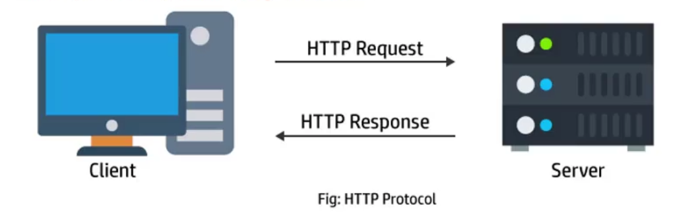

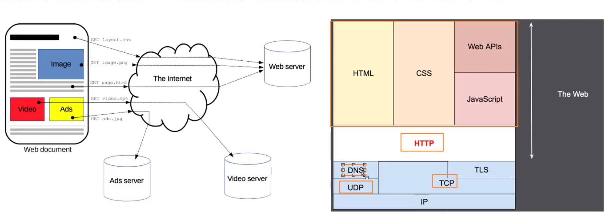

## HTTP的组成

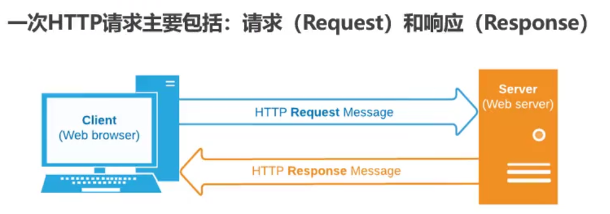

### 请求信息体

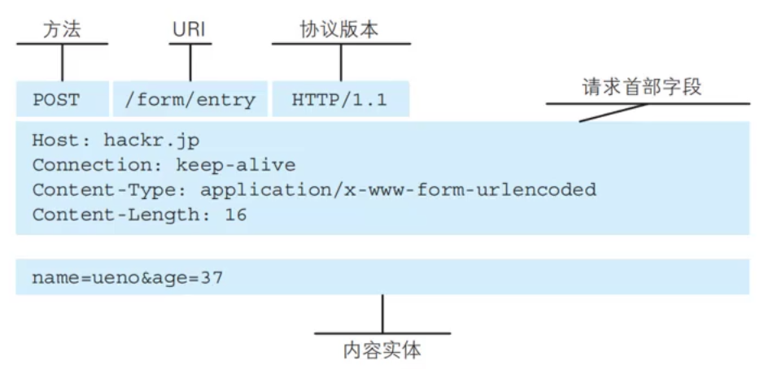

方法，URI，协议版本我们称之为请求行。

而请求首部字段常常称之为请求头。

服务器常常通过`request.headers`来获取请求头里面的详细信息。

请求体就是客户端携带的请求信息数据。

### 响应信息体

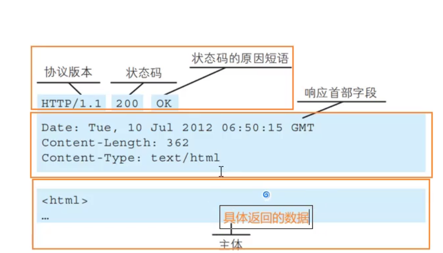

状态码标识了对客户请求的状态成功与否，里面也包含了各类代表的标识，相当于海军的海军旗。


## HTTP的版本

### HTTP/0.9

只支持GET请求方法获取文本数据，主要目的是为了获取HTML页面内容。

### HTTP/1.0

新增了POST,HEAD等请求方法，支持请求头和响应头，支持更多数据类型。

但是每次请求都需要和服务器建立一个TCP连接，请求完成后立刻断开TCP连接，每次建立连接都会增加性能损耗。

### HTTP/1.1(主流版本)

增加了PUT,DELETE等请求方法。

采用持久连接，多个请求可以共用一个TCP连接，防止频繁地建立握手机制。  


## HTTP的请求方式

- GET:请求了一个指定资源的表示方式，**使用GET请求应该只用于获取数据**。

- HEAD:HEAD请求和GET请求相似，不同的是没有响应体。

  ​	 HEAD方法常用于准备下载一个文件前，先获取文件的大小，再决定是否下载。

- POST:POST方法用于将实体提交到指定的资源(**常用于客户端向服务器提交数据**)。

- PATCH:PATCH常用于对资源进行**部分修改**。

- PUT:PUT方法用请求有效载荷(payload)替换目标资源的所有。

- DELETE:见文思义，就是删除指定的资源。

- CONNECT:建立一个到目标资源标识的服务器的隧道，常用于代理服务器，网页用不上。

- TRACE:沿着到目标资源的路径，执行一个消息的回环测试。


## HTTP Request Header

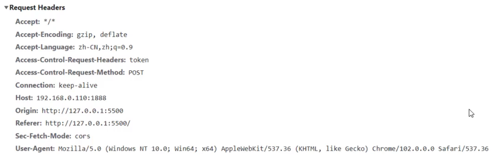

### content-type

这个标识符代表了本次请求携带的数据是什么类型。

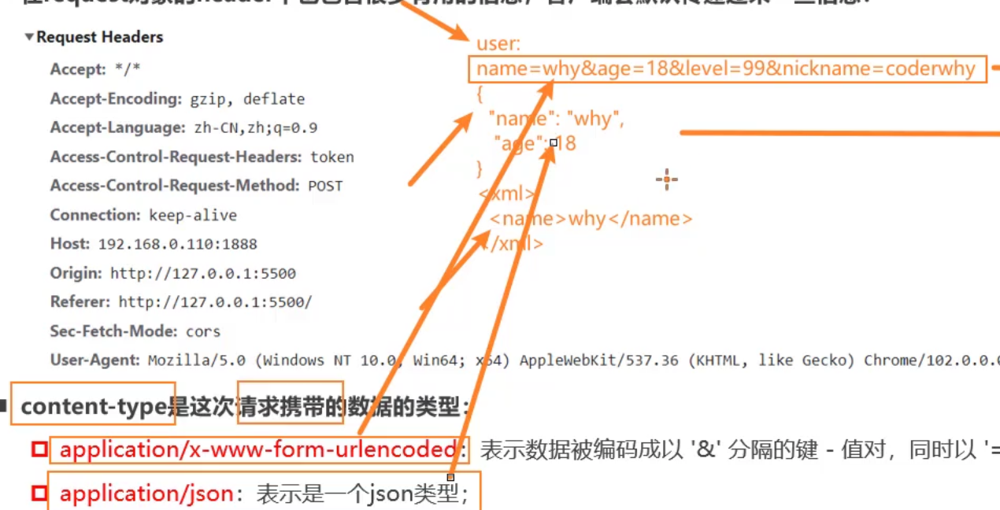

#### application/x-www-form-urlencoded

表示数据被编码成以"&"分隔的键值对数据，同时以"="分隔键和值。

#### application/json

表示一个JSON数据类型。

#### multipart/form-data

代表上传文件的格式，很多时候上传文件都会默认设置为此种格式，无需手动设置。

#### text/plain(不常用)

文本类型

#### application/xml(不常用)

xml格式


### content-length

文件的大小长度，无需手动设置，浏览器自动计算。

### keep-alive

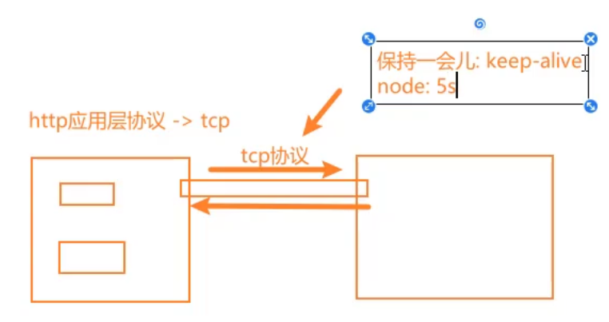

**http是基于TCP协议建立客户端和服务器端的“连接隧道”**，但是通常在进行一次请求和响应结束后会立刻中断； 

在http1.0中，如果想要继续保持连接： 

- ✓ 浏览器需要在请求头中添加 connection: keep-alive； 
- ✓ 服务器需要在响应头中添加 connection:keey-alive； 
- ✓ 当客户端再次放请求时，就会使用同一个连接，直接一方中断连接； 

**在http1.1中，所有连接默认是 connection: keep-alive的；** 

- ✓ 不同的Web服务器会有不同的保持 keep-alive的时间； 
- ✓ Node中默认是5s中；

### accept-encoding

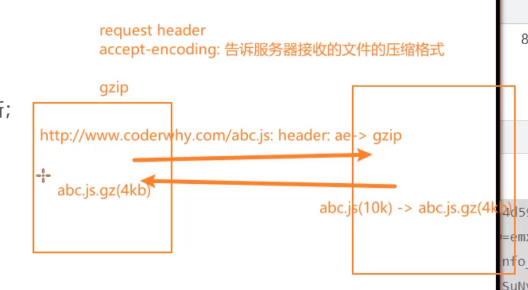

告知服务器，客户端支持的文件压缩格式，比如JS文件可以使用gzip编码，对应.gz文件。

如此一来，服务器可以根据此标识为传输的数据选取合适的压缩格式，提高运输效率。

同时浏览器能够自动执行解压操作，无需用户解压，同时压缩格式的选择也常常是浏览器自动配置的，当然我们可以在webpack中也可以进行文件的压缩配置。

### accept

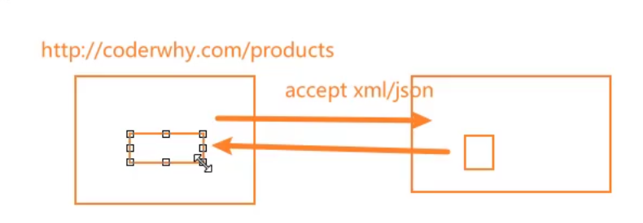

无需手动配置，这个不要和accept-encoding搞混了，这个字段用于告知服务器，客户端可接受**数据**的格式。

这个是用于请求数据的时候所使用的标识字段，注意accept-encoding指代的是文件的格式。

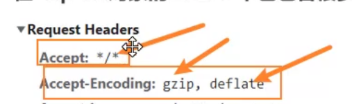

`*/*`代表了接收任何格式。


## 服务器响应

### HTTP 响应状态码

500以上状态码集合的错误常常是服务器的错误，400状态码集合多是客户端的问题，200状态码集合多是请求成功。

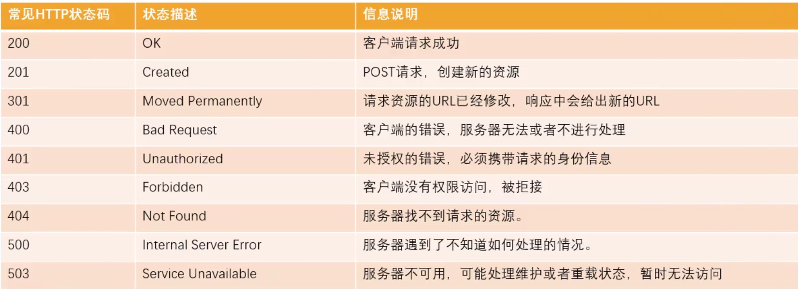

### HTTP Response Header

关键信息往往就是Content-Type(数据格式)和Access-Control-Allow-Origin(涉及跨域)，其它并不重要。

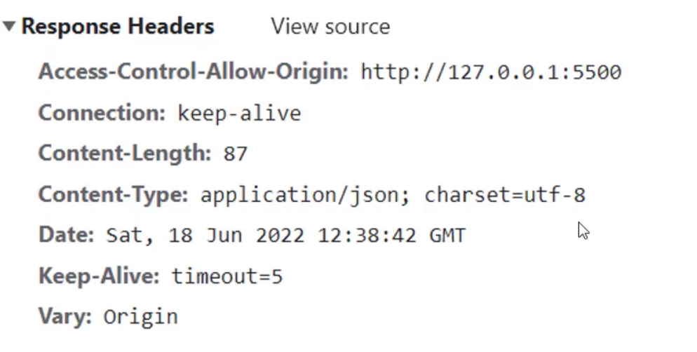


# AJAX

AJAX是异步的JS和XML，严格来说它不是一个封装合理或优秀的请求机制。

它可以使用JSON,XML,HTML和text格式发送和接收数据。

## 完成AJAX请求

1. 第一步：创建网络请求的AJAX对象(**使用XMLHttpRequest**)。

   通过 `new XMLHttpRequest()`创建AJAX对象。

   第二步：监听XMLHttpRequest对象状态的变化，或者监听onload事件(onload会在请求完成时触发)。

   这里会监听发送请求后来自服务器的响应，send以后的状态将通过`xhr.onreadyStatechange`函数来监听发送后的响应结果。

2. 第三步：配置网络请求(通过open方法配置，里面囊括了**请求方式，请求URI**)。

   第一个参数是请求方式，第二个参数是请求地址

3. 第四步：发送send请求。

   通过`xhr.send()`发送，注意这里不要尝试获取发送后的响应结果，应该在第二步获取。

```javascript
      // 1.创建XMLHttpRequest对象
      const xhr = new XMLHttpRequest();
      // 2.监听状态的改变(宏任务)
      // 在这里获取发送 请求的结果
      xhr.onreadystatechange = function () {
        // 判断xhr的请求状态
        if (xhr.readyState !== XMLHttpRequest.DONE) return;
        // 获取响应的结果
        console.log(xhr.response);
        // 将字符串转换为JSON对象
        const resJSON = JSON.parse(xhr.response);
        console.log(resJSON);
      };
      // 3.配置请求(通过open方法配置请求)
      // method:请求的方式(get/post/put/delete)
      xhr.open("get", "http://123.207.32.32:8000/home/multidata");
      // 4.发送请求(浏览器帮助发送对应的请求)
      xhr.send();
```

## XHR状态监听

XMLHttpRequest的state有四种状态，我们可以在状态监听函数(`xhr.onreadystatechange`)中获取对应的状态。

```javascript
      // 1.创建XMLHttpRequest对象
      const xhr = new XMLHttpRequest();
      // 2.监听状态的改变(宏任务)
      // 在这里获取发送 请求的结果
      xhr.onreadystatechange = function () {
        console.log("statechange", xhr.readyState);
      };
```

如果`xhr.readyState`不是一个`DONE`状态，则代表获取(下载)响应数据的进程尚未完成。

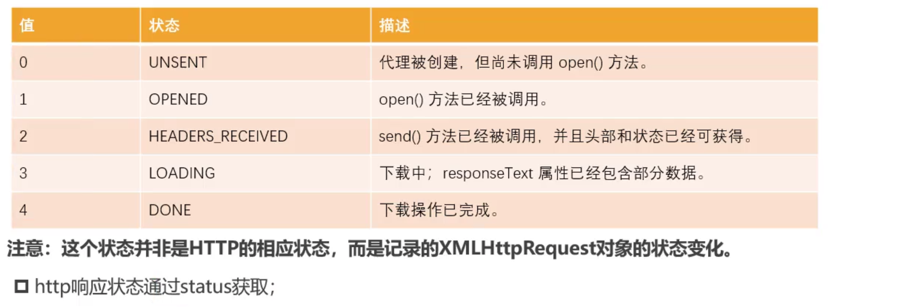

### 同步请求(不推荐)

这里需要注意，`xhr.send()`的请求是一个异步请求，它不会阻塞后续的代码继续运行，而且它本身就是一个**宏任务**。

但是如果我们期望它作为一个同步代码，在等待请求的过程中阻塞向下执行。那么我们就可以在xhr的open配置中的第三个参数写入 `false`，使其从默认的异步请求变成同步请求。

```javascript
      // 1.创建XMLHttpRequest对象
      const xhr = new XMLHttpRequest();
      // 2.监听状态的改变(宏任务)
      // 在这里获取发送 请求的结果
      xhr.onreadystatechange = function () {
        if (xhr.readyState !== XMLHttpRequest.DONE) return;
        // 将字符串转换为JSON对象
        const resJSON = JSON.parse(xhr.response);
      };
      // 3.配置请求(通过open方法配置请求)
      // method:请求的方式(get/post/put/delete)
      xhr.open("get", "http://123.207.32.32:8000/home/multidata", false);
      // 4.发送请求(浏览器帮助发送对应的请求)
      xhr.send();

      // 如果open配置了同步请求，那么xhr会等待请求结果返回之后再执行下面的代码
      console.log(xhr.response);
      console.log("1");
      console.log("2");
      console.log("3");
```

## XMLHttpRequest其它监听事件

- loadstart：请求开始。 
- progress： 一个响应数据包到达，此时整个 response body 都在 response 中。 
- abort：调用 xhr.abort() 取消了请求。 
- error：发生连接错误，例如，域错误。不会发生诸如 404 这类的 HTTP 错误。
-  load：请求成功完成。 
- timeout：由于请求超时而取消了该请求（仅发生在设置了 timeout 的情况下）。
-  loadend：在 load，error，timeout 或 abort 之后触发。

load只有**请求成功**才会回调，`xhr.onload` 是一个事件监听器，它会在 XMLHttpRequest 请求成功完成时被触发。**这包括从服务器接收响应数据的过程**。

所以，你可以理解为 `xhr.onload` 是在响应完成后才执行的监听事件。

error和loadend则是请求失败后的先后回调事件，progress代表了响应已经回来了，但是还没有完全加载完成。

timeout是在服务器请求超时的时候，该次请求被取消后的回调事件。

我们也常常使用load来获取数据，它只会在请求成功完成时**调用一次**：

```javascript
      // 1.创建XMLHttpRequest对象
      const xhr = new XMLHttpRequest();
      // 2.xhr.onload代表了请求完成的状态
      xhr.onload = function () {
        console.log("请求完成");
      };
      // 3.配置请求(通过open方法配置请求)
      // method:请求的方式(get/post/put/delete)
      xhr.open("get", "http://123.207.32.32:8000/home/multidata");
      // 4.发送请求(浏览器帮助发送对应的请求)
      xhr.send();
```

## xhr的响应数据和响应类型

发送请求后，我们应该获取对应的结果：**response属性**。

XMLHttpRequest的response是返回响应数据的**正文内容**。

注意，xhr默认会通过 `responseType` 把响应数据类型设置为 `"text"`，使其成为普通的字符串。

返回的数据类型取决于`responseType`的属性，**我们应该提前告知xhr获取到的数据类型**。我们可以通过`xhr.responseType`把响应数据的格式设置为`"json"`格式。

```javascript
      // 1.创建XMLHttpRequest对象
      const xhr = new XMLHttpRequest();
      // 2.xhr.onload代表了响应数据加载完成的状态
      xhr.onload = function () {
        console.log(xhr.response);
      };
      // 3.告知xhr获取到的数据的类型,默认是字符串
      // 我们将其设置为json
      xhr.responseType = "json";
      // 3.配置请求(通过open方法配置请求)
      // method:请求的方式(get/post/put/delete)
      xhr.open("get", "http://123.207.32.32:8000/home/multidata");
      // 4.发送请求(浏览器帮助发送对应的请求)
      xhr.send();
```

**在浏览器中，如果服务器设置的响应头的Content-Type是json，那么我们获取的响应数据就是json格式，响应数据的格式在浏览器中取决于服务器的响应头的数据格式。**

注意！如果我们设置了`xhr.responseType`，然后通过xhr获取服务器返回的数据类型不同的响应数据，会导致我们获取不到响应体里面的数据(获取结果为`null`)。

一般我们通过 `xhr.responseType = "json";`设置响应数据格式类型为 `json`即可。

## HTTP的响应状态(status)

XMLHttpRequest的state是用于记录xhr对象本身的状态变化，并非针对于HTTP的网络请求状态。 

如果我们希望获取HTTP响应的网络状态，可以通过status和statusText来获取：

```javascript
      // 1.创建XMLHttpRequest对象
      const xhr = new XMLHttpRequest();
      // 2.xhr.onload代表了响应数据加载完成的状态
      xhr.onload = function () {
        // xhr的响应内容
        console.log(xhr.response);
        // http的响应状态码和响应描述
        console.log(xhr.status, xhr.statusText);
      };

      xhr.onerror = function () {
        // http的响应状态码和响应描述
        console.log("发送请求失败", xhr.status, xhr.statusText);
      };
      // 3.告知xhr获取到的数据的类型,默认是字符串
      // 我们将其设置为json
      xhr.responseType = "json";
      // 3.配置请求(通过open方法配置请求)
      // method:请求的方式(get/post/put/delete)
      xhr.open("get", "http://123.207.32.32:8000/home/multidata");
      // 4.发送请求(浏览器帮助发送对应的请求)
      xhr.send();
```

这里必须注意，无论请求后**服务器的响应**是成功还是失败，都会来到`xhr.onload`进行处理，因为此时请求=>响应的整个流程已经完成。

`xhr.onerror`是请求失败的时候，也就是请求因为种种原因没有从客户端发出，才会执行这个步骤。

所以我们要对服务器响应的成功与否进行一个判断：

```javascript
      // 1.创建XMLHttpRequest对象
      const xhr = new XMLHttpRequest();
      // 2.xhr.onload代表了响应数据加载完成的状态
      xhr.onload = function () {
        // http的响应状态码和响应描述
        console.log(xhr.status, xhr.statusText);
        // 我们应该在这里对服务器响应的成功与否进行判断：
        if (xhr.status >= 200 && xhr.status < 300) {
          console.log("请求成功");
          // xhr的响应内容
          console.log(xhr.response);
        } else {
          console.log("请求失败");
        }
      };

      xhr.onerror = function () {
        // http的响应状态码和响应描述
        console.log("发生请求失败", xhr.status, xhr.statusText);
      };
```

http的状态码表示的是整个流程的处理结果，最终需要看服务器的返回状态码，根据这个状态码判断整个请求-响应流程是否成功。


## 请求方式传递参数

在开发过程中，我们使用最多的是GET请求和POST请求，在发送请求的过程中，我们也可以给服务器传递数据。

### GET请求的query参数

```js
  // 1.创建XMLHttpRequest对象
  const xhr = new XMLHttpRequest();
  // 2.监听状态的改变(宏任务)
  // 在这里获取发送 请求的结果
  xhr.onload = function () {
    console.log(xhr.response);
  };
  // 3.配置请求(通过open方法配置请求)
  xhr.responseType = "json";
  //   I.传递参数方式一：get请求参数拼接在url后面
  xhr.open("get", "http://123.207.32.32:1888/02_param/get?name=why&age=18");
  // 4.发送请求(浏览器帮助发送对应的请求)
  xhr.send();
```

get请求传递参数有明文传输的缺点，采用的`?拼接数据`的传输数据属于url的一部分，相对并不安全。

### POST请求的x-www-form-urlencoded格式

**我们必须为请求头设置Content-Type**，告诉服务器请求体的格式，这样子我们才能传输x-www-form-urlencoded格式的数据。

此外x-www-form-urlencoded的请求携参是写在`xhr.send()`里面，参数的表达形式和get的query格式一致。

```javascript
      //   II.传递参数方式二：post请求=>urlencoded
      xhr.open("post", "http://123.207.32.32:1888/02_param/posturl");
      const urlParam = "name=why&age=18";
      // urlencoded请求和get的query请求传参形式一致，只不过请求体放在了xhr.send()的传参里面
      //   我们必须为请求头设置Content-Type，告诉服务器请求体的格式
      xhr.setRequestHeader("Content-Type", "application/x-www-form-urlencoded");
      xhr.send(urlParam);
```

### POST请求的FormData格式

**默认情况下，请求头的content-type就是FormData格式**。

我们可以通过 ` const formData = new FormData(formEl);`把对应form表单DOM元素转换为`FormData`类型的form数据。

这里无需进行请求头格式的设置，核心是**将表单数据通过 `new FormData()`转换成符合FormData类型的数据。**

```javascript
      //   II.传递参数方式三：post请求=>formData
      const sendBtn = document.querySelector(".send");
      const formEl = document.querySelector(".info");
      sendBtn.onclick = function () {
        const xhr = new XMLHttpRequest();
        xhr.onload = function () {
          console.log(xhr.response);
        };
        xhr.responseType = "json";
        xhr.open("post", "http://123.207.32.32:1888/02_param/postform");

        // formElement对象转成FormData对象
        const formData = new FormData(formEl);
        xhr.send(formData);
      };
```

### POST请求的JSON格式(常用)

xhr通过post请求发送json数据是常见的请求方式，但是要求**发送的数据必须是字符串形式**。

注意！JSON格式发送数据，必须设置请求头的`Content-Type`为`application/json`。

编码格式默认情况下是`charset=utf-8`，可以省略编码格式。

```javascript
      const xhr = new XMLHttpRequest();
      // 2.监听状态的改变(宏任务)
      // 在这里获取发送 请求的结果
      xhr.onload = function () {
        console.log(xhr.response);
      };
      // 3.配置请求(通过open方法配置请求)
      xhr.responseType = "json";
      //   IV.传递参数方式四(主要)：post请求=>json
      xhr.responseType = "json";
      xhr.open("post", "http://123.207.32.32:1888/02_param/postjson");
      xhr.setRequestHeader("Content-Type", "application/json")
      xhr.send(JSON.stringify({ name: "why", age: 18, height: 1.88 }));
```


## AJAX网络请求封装

我们可以把上述xhr的请求流程封装在一个函数里面，同时请求所需的参数以对象的形式传参进这个函数里面。

### post请求(携参)

```javascript
      function hyajax({ url, method = "get", data = {}, successCB, failureCB } = {}) {
        const xhr = new XMLHttpRequest();
        xhr.onload = function () {
          if (xhr.status >= 200 && xhr.status < 300) {
            successCB && successCB(xhr.response);
          } else {
            failureCB && failureCB({ status: xhr.status, message: xhr.statusText });
          }
        };
        xhr.responseType = "json";

        xhr.open(method, url);
        xhr.setRequestHeader("Content-Type", "application/json");
        xhr.send(JSON.stringify(data));
      }

      hyajax({
        url: "http://123.207.32.32:1888/02_param/postjson",
        method: "post",
        data: {
          name: "haruhi",
          age: 22
        },
        successCB: function (res) {
          console.log(res);
        },
        failureCB: function (err) {
          console.log(err.message);
        }
      });
```

### get请求(携参)

如果采用data传参的方式发起get请求，那么我们应该在 `xhr.open()`之前对url进行拼接处理。

这意味着我们需要遍历data，然后采用数组的方式将其**键值对**收集起来，然后再通过数组的 `Array.prototype.join("&")`方法将其拼接起来：

```javascript
      function hyajax({ url, method = "get", data = {}, successCB, failureCB } = {}) {
        // 1.创建xhr请求(AJAX请求)
        const xhr = new XMLHttpRequest();
        // 2.请求完成后的响应回调获取
        xhr.onload = function () {
          if (xhr.status >= 200 && xhr.status < 300) {
            successCB && successCB(xhr.response);
          } else {
            failureCB && failureCB({ status: xhr.status, message: xhr.statusText });
          }
        };
        // 3.设置类型
        xhr.responseType = "json";
        // 4.open方法
        if (method.toUpperCase() === "GET") {
          const queryString = [];
          for (const key in data) {
            queryString.push(`${key}=${data[key]}`);
          }
          url = url + "?" + queryString.join("&");
          console.log(url);
          xhr.open(method, url);
          xhr.send();
        } else {
          xhr.open(method, url);
          // 5.设置请求头
          xhr.setRequestHeader("Content-Type", "application/json");
          // 6.发出请求
          xhr.send(JSON.stringify(data));
        }
      }

      hyajax({
        url: "http://123.207.32.32:1888/02_param/get",
        data: {
          name: "haruhi",
          age: 22
        }, //["name=why","age=18"]
        method: "get",
        successCB: function (res) {
          console.log(res);
        },
        failureCB: function (err) {
          console.log(err.message);
        }
      });
```

**注意，get请求无需设置请求头的格式，也无需通过send传递参数。**


### AJAX的Promise封装(最终版)

我们对AJAX封装函数进行改造，使其作为一个Promise，异步地输出thenable：

```javascript
function hyajax({ url, method = "get", data = {} } = {}) {
  return new Promise((resolve, reject) => {
    // 1.创建xhr请求(AJAX请求)
    const xhr = new XMLHttpRequest();
    // 2.请求完成后的响应回调获取
    xhr.onload = function () {
      if (xhr.status >= 200 && xhr.status < 300) {
        resolve(xhr.response);
      } else {
        reject({ status: xhr.status, message: xhr.statusText });
      }
    };
    // 3.设置类型
    xhr.responseType = "json";
    // 4.open方法
    if (method.toUpperCase() === "GET") {
      const queryString = [];
      for (const key in data) {
        queryString.push(`${key}=${data[key]}`);
      }
      url = url + "?" + queryString.join("&");
      console.log(url);
      xhr.open(method, url);
      xhr.send();
    } else {
      xhr.open(method, url);
      // 5.设置请求头
      xhr.setRequestHeader("Content-Type", "application/json");
      // 6.发出请求
      xhr.send(JSON.stringify(data));
    }
  });
}
```


## AJAX的超时和取消请求

### 超时处理

xhr可以通过timeout设置过期时间，达到过期时间后默认取消本次请求。

默认xhr是没有设置过期时间的，如果开发者不设置，则一直等待。

```javascript
      const xhr = new XMLHttpRequest();

      xhr.onload = function () {
        console.log(xhr.response);
      };
      xhr.responseType = "json";
      // timeout:浏览器达到过期时间，仍未获取对应的结果，取消本次请求
      xhr.timeout = 3000;
      // 1.过期时间的设置
      xhr.ontimeout = function () {
        console.log("请求过期 timeout");
      };
      xhr.open("get", "http://123.207.32.32:1888/01_basic/timeout");

      xhr.send();
      };
```

### 取消请求(**Promise相关必学**)

如果我们想终止请求，我们可以通过 `xhr.abort()`来取消本次请求。

```javascript
      const xhr = new XMLHttpRequest();

      xhr.onload = function () {
        console.log(xhr.response);
      };
	  //取消处理
      xhr.onabort = function () {
        console.log("请求被取消");
      };
      xhr.responseType = "json";
      xhr.open("get", "http://123.207.32.32:1888/01_basic/timeout");

      xhr.send();

      // 2.手动取消结果
      const cancelBtn = document.querySelector(".cancelRequest");
      cancelBtn.onclick = function () {
        xhr.abort();
      };
```

我们如果期望使用Promise来调用xhr，我们就需要对ajax的Promise请求版本进行修改：

```javascript
function hyajax({ url, method = "get", data = {}, timeout = 10000 } = {}) {
  // 1.创建xhr请求(AJAX请求)
  const xhr = new XMLHttpRequest();
  // 1.1.创建promise
  const promise = new Promise((resolve, reject) => {
    // 2.请求完成后的响应回调获取
    xhr.onload = function () {
      if (xhr.status >= 200 && xhr.status < 300) {
        resolve(xhr.response);
      } else {
        reject({ status: xhr.status, message: xhr.statusText });
      }
    };
    // 3.设置类型
    xhr.responseType = "json";
    // 设置超时时间
    xhr.timeout = timeout;
    // 4.open方法
    if (method.toUpperCase() === "GET") {
      const queryString = [];
      for (const key in data) {
        queryString.push(`${key}=${data[key]}`);
      }
      url = url + "?" + queryString.join("&");
      console.log(url);
      xhr.open(method, url);
      xhr.send();
    } else {
      xhr.open(method, url);
      // 5.设置请求头
      xhr.setRequestHeader("Content-Type", "application/json");
      // 6.发出请求
      xhr.send(JSON.stringify(data));
    }
  });
  // 为了外界能够调用xhr完成取消这类功能，我们应该把promise单独返回出去，同时把xhr写在promise的外层作用域
  // 最后我们把xhr添加到promise的里面，以方便外界调用xhr.abort()之类的功能
  return promise;
}

```

为了外界能够调用xhr完成取消这类功能，我们应该把promise单独返回出去，同时把xhr写在promise的外层作用域。
最后我们把xhr添加到promise的里面，以方便外界调用`xhr.abort()`之类的功能。

调用该方法的展示：

```html
    <script src="./utils/hyajax.js"></script>
    <script>
      const promise = hyajax({
        url: "http://123.207.32.32:1888/02_param/get",
        data: {
          name: "haruhi",
          age: 22
        }, //["name=why","age=18"]
        method: "get"
      });
      console.log(promise.xhr);
      promise
        .then(res => {
          console.log(res);
        })
        .catch(err => {
          console.log(err.message);
        });
```

## 文件上传

目前前端上传文件都是以**表单**的格式处理的，通过获取表单元素来获取上传的文件(下图是服务器定义好的返回格式)：

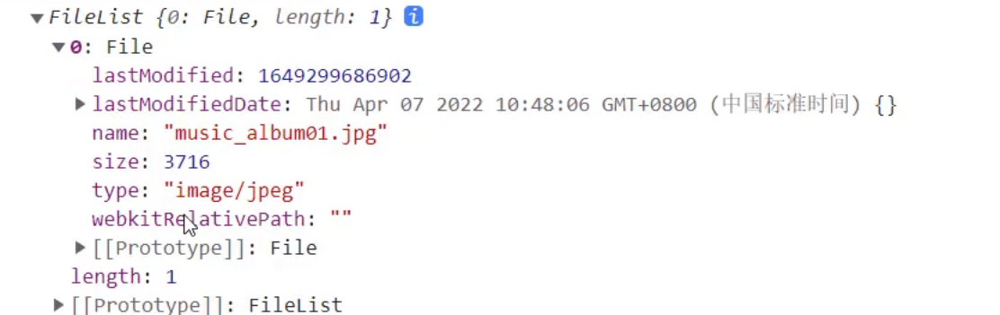

```javascript
      // xhr和fetch都可以文件上传，但是xhr可以监视文件上传进度
      const uploadBtn = document.querySelector(".upload");
      uploadBtn.onclick = function () {
        // 1.创建对象
        const xhr = new XMLHttpRequest();
        xhr.onload = function () {
          console.log(xhr.response);
        };
        xhr.responseType = "json";
        xhr.open("post", "http://123.207.32.32:1888/02_param/upload");
        // 表单,通过获取元素来获取上传的文件
        const fileEl = document.querySelector(".file");
        // fileEl.files=>上传的文件
        console.log(fileEl.files);
        const file = fileEl.files[0];
        // 转换为服务器接收的表单格式
        const formData = new FormData();
        formData.append("avatar", file);
        // 发送请求
        xhr.send(formData);
      };
```


 服务器接收的上传文件格式必须是表单，所以我们获取文件数据后必须将其转换为通过`FormData()`生成的表单数据，才能发送给服务器。

 `formData.append("avatar");`的第一个参数是键名，具体是否需要验证要看后端有没有验证这个字段的需求。

**我们可以通过`xhr.onprogress=function(event){...}`来监视文件上传进度，我们可以通过这个 `event`来监视上传进度。**

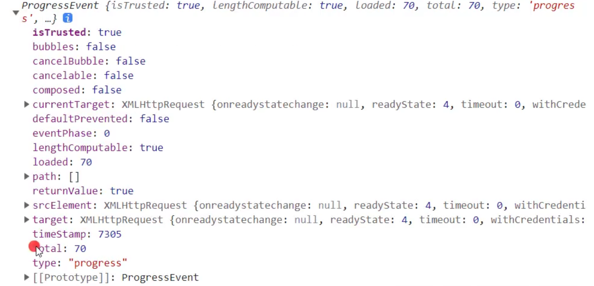

# Fetch

Fetch可以看做是早期的XMLHttpRequest的上位替代方案，它提供了一种更加现代的处理方案： 

**Fetch函数内部封装了Promise机制，它的返回值是一个Promise**，提供了一种更加优雅的处理结果方式 

​	✓ 在请求发送成功时，调用resolve回调then；

​	✓ 在请求发送失败时，调用reject回调catch； 

比如**不像XMLHttpRequest**一样，所有的操作都在一个对象上； 

## fetch函数的使用

`Promise<Response> fetch(input[,init]);`

input：定义要获取的资源地址，可以是一个**URL字符串**，也可以使用一个Request对象（实验性特性）类型；

init：其他初始化参数 

​	✓ method: 请求使用的方法，如 GET、POST；

​	 ✓ headers: 请求的头信息； 

​	✓ body: 请求的 body 信息；

### fetch的response

`fetch` 函数返回一个 Promise，该 Promise 在 `response` 对象解析完成时被解析。`response` 对象表示 HTTP 响应，包含请求的状态和其返回的数据。`response` 对象的具体内容包括：

1. **状态信息 (Status Information):**
   - `status`: HTTP 响应状态码，例如 200 表示成功。
   - `statusText`: HTTP 状态码的文本描述。
2. **HTTP 头信息 (HTTP Headers):**
   - `headers`: 包含响应中所有头信息的 Headers 对象。
3. **响应数据 (Response Data):**
   - `text()`: 以文本形式解析响应体。
   - `json()`: 以 JSON 形式解析响应体。
   - `blob()`: 将响应体解析为二进制数据。
   - `arrayBuffer()`: 将响应体解析为 ArrayBuffer。
4. **其他信息:**
   - `url`: 响应的 URL。
   - `redirected`: 一个布尔值，指示响应是否是重定向的结果。
   - ...

fetch的基本请求如下(这个是未优化的代码)：

```javascript
      // 1.fetch发送get请求
      fetch("http://123.207.32.32:8000/home/multidata")
        .then(res => {
          // 1.获取reponse
          const response = res;
          console.log(response);
          //   2.获取具体的结果
          response.json().then(res => {
            console.log("res", res);
          });
        })
        .catch(error => {
          console.log(error);
        });
```

第一次优化后的版本：

```javascript
      // 1.fetch发送get请求
      fetch("http://123.207.32.32:8000/home/multidata")
        .then(res => {
          // 1.获取reponse
          const response = res;
          console.log(response);
          //   2.获取具体的结果
          return response.json();
        })
        .then(res => {
          console.log(res);
        })
        .catch(error => {
          console.log(error);
        });
```

根据上面的代码我们可以判断，如果这个fetch函数本身请求的结果就是一个Promise，那么我们完全可以采用 async/await 的方式来输出这个函数的结果，避免回调地狱。

第二次优化后的版本:

```javascript
     /* II.优化版本II */
      async function getData() {
        const response = await fetch("http://123.207.32.32:8000/home/multidata");
        const res = await reponse.json();
        console.log(res);
      }
	  getData()
```

## POST请求(携参)

创建一个 POST 请求，或者其他方法的请求，我们需要使用 fetch 选项**(也就是第二个参数，以对象的形式存在)**： 

- method：HTTP 方法，例如 POST， 
- body：request body，其中之一： 

​		✓ 字符串(例如 JSON 编码的),所以我们需要将对象通过`JSON.stringify()`进行转换后传入。 

​		✓ FormData 对象，以 `multipart/form-data` 形式发送数据，

非常杯具，fetch请求还是要通过headers设置`Content-Type`的格式为 `application/json`，同时把传参改为**字符串格式**，才能正常完成post携参JSON数据请求。

```javascript
      async function getData() {
        const response = await fetch("http://123.207.32.32:1888/02_param/postjson", {
          method: "post",
          headers: {
            "Content-Type": "application/json"
          },
          body: JSON.stringify({
            name: "why",
            age: 18
          })
        });
        const res = await response.json();
        console.log(res);
      }
      getData();
```

### formData格式

```javascript
      async function getData() {
        const formData = new FormData();
        formData.append("name", "why");
        formData.append("age", 18);
        const response = await fetch("http://123.207.32.32:1888/02_param/postform", {
          method: "post",
          body: formData
        });
        // 获取response的状态
        if (response.ok) {
          const res = await response.json();
          console.log(res);
        }
      }
      getData();
```

## fetch的响应

Fetch的数据响应主要分为两个阶段： 

**阶段一：**当服务器返回了响应（response） 

- fetch 返回的 promise 就使用内建的 Response class 对象来对响应头进行解析； 
- 在这个阶段，我们可以通过检查响应头，来检查 HTTP 状态以确定请求是否成功；
- 如果 fetch 无法建立一个 HTTP 请求，例如网络问题，亦或是请求的网址不存在，那么 promise 就会 reject； 
- 异常的 HTTP 状态，例如 404 或 500，不会导致出现 error； 

​		◼ 我们可以在 response 的属性中看到 HTTP 状态： 

​			status：HTTP 状态码，例如 200； 

​			ok：布尔值，如果 HTTP 状态码为 200-299，则为 true； 

**阶段二：**为了获取 response body，我们需要使用一个其他的方法调用。 

- `response.text()` —— 读取 response，并以文本形式返回 response； 
- `response.json()` —— 将 response 解析为 JSON；


## fetch上传文件

```javascript
      // xhr和fetch都可以文件上传，但是xhr可以监视文件上传进度
      const uploadBtn = document.querySelector(".upload");
      uploadBtn.onclick = async function () {
        // 表单,通过获取元素来获取上传的文件
        const fileEl = document.querySelector(".file");
        // fileEl.files=>上传的文件
        const file = fileEl.files[0];
        // 转换为服务器接收的表单格式
        const formData = new FormData();
        formData.append("avatar", file);

        /* 发送fetch请求上传文件 */
        const response = await fetch("http://123.207.32.32:1888/02_param/upload", {
          method: "post",
          body: formData
        });
        const res = await response.json();
        console.log(res);
      };
```

